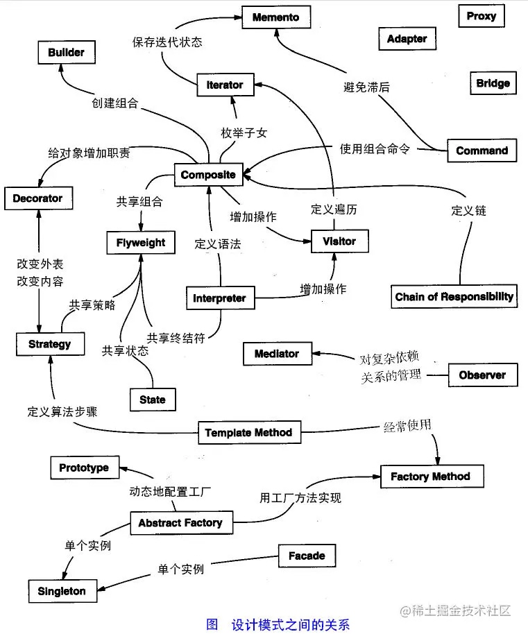

## [xxx] Design Pattern

:::tip
基本认知

- 设计模式不是硬知识，是经验。需要慢慢品，无法一蹴而就。
- 通过最佳使用场景 (例子) 来学习设计模式是最快的
- 想想不用设计模式怎么实现？该场景下使用各种设计模式实现，分别有什么优劣？对比一下 哪种更好？ (如果不能合理设计，或者用错设计模式，会导致维护更困难，这就是所谓的“反设计/过度设计”)

:::


---


- 创建型模式：在创建对象的同时，隐藏创建逻辑的方式，而不是用 new 直接实例化对象
- 结构型模式：组合类和对象
- 行为型模式：关注对象间的通信





```yaml

- type: Design-Pattern
  repo:
    - url: https://github.com/aierui/design-pattern-in-go
      qs:
        - q: "**What's Design Pattern? What are some common DP?**"

```


### 结构型模式


```yaml

- name: 适配器模式 adapter
  scenario: 把原本不兼容的接口，通过适配器进行统一
  examples: 转换器
  usage: ''
- name: 装饰器模式 decorator
  scenario: 不能或者不想通过继承类的方式拓展功能；在不修改原对象的情况下增加新功能 (避免直接继承导致子类膨胀问题)
  examples: 俄罗斯套娃/大众汽车/nokia 手机 &#40;科技以换壳为本&#41;
  usage: ''
- name: 外观模式 facade
  scenario: 屏蔽内部复杂度，提供一个简单接口，隐蔽内部的复杂子系统
  examples: 用户注册只需要手机号，服务端会从各种渠道获取其他数据
  usage: ''
- name: 代理模式 proxy
  scenario: 给某个对象提供一个代理，并由代理对象控制原对象的引用，为某些资源的访问，对象的类的易用操作上提供方便使用的代理服务；
  examples: 分销商/老大和小弟
  usage: |
    - 和适配器的区别：适配器是连接了两个接口
    - 和装饰器的区别：装饰器是对现有的对象进行包装
- name: 组合模式 composite
  scenario: 让我们的服务节点进行自由组合，对外提供服务，如果我们需要对 ABC 三个服务随意进行组合，
  examples: 营销规则决策树，根据不同的性别/年龄发放不同的优惠券
  usage: ''
- name: 桥接模式 bridge
  scenario: 把抽象部分和实现部分分离，不希望使用继承或者因为多层次继承导致系统类的个数急剧增加的系统
  examples: 聚合支付，聚合了支付渠道 (微信/支付宝) 和支付方式 (指纹/人脸)
  usage: ''
- name: 享元模式 flyweight
  scenario: 通过共享通用对象，减少内存使用 || 享元工厂把变化的对象和不变对象组装
  examples: 秒杀场景的商品库存和详情
  usage: ''

```


### 行为型模式

```yaml

- name: 责任链模式 cor
  scenario: 解决一组服务中的先后关系
  examples: 击鼓传花/离职时需要各层领导签字/平时
- name: 命令模式 command
  scenario: 把类似场景拆分成三个部分：命令/命令实现者/命令调用者，有新菜品时可以直接新增，很容易拓展外部调用
  examples: 销售不需要关心生产车间里的具体流程/餐厅服务员不需要关心厨师怎么做菜
  usage: 怎么组合使用命令模式和组合模式？
- name: 中介者模式 mediator
  scenario: >-
    系统中的对象之间存在复杂的引用关系，导致难以复用，通过引入中介者类，封装这些对象之间的引用关系，如果需要改变行为，则引入新的中介者类即可，不需要删除原中介者，
  examples: 交警维持交通秩序
- name: 备忘录模式 memento
  scenario: 属于附加功能，通过记录原对象的行为从而实现备忘录模式，
  examples: 回滚系统
- name: 观察者模式
  scenario: 对象的一种一对多的关系，当依赖的对象的状态发生改变时，所有依赖它的对象都得到通知并被自动更新，可以用观察者模式构建链式触发机制
  examples: MQ 服务的通知中心
- name: 状态模式
  scenario: >-
    对象的行为依赖于他的状态 (属性)，并且可以根据其状态改变而改变相关行为 || 状态模式的核心在于环境类，环境类可以根据不同场景调用不同实现类 ||
    这样的话，客户端不需要像策略模式一样，知道所有实现类的类名，只需要实例化环境类，就可以实现需要的功能
  examples: >-
    代码中包含大量与对象状态有关的条件语句，会导致代码的可维护性变差，不能方便地增加和删除状态，使客户类与类库之间的耦合增强，在这些条件语句中包含了对象的行为，而且这些条件对应对象的各种状态
- name: 策略模式 strategy
  scenario: 将不同的处理过程进行独立封装，通过接口暴露出去，调用者根据不同场景和条件，使用不同策略不需要了解其中细节
- name: 模版模式 template
- name: 访问者模式 visitor
- name: 解释器模式
- name: 空对象模式
- name: 迭代器模式 iterator
  scenario: 实现 Iterator 接口，通过 next 的方式获取集合元素
  examples: 公司组织架构

```


### 创建型模式


```yaml
- name: 工厂模式
  scenario: >-
    把某个对象的不同种类定义成 struct || 把该对象的不同属性定义成 interface || 把 struct 整合到
    NewInterface()
- name: builder 模式
  scenario: 将多个简单对象组装成复杂对象
  examples: |

    1. 基本物料不变，但是其组合方式经常变化，比如装修
    2. 建造者模式所创建的产品，一般具有较多的共同点，其组成部分相似，*如果产品之间的差异性很大，则不适合使用建造者模式*，因此其使用场景有一定的局限性

```


