```markdown

图 2：磁盘和内存的 10 速度对比
再看数据存储领域，有两个“极端”发展方向：
1、加快读：通过素引 1（日 + 树、二份查找树等方式），提高查询速度，但是写入数据时要维护索引，因此会降低写入效率。
2、加快写：纯日志型，数据以 append 追加的方式顺序写入，不加索引，使得写入速度非常高 (理论上可接近
磁益的写入速度），但是缺乏索引支持，因此查询性能低。
老许注：这里应该是可接近内存随机写的速度
基于这两个极端，又衍生出来了了类最具代表性的底层索引结构：
】1、哈希索引：通过哈希西数将 key 映射成数据的存储地址，适用于等值查询等简单场景，对于比较查询、范围查询等复杂场景无能为力。
2、B/B+ Tree 索引：最常见的索引类型，重点考虑的是读性能，它是很多传统关系型数据库，比如 MysQL、Oracle 的底层结构。
3、LSM Tree 索引：数据以 Append 方式追加写入日志文件，优化了写但是又没显著降低读性能，众多
NosQL 存储系统比如 Big Table, HBase, Cassandra, RocksDB 的底层结构。

```


## storage engine


```markdown
堆表(heap table）和索引组织表（Index Oragnization Table，简称IOT)是两种数据表的存储结构。pg中的表是堆表。mysql Innodb引擎中的表是索引组织表。oracle中既支持堆表，也支持索引组织表。
```

*从这个角度来看，pgsql的heap就是mysql的memory，而IOT就是mysql的InnoDB*

mysql的MyISam既不是heap也不是IOT，而是HOT(Heap Organized Table)


---


```markdown
查询计划的解释是由优化器提供的，而执行详细信息的收集是由执行器提供的。
```

这点在mysql和postgres里是一样的。*也就是说几个mysql常用的优化命令，optimizer-trace是optimizer提供的，explain analyze 是 executor提供的，show status 则是一个数据汇总的命令，*


---

[难道没有完美的存储引擎？-51CTO.COM](https://www.51cto.com/article/705136.html)

```markdown
Innodb的PAGE结构与HEAP结构的类似，不过在空闲空间管理上是完全不同的。前面是FILE HEADER/PAGE HEADER，中间是数据记录，数据记录也是从低地址往高地址写，和Oracle相反。这是因为BTREE存储结构不需要和slotted page一样，在块里放一个指示器，其行指示器的功能被BTREE替代了。

Innodb的这种存储结构，并不存在一个十分友好的类似Oracle的记录物理地址的ROWID这样的结构。所以要想定位某条数据记录，需要使用主键或者簇主键的方式来实现。主键可以定义某条记录的唯一性地址，因此Mysql的某张表上的其他索引(secondary index)的索引中存储的键值不像Oracle那样存储ROWID就可以了，而是存储的是主键中这一行的地址指针。基于一个secondary index的查询首先找出某些行的主键，然后再去扫描一次主键索引，才能找到相关行的地址，再找到这条记录。比起有rowid的Oracle数据库，这里多了一次主键索引的扫描。

可能有些朋友会觉得，是不是heap结构一定优于BTREE结构呢?其实还是回到今天的标题，没有完美的存储引擎。针对不同的应用场景，heap和BTREE各有优势。BTREE结构写入数据时按主键排序的，而且并发写入时数据并不是按照插入顺序写入数据块，如果主键存在一定的无序性，那么并发写入的数据可以被打散到多个块中，从而缓解热块冲突的压力。而二级索引的结构虽然对读取数据的操作有影响，对于存在多条索引的数据写入，数据修改，是有优势的。因为只要主键的键值不变，行数据的变化，行在数据块中存储的变化，不需要变更第二索引。

因此我们可以十分明确的肯定，不同的存储结构都各有利弊，并不能很直接的说哪种更好。不过在开发高并发，大数据量的系统的时候，了解存储引擎的一些特点，可以有效的避免一些问题。比如在Mysql、达梦等数据库中建表，尽可能定义一个显式的主键，从而避免系统自动添加主键。另外如果某张表的热块冲突特别严重的时候，主键可以考虑选择随机性的数据，而不是单边增长的数据，就可以有效的进行数据打散，从而降低热块冲突的可能性。
```

没看懂想表达什么

mysql的memory引擎就是pgsql的heap引擎

所以“那为什么mysql innodb使用bptree，而不是memory引擎呢？有啥区别？”

```markdown
Heap表，即使用MEMORY存储引擎的表，这种表的数据存储在内存中，由于硬件问题或者断电，数据容易丢失，所以只能从其他数据表中读取数据作为临时表或者只读缓存来使用。
```

storage, transaction, persist 几个方面


## MySQL


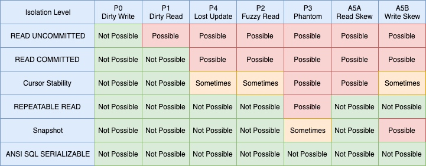
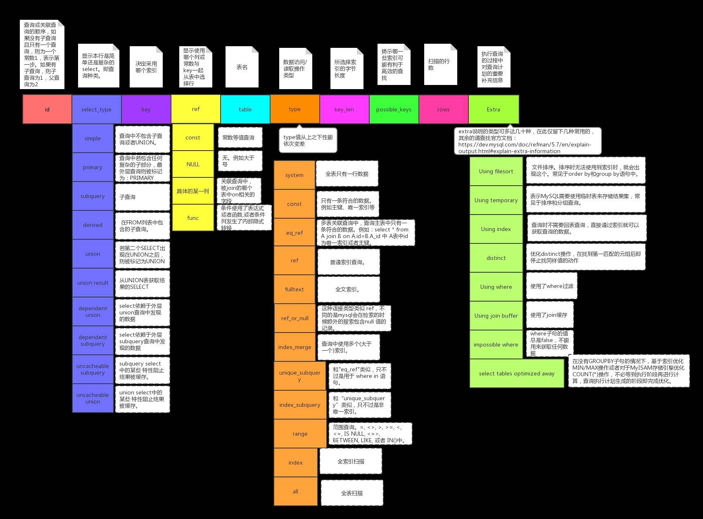
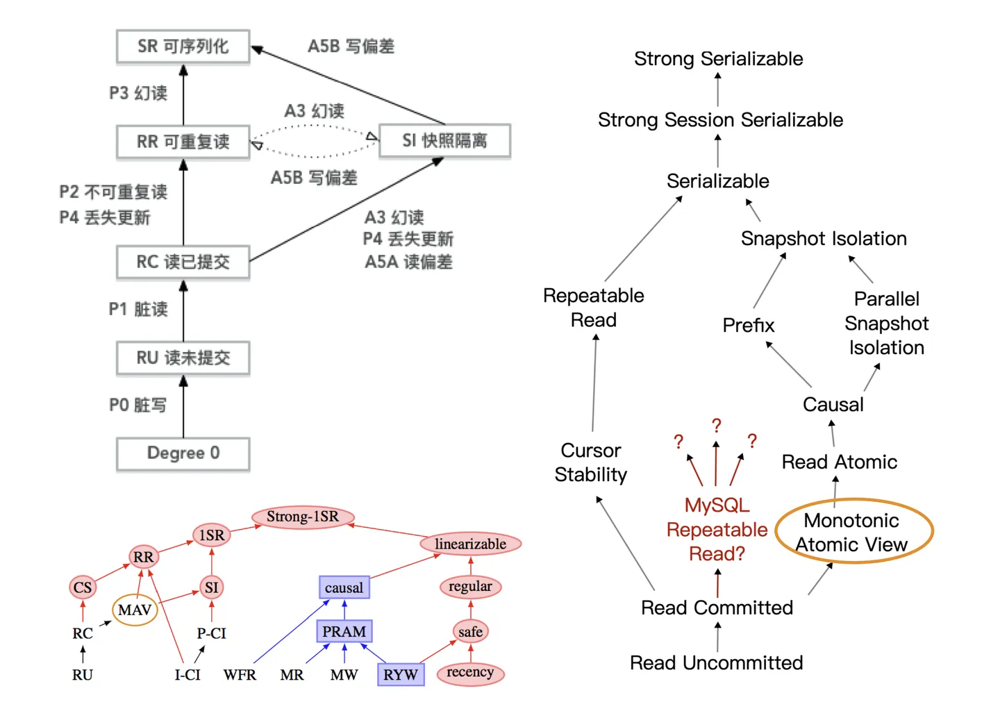
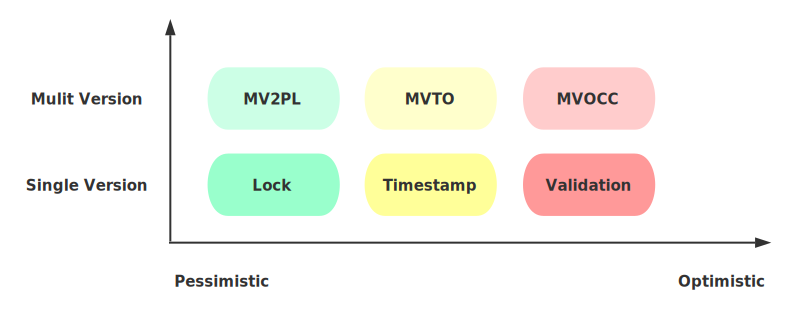
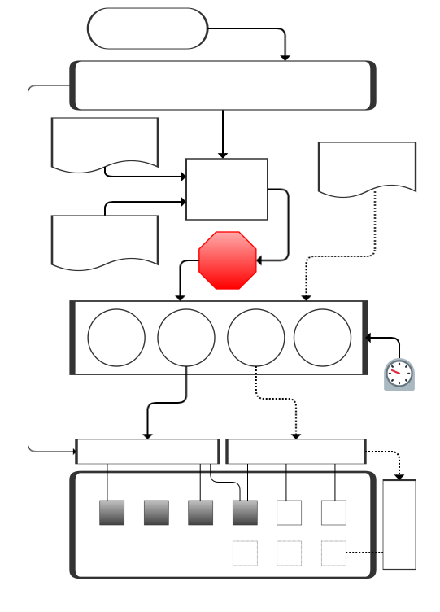
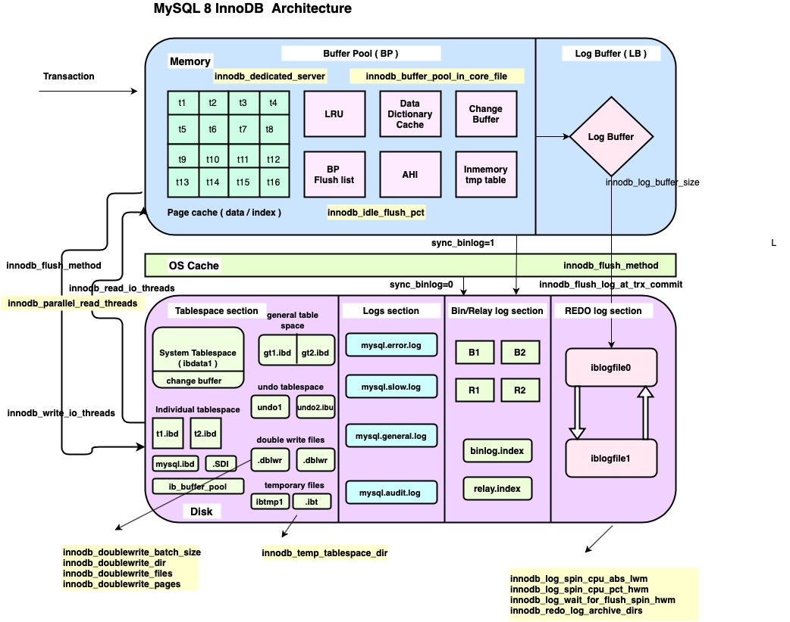
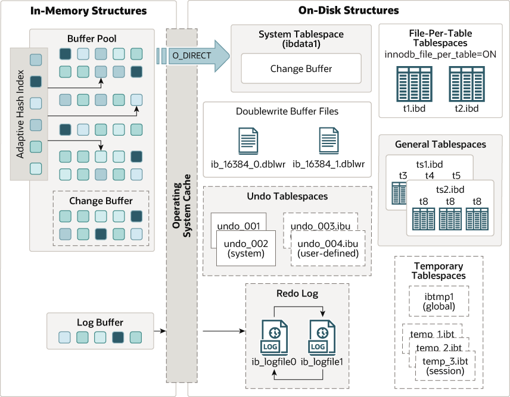


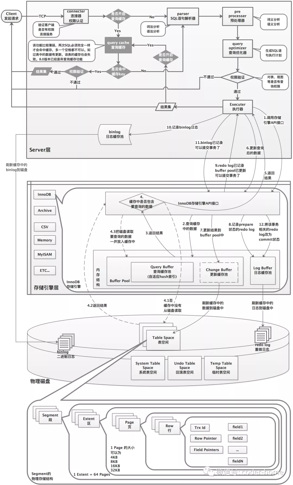


如果拿图书馆来类比mysql的话，就很好理解了。假设我们的需求是进入图书馆获取n本符合我们需要的书。

- connector就相当于门卫，只有预约（相当于auth）过才能进入，我们可以通过调整连接数（就是预约人数）来动态调整图书馆的负载。
- parser就相当于图书馆的前台，是把汉语转化成该书的ISBD号等MACS专用信息（将查询语句转换为内部数据结构，相当于compiler），并且提供这些书的位置和路线（提供查询计划）。mysql的parser其实就是compiler，词法分析、语法分析啥的。
- optimizer就相当于优化我们去找到这本书的路线（找到最优路线，提高查询效率）。
- executor则相当于“图书馆操作员”，负责执行优化后的查询计划（也就是带着我们），从图书馆书架（存储引擎）里查找所有需要的数据，这也解释了查询操作关键字的执行顺序，当然要先确定这些书籍的大概区域（也就是FROM），如果需要把这些书按序排列的话，就最后再执行Order这种已经拿到所有书籍之后无关紧要的操作。那中间肯定就是来获取查找这些书了，也就是各种条件（where和groupby/having和select），当然书肯定不需要重复的（也就是Distinct去重操作）。

如果我们把存储引擎比做图书馆的所有书架的话，表、页、行分别类比成什么呢？表可以类比成图书馆的某个区域，每个区域存放着特定类型的书籍。页可以看作是该区域的某个书架，每个书架上放着一定数量的书籍。行可以类比成某一排书，每一排上放着一本书。


进一步的，我们可以用这些继续类比myisam和innodb，myisam就是每个分类（比如工业技术、交通运输、历史地理等等，具体查看《中国图书馆分类法》）都会有一个单独的目录，并且不允许很多人同时查找（不支持并发查找，也就是不支持事务），进行查找时直接锁表，相应的，我们可以直接通过这个单独的MYI索引文件查找对应的图书，非常快。

InnoDB就灵活的多了，他是以书架为单位进行查找和存储的，所以他的目录（索引）是和某排图书在一起的（相当于每排书一个索引（主键索引），索引id都贴在书架该层的最前面，这时就存在两种情况，一种就是直接查目录（索引）就可以获得数据，不需要再查数据表，这个就是“索引覆盖”（或者说Index Dive，都是类似意思）。如果目录中查不到我们需要的数据，就需要“回表”了，那么我们根据索引id来看需要的书是不是在这排（再多说一句，这也是为什么主键id最好单调递增的原因））。他是支持多人同时查找的。并且在读写操作时只锁定某排书（也就是行级锁定），粒度更细，这样就更能频繁地执行读操作和写操作。

需要注意的是mysql还支持同时使用多种存储引擎，也就是说在图书馆里如果有一些冷门分类，很少有新书入库的，那就用myisam这种类型的管理方式，如果非常热门的分类，每天都有很多用户来买书，每天书店也需要频繁补货的，就应该用innodb。当然，如果我们把mysql看作是图书馆的话，不同图书馆的特性（规矩、规章制度）也不同，比如说oracle或者sql server这种的就比较死板，图书馆开店营业之前就定好了所有书架的管理模式（也就是存储引擎），之后再也不能修改，更不存在说不同分类使用不同的管理模式一说了。

另外，还需要注意一个问题，编织目录（索引）的具体方法和该“图书分类”（存储引擎）的映射关系。众所周知，对于不同图书分类也应该使用不同的方式来编写目录。比如说R树适用于myisam（也有B+Tree），hash适用于memory，B+Tree则适用于InnoDB。


上面就给MySQL提供了一个大概的类比，接下来我们将深入各个组件。

好的，那我们来继续聊聊optimizer的细节，如果我们把mysql比做图书馆的话，ICP, MRR, BKA, BNL 以及 index dive 这些分别可以类比成什么？

我们会分门别类地介绍optimizer的这些概念。首先需要注意的是，optimizer的这些优化方法都是内置的，也就是不能修改（实际上可以修改，但是不建议），而MySQL配置项的主要集中在storage engine和executor。

首先介绍ICP

```markdown
ICP的原理很简单。当 MySQL 执行查询语句时，它会根据查询条件选择合适的索引来访问数据。在传统的执行方式中，MySQL 首先通过索引找到满足条件的记录的主键，然后再根据主键值从数据表中获取记录。而索引条件下推则在索引访问阶段就进行条件过滤，只返回满足查询条件的记录的主键，避免了不必要的主键查找操作。

这样做的好处是减少了磁盘 IO 和网络传输，提高了查询效率。特别是对于那些返回记录较多但满足查询条件的记录较少的查询，索引条件下推可以大幅提升性能。
```

这些概念太抽象了，简单来说就是“ICP就是把本应executor执行的，推给SE来执行”

仍然用图书馆类比的话，


BKA和BNL都是在join操作时才会使用的优化技术

ICP就是“把查询条件放到存储引擎，能提高查询效率”，通俗来说就是，在查询过程中，直接在查询引擎层的 API 获取数据时，实现“非直接索引”过滤条件的筛选，而不是查询引擎层查询出来之后在 server 层筛选。

再则，ICP更适合那种大量数据，但是其中只有极少数满足查询条件的场景。


```markdown
MRR是一种针对读取操作的优化技术。它通过在一个请求中读取多个连续范围的数据，以减少读取磁盘的次数。MRR通常用于处理顺序扫描（Sequential Scan）或范围查询（Range Query）等需要从磁盘读取大量连续数据的场景。通过减少磁盘IO次数，MRR可以显著提高读取操作的性能。
```

MRR主要关注的是优化读取操作的效率


这些优化器技术都旨在提高查询性能，减少不必要的磁盘I/O和数据扫描


```markdown

您的图书馆类比已经很形象，可以帮助理解MySQL的各个组件。让我们尝试对您的类比进行一些调整，以更准确地反映executor和storage engine的作用，以及它们与ICP（Index Condition Pushdown）的关系。

### Executor（执行器）类比：
Executor可以类比为图书馆的图书检索系统操作员。当读者（用户查询）提出要查找某本书（请求数据）时，操作员会根据图书馆的规则和索引目录（查询计划）来确定最佳的检索路径（执行计划）。操作员负责整个检索过程的协调和执行，确保读者能够高效地找到他们想要的书籍。

### Storage Engine（存储引擎）类比：
Storage Engine可以类比为图书馆的书架管理系统。这个系统负责实际存储书籍（数据），并根据索引目录（索引）快速定位书籍。在InnoDB（一个灵活的书架管理系统）中，每个书架（每排书）都有自己的索引标签（主键索引），使得查找过程更为高效。

### ICP（Index Condition Pushdown）类比：
ICP可以类比为图书馆的预筛选服务。在读者进入藏书区之前，图书馆工作人员（存储引擎）会根据读者的需求（查询条件）和目录信息（索引）提前筛选出可能的书籍范围。这样，当操作员（executor）带领读者去书架找书时，他们只需要在已经缩小范围的书籍中寻找，而不是遍历整个书架。

### 调整后的类比：
- **Connector**：门卫，负责认证读者（用户连接）并允许他们进入图书馆（数据库）。
- **Parser**：图书馆的接待台，将读者的查询（SQL语句）转换成图书馆能够理解的请求（内部数据结构）。
- **Optimizer**：图书推荐专家，为读者（查询）找到最佳查找路线（最优查询计划）。
- **Executor**：图书检索系统操作员，根据推荐专家的建议（查询计划）执行查找任务。
- **Storage Engine**：书架管理系统，负责存储书籍（数据）并根据索引（目录）快速定位。
- **ICP**：预筛选服务，提前根据读者需求缩小查找范围，减少操作员和读者的工作量。

通过这个调整后的类比，我们可以更清楚地看到，executor负责协调和执行查询计划，而storage engine负责数据的存储和基于索引的快速检索。ICP则是一种优化手段，它允许存储引擎在数据检索过程中提前进行条件过滤，从而提高查询效率。

```

```markdown

按照调整后的类比，ICP（Index Condition Pushdown）与传统的索引查找之间的区别可以这样理解：

### 传统索引查找：
- **过程**：当读者（用户）知道他们想要找的书的确切分类或编号（查询条件与索引完全匹配）时，图书检索系统操作员（executor）直接利用图书馆的索引目录（索引）快速找到对应的书架（存储引擎）上的书（数据）。
- **优点**：这种方法快速且直接，因为索引目录（索引）提供了快速定位数据的方法。
- **缺点**：如果读者的查询较为复杂，包含了索引目录上没有的全部信息，那么操作员需要先通过索引找到可能的书籍范围，然后再到书架上一本本地检查书籍以满足剩余的条件。

### ICP（Index Condition Pushdown）：
- **过程**：在读者进入藏书区之前，图书馆提供预筛选服务（ICP）。即使读者只知道部分信息，比如书的作者或主题的一部分，工作人员（存储引擎）可以使用索引目录提前筛选出可能的书架范围。当操作员随后带领读者去书架找书时，他们只需要在这些预筛选的书架上寻找，而不必检查整个图书馆。
- **优点**：ICP允许存储引擎在数据实际被检索前，先根据索引过滤掉不符合条件的数据，减少了需要操作员（executor）处理的数据量，提高了查询效率，尤其是在处理大量数据时。
- **应用场景**：当查询条件既有能够使用索引快速定位的部分，也有需要检查具体数据才能确定的部分时，ICP可以显著优化查询性能。

### 区别：
- **过滤时机**：传统索引查找的过滤工作通常在操作员（executor）拿到数据后才进行，而ICP的过滤工作则是在数据检索前，由工作人员（存储引擎）提前完成的。
- **性能影响**：ICP可以减少数据访问量，因为很多不符合条件的数据在早期阶段就被排除了，这通常可以提高查询性能，尤其是在数据量大且查询条件复杂时。

在类比中，ICP相当于在图书检索系统操作员（executor）正式检索之前，由图书馆工作人员（存储引擎）利用索引目录（索引）进行的预筛选，这样可以减少操作员需要检查的书籍数量，提高整体检索效率。
```


```markdown

将查询条件下推至存储引擎层级可以提高查询效率的原因是减少了不必要的数据读取。

当查询语句中包含了条件限制时，传统的方式是将所有数据读入MySQL服务器，然后再进行条件过滤。这样会导致大量的数据传输和处理，尤其是在数据量较大时。

而通过将查询条件下推至存储引擎层级，MySQL可以在存储引擎中进行条件过滤，只将满足条件的数据传输到MySQL服务器。这样可以大大减少数据传输和处理的工作量，提高查询效率。

另外，存储引擎层级通常会有索引等数据结构支持，可以更高效地执行条件过滤操作。因此，将查询条件下推至存储引擎可以充分利用存储引擎的优势，减少不必要的数据读取，从而提高查询性能。

总结起来，通过将查询条件下推至存储引擎层级，可以减少数据传输和处理，利用存储引擎的优势进行条件过滤，最终提高查询效率。这就是ICP技术的作用。

---

是的，BKA（Batch Key Access）和BNL（Block Nested Loop）都是在连接操作（join）中使用的优化技术。

1. BKA（Batch Key Access）：BKA优化技术在连接操作中使用，特别是在执行连接操作时，如果一个表上的索引已经排序，而另一个表上的连接列也是有序的，那么MySQL可以使用BKA来批量访问这两个表。它允许优化器批量访问索引，减少索引访问的次数，从而提高连接操作的性能。

2. BNL（Block Nested Loop）：BNL优化技术也是在连接操作中使用的。当连接操作无法使用更高级的连接算法（如索引连接或哈希连接）时，MySQL会使用BNL。BNL通过逐行读取两个表的数据，并执行循环匹配操作，以获取满足连接条件的结果。虽然BNL可能会导致性能较低，但在某些情况下，它仍然是执行连接操作的一种有效方法。

需要注意的是，BKA和BNL是在特定的情况下被MySQL优化器选择使用的。MySQL的优化器会根据表的大小、索引的可用性、连接条件等因素来决定使用哪种连接算法。根据查询的具体情况，优化器会选择最佳的连接方式来提高查询性能。

因此，虽然BKA和BNL是在连接操作中使用的优化技术，但并不是所有连接操作都会使用它们。MySQL的优化器会根据具体情况选择最合适的连接算法。

```

```markdown
- ICP（Index Condition Pushdown）：ICP在优化器中是一项重要的优化技术，它类似于图书馆的索引目录。在图书馆中，索引目录帮助读者快速找到所需书籍的位置。类比到MySQL中，ICP会尽可能将查询条件下推至存储引擎层级，以减少不必要的数据读取，提高查询效率。
- MRR（Multi-Range Read）：MRR是一种批量读取技术，类似于在图书馆中一次性获取多本书。MRR允许MySQL在存储引擎层级批量读取满足查询条件的多个数据块，以减少磁盘I/O操作，提高查询性能。
- BKA（Batch Key Access）：BKA是一种批量键访问技术，类似于在图书馆中通过预定书架号快速获取多本书。在MySQL中，BKA允许优化器批量访问索引，以减少索引访问的次数，提高查询速度。
- BNL（Block Nested Loop）：BNL是一种块嵌套循环技术，类似于在图书馆中通过遍历多个书架来查找所需书籍。在MySQL中，BNL用于处理连接操作，它会逐行读取两个表的数据，并执行循环匹配操作，以获取符合连接条件的结果。
- Index Dive：Index Dive类似于在图书馆中通过索引快速定位到需要的书籍的过程。在MySQL中，Index Dive是一种优化技术，它允许优化器通过索引的跳跃访问，直接定位到满足查询条件的数据，而无需完全扫描索引。

```

---

*[数据库事务隔离发展历史 | CatKang的博客](https://catkang.github.io/2018/08/31/isolation-level.html)*

```markdown
ANSI SQL标准(1992)：基于异象
A Critique of ANSI(1995)：基于锁
A Generalized Theory(1999)：基于序列化图

Cursor Stability
Snapshot Ioslation
```


---

[浅析数据库并发控制机制 | CatKang的博客](https://catkang.github.io/2018/09/19/concurrency-control.html)


```markdown
这里从两个维度，对常见的并发控制机制进行分类：

1. 乐观程度
不同的实现机制，基于不同的对发生冲突概率的假设，悲观方式认为只要两个事务访问相同的数据库对象，就一定会发生冲突，因而应该尽早阻止；而乐观的方式认为，冲突发生的概率不大，因此会延后处理冲突的时机。如上图横坐标所示，乐观程度从左向右增高：

1、基于Lock：最悲观的实现，需要在操作开始前，甚至是事务开始前，对要访问的数据库对象加锁，对冲突操作Delay；
2、基于Timestamp：乐观的实现，每个事务在开始时获得全局递增的时间戳，期望按照开始时的时间戳依次执行，在操作数据库对象时检查冲突并选择Delay或者Abort；
3、基于Validation：更乐观的实现，仅在Commit前进行Validate，对冲突的事务Abort

可以看出，不同乐观程度的机制本质的区别在于，检查或预判冲突的时机，Lock在事务开始时，Timestamp在操作进行时，而Validation在最终Commit前。相对于悲观的方式，乐观机制可以获得更高的并发度，而一旦冲突发生，Abort事务也会比Delay带来更大的开销。
```

```markdown
对应上述每种乐观程度，都可以有多版本的实现方式，多版本的优势在于，可以让读写事务与只读事务互不干扰，因而获得更好的并行度，也正是由于这一点成为几乎所有主流数据库的选择。为了实现多版本的并发控制，需要给每个事务在开始时分配一个唯一标识TID，并对数据库对象增加以下信息：

txd-id，创建该版本的事务TID
begin-ts及end-ts分别记录该版本创建和过期时的事务TID
pointer: 指向该对象其他版本的链表

其基本的实现思路是，每次对数据库对象的写操作都生成一个新的版本，用自己的TID标记新版本begin-ts及上一个版本的end-ts，并将自己加入链表。读操作对比自己的TID与数据版本的begin-ts，end-ts，找到其可见最新的版本进行访问。根据乐观程度多版本的机制也分为三类：
```

以 乐观程度 和 是否MV 为横纵坐标，可以看到pgsql就使用MVTO，而mysql（InnoDB）和oracle则使用MVRC(MM read consistency)

```markdown
PostgreSQL uses multi-version timestamp ordering (MVTO) while InnoDB and Oracle use multi-version read consistency (MVRC). The main difference is that PostgreSQL is with-REDO/no-UNDO because it stores every row version in the main table, while Oracle/InnoDB implements with-REDO/with-UNDO where they reconstruct a block and/or row image from the log to provide read consistency.
```

*MVCC具体起到什么作用？我知道MVCC是用来实现再db中并发读写操作时保证数据一致性，那从CAP的角度出发，是为了保证Consistency吗？*

与其说MVCC是为了保证C，不如说是为了保证在C和A之间的平衡（想想之所以说InnoDB是50%C +50%A，就知道了）

```markdown
我还有一个问题哈，所有database中都有MVCC机制吗？比如说vector db, graph db, column db, document db之类的，还是说只有RDB才支持MVCC机制？
---
不是所有的数据库都使用MVCC机制。MVCC是一种在关系数据库管理系统（RDBMS）中常见的并发控制技术，尤其是在那些需要处理高并发读写操作的系统中。它主要用于提供一致性的读取视图，同时减少锁的使用，从而提高并发性能。

```

这个也挺好理解的，答案是，“所有RDB都支持MVCC，但也并不是全部db都有MVCC机制”，我的理解是，RDB是狭义上的DB，但是如果像vector之类的特殊功能的DB，实际上起到的也并不需要支持狭义上DB的功能。


---

***[数据库故障恢复机制的前世今生 | CatKang的博客](https://catkang.github.io/2019/01/16/crash-recovery.html)***

```markdown

根据提供的文档《数据库故障恢复机制的前世今生》，以下是几个问题及其回答：

1. **数据库系统在运行过程中可能遇到哪些故障类型？**
   - 数据库系统可能遇到的故障类型包括：Transaction Failure（事务失败），Process Failure（进程失败），System Failure（系统故障），以及Media Failure（媒体故障）。事务失败可能是主动回滚或冲突后强制中止；进程失败指进程由于各种原因退出，导致进程内存内容丢失；系统故障来源于操作系统或硬件故障；媒体故障是存储介质的不可恢复损坏。

2. **什么是Durability of Updates和Failure Atomic？**
   - Durability of Updates（更新的持久性）指的是已经提交的事务的修改，在故障恢复后仍然存在。Failure Atomic（故障的原子性）指的是失败事务的所有修改都不可见。这两个特性对于确保数据库在出现故障时仍能保持数据一致性和完整性至关重要。

3. **Shadow Paging是如何工作的？**
   - Shadow Paging是一种直观的故障恢复解决方式。它使用Shadow File，这种文件包含两个Directory项，Current和Shadow。事务对文件进行修改时，会获得新的Page，并加入Current的Page Table中，所有修改只发生在Current Directory。事务提交时，Current指向的Page刷盘，并通过原子操作将Current的Page Table合并到Shadow Directory中，事务中止时只需丢弃Current指向的Page。如果过程中发生故障，恢复Shadow Directory即可回滚所有未提交事务。

4. **WAL（Write Ahead Logging）是如何帮助故障恢复的？**
   - WAL通过记录对数据库的操作日志来帮助故障恢复。每次修改数据内容前先顺序写对应的Log，保证Log先于数据内容落盘（Write Ahead）。事务完成提交前还需要在Log中记录对应的Commit标记。根据Log中记录的内容，可以分为Undo-Only，Redo-Only，和Redo-Undo三类日志，它们分别采用不同的方式保证Durability和Atomic特性。

5. **ARIES算法是如何实现故障恢复的？**
   - ARIES算法是一种Redo-Undo的WAL实现，它在修改数据前先追加Log记录，Log内容同时包括Redo和Undo信息。数据Page中记录最后修改的日志项LSN（Log Sequence Number）。故障恢复阶段包含三个阶段：Analysis，Redo和Undo。Analysis阶段确定后续Redo和Undo阶段的操作范围，Redo阶段重放所有Log中的Redo内容，Undo阶段对所有未提交事务利用Undo信息进行回滚。

以上问题和回答基于文档内容进行了总结和解释。如果您需要更多信息或有其他问题，请随时提问。
```


---

[高并发的哲学原理（九）-- 细数四代分布式数据库并拆解 TiDB 和 OceanBase（主从、中间件、KV、计算与存储分离、列存储、CAP定理） - 岁寒](https://lvwenhan.com/tech-epic/507.html)


```markdown
正如经济政策的不可能三角“不可能同时实现资本流动自由，货币政策的独立性和汇率的稳定”那样，单机数据库也有一个不可能三角，那就是：①持久化 ②事务隔离 ③高性能。

为什么不可能
- 持久化需要每一次写数据都要落到磁盘上，宕机再启动以后，数据库可以自修复。如果只要求这一条，很好实现。
- 事务隔离需要每一次会话(session)的事务都拥有自己的数据库版本：既要多个并行的事务相互之间不会写到对方的虚拟数据库上(读提交)，又要不能读到对方的虚拟数据库上(可重复读)，还要在一个事务内不能读到别的事务已经提交的新增的数据(幻读)，终极需求则是完全串行化：我的读 session 不结束，你就不能读。这个需求和持久化需求结合以后，会大幅增加日志管理的复杂度，但，还是可以管理的。
- 读写都要尽量地快：单独实现也很快，Redis 嘛，但是加上持久化和事务隔离，就很难做了：需要对前两项进行妥协。
```

mysql就选择了持久化+隔离和性能各一半

```markdown
在分布式数据库时代，持久化已经不是分布式数据库“真正的持久化”了，取而代之的是“数据一致性”：由于数据存在了多台机器上，那机器之间数据的一致性就成了新时代的“持久化”。于是新不可能三角出现了：①一致性 ②事务隔离 ③高性能。
```

CAP中选择CP，放弃了A也就是事务

```markdown
第一代分布式数据库：中间件

放弃了持久化，选择数据一致性

第二代分布式数据库：KV
第三代分布式数据库：以 Spanner 为代表的 NewSQL （基于原子钟）
第四代分布式数据库：云上数据库 Aurora PolarDB （将计算节点和存储节点分离，就是存算分离）

```


```markdown
NewSQL 最大的特点就是使用非 B 树磁盘存储结构（一般为 LSM-Tree），在上面构筑一个兼容 SQL 常用语句和事务的兼容层，这样既可以享受大规模 LSM-Tree 集群带来的扩展性和高性能，也可以尽量少改动现有应用代码和开发习惯，把悲伤留给自己了属于是。

目前比较常见的 NewSQL 有 ClustrixDB、NuoDB、VoltDB，国内的 TiDB 和 OceanBase 也属于 NewSQL，但他们俩有本质区别，我们下面会详细讨论。
```


---


### optimize


```markdown
**分析执行计划、矫正行数、添加索引、避免回表、使用 ICP、优化字符串索引、控制 flush 时机、加快 innoDB 刷盘、避免对索引字段做函数操作。**

- 预发跑 sql explain
- 看一下行数对不对，不对可以用`analyze table <t>`矫正
- 添加索引，索引不一定是最优的，`force index`强制走索引，但是不建议使用
- 查看是否存在回表的情况
- 覆盖索引避免回表，不用*
- 合理安排联合索引的顺序
- MySQL5.6 之后使用 ICP 减少回表次数
- 给字符串加索引，用`前缀索引`、`倒序存储`、`hash`
- 数据库的 flush 时机
- innoDB 刷盘速度，脏页比例、redolog 写盘速度
- 索引字段不要做函数操作，会破坏索引值的有序性，优化器会放弃走树结构。如果触发隐式转换，也会走 cast 函数，会放弃走索引

```


### Index

```markdown
- 隐藏索引:
应用场景：软删除、灰度发布。

在没有hiding index之前，只能通过显式的方式删除索引，如果删除后发现索引删错了，又只能通过创建索引的方式将删除的索引添加回来，如果数据库中的数据量非常大，或者表比较大，这种操作的成本非常高。

在MySQL 8.0中，只需要将这个索引先设置为隐藏索引，使查询优化器不再使用这个索引，但是，此时这个索引还是需要MySQL后台进行维护，当确认将这个索引设置为隐藏索引系统不会受到影响时，再将索引彻底删除。这就是软删除功能。

灰度发布，就是说创建索引时，首先将索引设置为隐藏索引，通过修改查询优化器的开关，使隐藏索引对查询优化器可见，通过explain对索引进行测试，确认这个索引有效，某些查询可以使用到这个索引，就可以将其设置为可见索引，完成灰度发布的效果。

- 降序索引:
- 函数索引: 在索引中使用函数（表达式）的值，函数索引基于虚拟列功能实现
```


```markdown
# ***InnoDB, feats? (checkpoint, buffer-pool, read-ahead, insert-buffer, double-write, adaptive-hash-index) 这些都是啥?***
---

- 事务相关：支持 ACID 事务、MVCC、InnoDB 锁机制、redolog
- 性能相关：插入缓冲、二次写、缓冲池、自适应哈希索引

但是实际上事务相关特性，本质上也还是为了优化性能，比如说之所以用 MVCC 就是为了能够并发事务，而 InnoDB 锁机制和 redolog 本质上来说都是为了保证 MVCC 正常运行。另外，也有一些其他特性，比如外键、行级锁定、共享表空间和独立表空间等等，这些都比较简单，就不太重要了。

- `插入缓冲 (insert buffer)`，*加速插入操作*，插入缓冲用于非聚簇索引的插入和更新操作，先判断插入的非聚簇索引是否在缓存池中，如果在则直接插入，否则插入到`插入缓存对象`中。再以一定的频率进行插入缓冲和辅助索引叶子节点的 merge 操作，将多次插入合并到一个操作中，提高对非聚簇索引的插入性能
- `二次写 (double write)`由两部分组成，一部分是内存中的`double write buffer`，大小为 2MB，另一部分是物理磁盘上共享表空间连续的 128 个页，大小也为 2MB。在对缓冲池的脏页刷新时，并不直接写磁盘，而是通过 memcpy 函数将脏页先复制到内存中的该区域，之后通过`double write buffer`再分两次，每次 1MB 顺序地写入共享空间的物理磁盘上，然后马上调用 fsync 函数，同步磁盘，避免 OS 缓冲写带来的问题
- `自适应哈希索引 (adaptive hash index)`*自动在内存中创建 hash 索引来加速读操作*，innoDB 会根据访问的频率和模式，为热点页建立哈希索引，来提高查询效率。索引通过缓存池的 B+ 树页构造而来，因此建立速度很快，innoDB 存储引擎会监控对表上各个索引页的查询，如果观察到建立哈希索引可以带来速度上的提升，则建立哈希索引，所以叫做`自适应哈希索引`
- `缓存池`为了提高数据库的性能，引入缓存池的概念，通过参数可以设置缓存池的大小和实例个数，缓存池可以存储一下内容：索引页、数据页、undo 页、插入缓冲、自适应哈希索引、innoDB 存储的锁信息和数据字典信息 (data dict)
```


```markdown
"***InnoDB是怎么保证事务ACID的？***"
---

事务的原子性/A让你在提交前能随时中止事务并丢弃所有写入，相应地，事务的持久性/D则承诺一旦事务成功提交，即使发生硬件故障或数据库崩溃，写入的任何数据也不会丢失。事务的隔离性/I确保每个事务可以假装它是唯一在整个数据库上运行的事务 —— 数据库会确保当多个事务被提交时，结果与它们一个接一个地串行运行是一样的，尽管实际上它们可能是并发运行的。而原子性与隔离性则服务于 一致性/Consistency —— 也就是应用的正确性/Correctness —— ACID 中的C是应用的属性而非事务本身的属性，属于用来凑缩写的。然而在工程实践中，完整的隔离性/I是很少见的。

- `一致性`，*一致性是最基本属性，其他三种都是为了实现一致性而存在的*
- `隔离性`，用事务的`隔离级别`保证事务的隔离性，为了保证并发场景下的一致性，引入隔离性，不同事务之间互不影响
- `原子性`，用 undolog 保证事务执行失败后，直接回滚
- `持久性`，用 redolog 保证事务提交后，对数据的修改是永久性的，即使系统故障也不会丢失
```


```yaml


        # geektime MySQL实战45讲
        #        - 一条 SQL 查询语句是如何执行的？
        #        - 一条 SQL 更新语句是怎么执行的？
        #        - 事务隔离（为什么你改了我还看不见？）
        #        - 索引（上下）
        #        - 全局锁和表锁；（给表加个字段怎么有这么多阻碍？）
        #        - 行锁；（怎么减少行锁对性能的影响？）
        #        - 事务到底是隔离的，还是不隔离的？
        #        - 普通索引和唯一索引，应该怎么选择？
        #        - MySQL 为什么有时候会选错索引？
        #        - 怎么给字符串字段加索引？
        #        - 为什么我的 MySQL 会抖动一下？
        #        - 为什么表数据删掉一半，表文件大小不变？
        #        - count(*) 这么慢，我该怎么办？
        #        - order by 是怎么工作的？
        #        - 如何正确地显示随机消息？
        #        - 为什么这些 SQL 语句逻辑相同，性能却差异巨大？
        #        - 为什么我只查一行的语句，也执行这么慢？
        #        - 幻读是什么？幻读有什么问题？
        #        - 为什么我只改了一行的语句，锁这么多？
        #        - MySQL 有哪些“饮鸩止渴”提高性能的方法？
        #        - MySQL 是怎么保证数据不丢的？
        #        - MySQL 是怎么保证主备一致的？
        #        - MySQL 是怎么保证高可用的？
        #        - 备库为什么会延迟好几个小时？
        #        - 主库出问题了，从库怎么办？
        #        - 读写分离有哪些坑？
        #        - 如何判断一个数据库是不是出问题了？
        #        - 误删数据之后，除了跑路，还能怎么办？
        #        - 为什么还有 kill 不掉的语句？
        #        - 我查了这么多数据，会不会把数据库内存打爆？
        #        - 到底可不可以使用 join？
        #        - join 语句优化？
        #        - 为什么临时表可以重名？
        #        - 什么时候会使用内部临时表？
        #        - 都说 innoDB 好，那还要不要使用 memory 引擎？
        #        - 自增主键为什么不是连续的？为什么 MySQL 的自增主键不单调也不连续？ # mysql8 之后通过 redolog 解决了自增主键不单调的问题，但是不连续的问题依然存在。*mysql8 对于自增计数器做了修改，每次计数器的变化都会写入到系统的 redolog，并在每个检查点存储在引擎私有的系统表中；当 mysql 服务器被重启后，可以从`持久化的检查点`和`redolog`中恢复出最新的自增计数器，避免出现不单调的主键*
        #        - insert 语句的锁为什么这么多？
        #        - 怎么最快地复制一张表？
        #        - grant 之后要跟着 flush privileges 吗？
        #        - 要不要使用分区表？
        #        - 自增 ID 用完了怎么办？

```


### usage


[MySQL CLI Cheatsheet](https://gist.github.com/hofmannsven/9164408)

```mysql
# 添加索引
CREATE FULLTEXT INDEX index_name ON table_name (field_to_index);

# 删除索引
DROP INDEX index_name ON table_name;

# 查看索引
SHOW INDEX FROM table_name;

```


```mysql
# 硬删除数据库数据后，清除对应文件，从而优化索引效率的
OPTIMIZE TABLE table_name;

# 查看 MySQL 是否支持分表
SHOW VARIABLES LIKE '%partition%';

# 查看当前进程列表
SHOW PROCESSLIST;
```


```mysql

# 字符串函数
SELECT LEFT('string', length), RIGHT('string', length), SUBSTR('string', start, length), SUBSTRING_INDEX('string', delimiter, count);

# 将字符串转换为日期类型
SELECT CAST(date AS DATE) AS date FROM table1;

# string转int
SELECT CAST('123' AS SIGNED);

# 聚合函数
SELECT AVG(column_name), MIN(column_name), MAX(column_name), COUNT(column_name), SUM(column_name) FROM table_name;

# 聚合字符串
SELECT GROUP_CONCAT(column_name ORDER BY another_column_name SEPARATOR 'separator');

# 控制流函数if(), ifnull(), when case
SELECT COUNT(IF(channel_type=1, IF(check_status=6,1,0),0)) FROM tougao_record WHERE accept_company_id=100;

# 时间戳按天分组
SELECT DATE_FORMAT(date_entered, "%Y-%m-%d") AS ud, COUNT(id) AS cs FROM ttrss_entries GROUP BY ud;

# 每个月的数据统计
SELECT MONTH(date_entered) AS month, COUNT(id) FROM ttrss_entries WHERE YEAR(date_entered) = 2020 GROUP BY month;

# xxx时间内的数据统计
SELECT COUNT(id) FROM ttrss_feeds WHERE DATE_SUB(CURDATE(), INTERVAL 7 DAY) <= DATE(last_successful_update);

# 怎么获取格式化时间的差值
SELECT TIME_TO_SEC(TIMEDIFF(t2, t1)), TIMESTAMPDIFF(SECOND, t1, t2), UNIX_TIMESTAMP(t2) - UNIX_TIMESTAMP(t1);

# 按中文字母排序
SELECT * FROM tablename WHERE 1=1 ORDER BY CONVERT(name USING gbk) COLLATE gbk_chinese_ci ASC;

# 目前有分数散布在1-100的n组数据，怎么根据统计区间呢？
SELECT ELT(INTERVAL(score, 0, 60, 80, 100), '0-60', '60-80', '80-100') AS score_interval, COUNT(id) FROM student_score GROUP BY score_interval;


```


```mysql
# insert into ... on duplicate key update
INSERT INTO test_tbl (id, dr) VALUES (1, 2), (2, 3), (x, y) ON DUPLICATE KEY UPDATE dr=VALUES(dr);

# 批量插入时，如何不插入重复数据？
INSERT IGNORE INTO test_tbl (id, dr) VALUES (1, 2), (2, 3), (x, y);

# 不存在则插入，存在则修改
REPLACE INTO test_tbl (id, dr) VALUES (1, 2), (2, 3), (x, y);
```


## pgsql


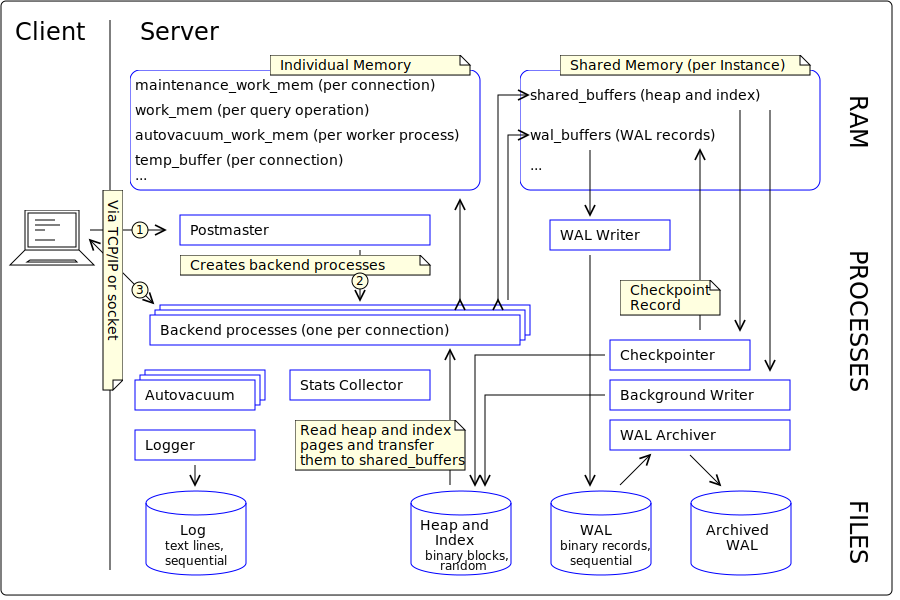

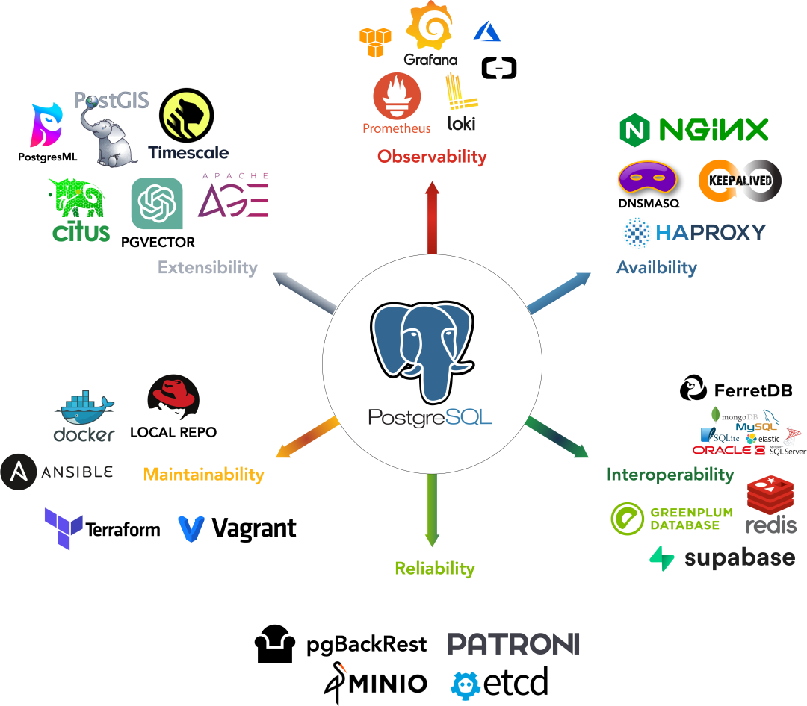


## redis


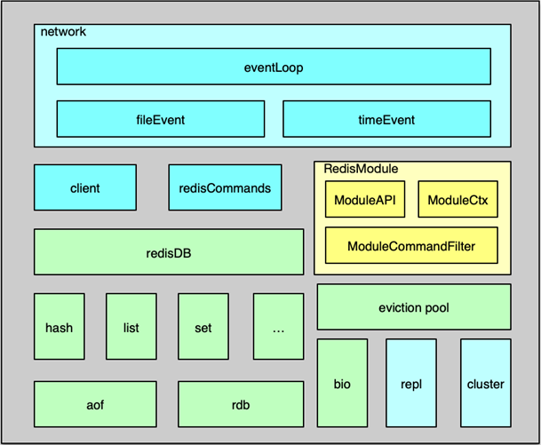
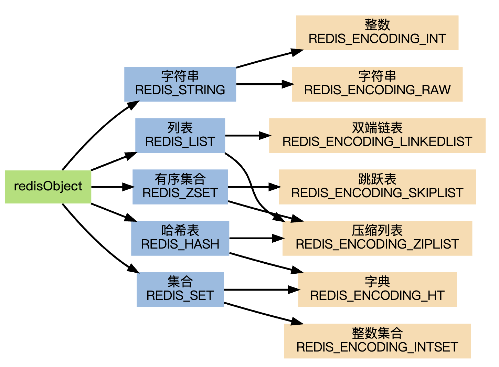


