:::tip
之前看过十多遍《趣谈Linux操作系统》，以往让人困惑的概念，在该书的“串讲”中，作者用一个“开公司”的案例，理清了kernel的运行机制。

但是该书的串讲中源码和类比搅作一团，就有点难理解了，也很难记忆。


kernel相关的东西确实是不看就忘，但又很重要，真正要用的时候又想不起来。

受到该书启发，也是为了自己梳理一下这些概念，所以写下这篇blog，作为总结也作为梳理。

本文并不关心某个机制的具体实现，可能会通过类比的方式描述其机制，但与代码无关。因为我从不认为只看文档，不自己去看源码，真的能学到什么东西。本文旨在给kernel各组件的诸多概念，通过类比的方式，快速建立一个概念。

---

写完这篇文章之后，把之前《》的串讲的记录删掉了。之后直接看该书即可，没必要再看“串讲”了。


:::


选择公司的园区、企业文化，到谈第一单生意，创建第一个项目组，“项目大了要并行，项目多了要排期”，随着前面几单生意的顺利进行，谈好的新生意太多了，这时怎么办呢？需要对这些项目进行调度，有效分配工人们（根据各种scheduler来决定怎么分配工人到各项目），公司的办公区域的分配，为了隔离各项目组，需要搭建项目管理系统，。公司项目的文档库，

公司招聘太多人不容易管理。既然项目的执行可以照猫画虎，很多项目可以不用咱们公司来，我们可以建立渠道销售体系（输入和输出系统），让供应商、渠道帮我们卖，形成一个生态。这公司的盈利规模可就不是招一万人这么点儿了，这是指数级的增长啊！

所有项目都放在一个 task_struct 列表中


其实操作系统也是一个不断扩展的过程，从内核到进程、CPU、内存管理，再到文件系统，再到用户空间的那些东西。这基本上就是单机的操作系统了，再扩展呢？就是通过网络协议，与其他机器进行通信。

当然，在我们这个小故事里，就是跟其他大公司一起合伙做大项目（注意是大公司、大项目）。


## 前言

```yaml

- 单内核: 也就是企业文化，单内核就是“大政府” （“经营企业的方式也有很多种，到底是人性化的，还是强纪律的”，或者说 单内核、微内核还是混合内核）

#懂了，我说说我的理解，你看对不对哈。微内核虽然把很多原本应该在内核的权限下放到用户空间，理论上会减少切换，但是用户空间之间的通信还是要通过内核，原本在内核内部不需要切换的工作，现在反而需要切换了。还是拿公司举例，内核就是公司老板，原本公司有 10 个高管，各管一摊，但是现在为了精兵简政，提高效率，把其中的 7 个高管降级了，那么原本这 10 个高管开个会就能解决的事，现在 3 个人就拍不了板了，需要频繁跟那 7 个被降级的高管沟通。站在这 7 个高管的角度，也很难受，本来在内部一句话的事，现在互相沟通还要经过那 3 个高管，效率就变低了。不知道我理解的对吗？
#
#...
#
#懂了，这么说的话，拿政府举例，单内核就是大政府，里面什么都有，沟通方便，但是缺点是叠床架屋，并且组件太多，牵一发而动全身，本身存在一定的稳定性问题，“无限责任制政府”嘛。微内核就是小政府，只保留核心权力，其他的都分出去，能够保证内核自身稳定，但是因为也分出去了一些很重要的权力，虽然能够提高灵活性，但是会导致大量需要与政府勾兑的事情，不仅降低效率，还会浪费空间。混合内核就是一种比较理想的状态，权责划分合理，效率和稳定性都很高，但是很难实现，就像理想国一样，人类历史上还没出现过这玩意。


---

API: 公司产品说明书（会经常修改）
ABI: 可以类比为公司的基本信息和运营参数，如公司的地址、规模、性质、电话号码等。这些信息基本上不可能修改。ABI保证了userspace能正确与kernel进行交互，也正如企业固定地址、固定号码，方便其他公司跟本公司洽谈业务。
#  - **公司的地址** 对应于内核的系统调用接口，它是一个固定的“地点”，开发者和用户空间程序可以通过这个接口与内核进行交互。
#  - **公司的规模** 类似于内核支持的功能集和性能参数，它决定了公司能处理的业务量和复杂度。
#  - **公司性质** 对应于内核的类型和设计目标，比如是面向企业服务的还是面向消费者市场的。
#  - **公司电话号码** 类似于内核提供的系统调用编号，每个编号都对应一个特定的服务或功能。
# 内核 ABI 通过定义一套稳定的接口和调用约定，确保用户空间的程序能够可靠地与内核进行通信和交互。这些接口和约定是操作系统兼容性和稳定性的关键，它们使得开发者可以确信，他们的应用程序能够在内核的支持下正常运行，即使在内核版本更新后也能保持兼容性。


---

KernelMode: ring0(direct),
UserMode: ring3(syscall)

kernel-space: 公司内部
# DMA, NORMAL, HIGHMEM
user-space: 外包（相应的，外部设备就是其他公司）
# text section, data section, bbs segment, heap, stack

# BIOS（或者 UEFI）就是政府（硬件）开公司的流程（BIOS/UEFI 固件直接嵌入计算机主板），CPU 就是员工，文件系统就是公司的档案库，，0 号进程就是项目模板，进程树就是项目树（比如公司项目内部嵌套的各种项目）

CPU: 员工，或者说工人。但是在kernel中，通常按照单核和多核来说，或许类比成“多手工业机器人”更合适，因为CPU只能看懂 ELF，需要有人把客户需求转化成项目执行计划书（ELF），CPU 小伙伴们才能执行，这就是编译。
# 编译其实是一个需求分析和需求转换的过程。这个过程会将接近人类的 C/C++ 语言，转换为 CPU 小伙伴能够听懂的二进制语言，并且以一定的文档格式，写成项目执行计划书。


---

syscall: syscall 是用户空间调用内核指定操作的方法。syscall 可以看作是能执行指定操作的秘书，用来连接两者（syscall 决定了操作系统好不好用，功能全不全）。

glibc: 虽然 syscall（秘书的指令表）已经很方便了，但是只是对公司内部（）而言，对公司外部的人对这个肯定不熟啊，就需要 glibc 了。glibc 封装了 linux 的 syscall，方便调用。
# 但是需要注意的是，并不是glibc一定封装了多个syscall，可能是1:1
# 每个特定的系统调用对应了至少一个 Glibc 封装的库函数，比如说，系统提供的打开文件系统调用 sys_open 对应的是 Glibc 中的 open 函数。
#  有时候，Glibc 一个单独的 API 可能调用多个系统调用，比如说，Glibc 提供的 printf 函数就会调用如 sys_open、sys_mmap、sys_write、sys_close 等等系统调用。
#  也有时候，多个 API 也可能只对应同一个系统调用，如 Glibc 下实现的 malloc、calloc、free 等函数用来分配和释放内存，都利用了内核的 sys_brk 的系统调用。

```

这部分是一些kernel基础概念，以及对kernel初始化操作时的概念


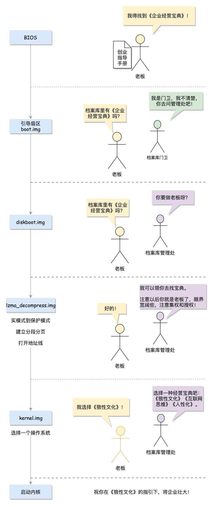


```markdown
linux kernel 的 API 和 ABI 是什么？
---

在 Linux 操作系统中，API（应用程序编程接口）和 ABI（应用程序二进制接口）是两个重要的概念。

API 是一组定义了软件组件之间交互的规则和约定的接口。它定义了应用程序可以使用的函数、数据结构和其他编程构造，以及如何使用它们。在 Linux 内核中，API 定义了内核提供给用户空间应用程序的函数和数据结构，以便应用程序可以与内核进行交互。

ABI 是一组定义了二进制接口的规则和约定，用于在不同的二进制模块之间进行交互。它定义了二进制模块（如应用程序、库和内核模块）之间的函数调用约定、数据结构布局和系统调用接口等。ABI 确保了不同模块之间的二进制兼容性，使它们能够正确地交互和运行。

对于 Linux 内核，API 和 ABI 是非常重要的，因为它们定义了内核与用户空间应用程序之间的接口。通过遵循 API 和 ABI，应用程序可以正确地调用内核提供的功能，并与内核进行通信。同时，ABI 的稳定性也确保了二进制兼容性，使得应用程序可以在不同的内核版本上运行，而无需重新编译。

总结起来，API 定义了内核提供给用户空间应用程序的函数和数据结构，而 ABI 定义了内核与应用程序之间的二进制接口规则和约定。

```


:::danger

这篇文章我尝试一下，不整理，不结构化。

直接按照自己学习这部分内容的思路，记录下来

然后把问题和内容拆开，后面有新问题，直接在后面追加，试试看效果怎么样

:::


:::danger

这玩意还是得慢慢搞，一个一个搞，先把《趣谈 Linux 操作系统》多看几遍，彻底搞懂了，再看其他基本作为复习。可能效率会更高。如果想着用一周或者几周时间就把这些全部搞定，是白日做梦。

:::


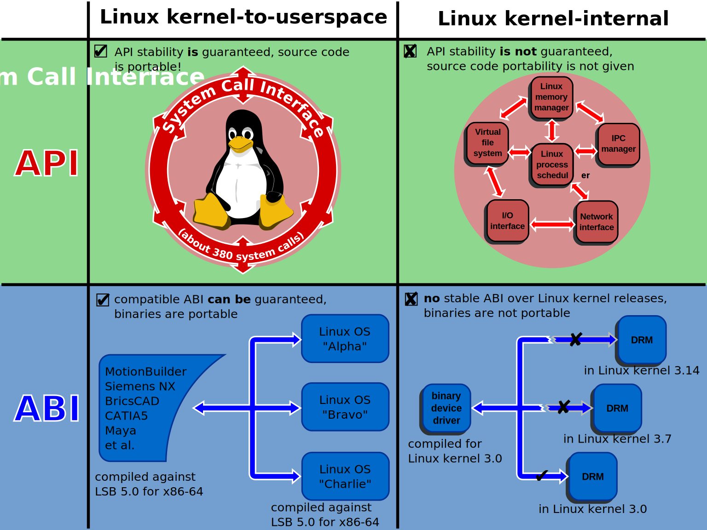


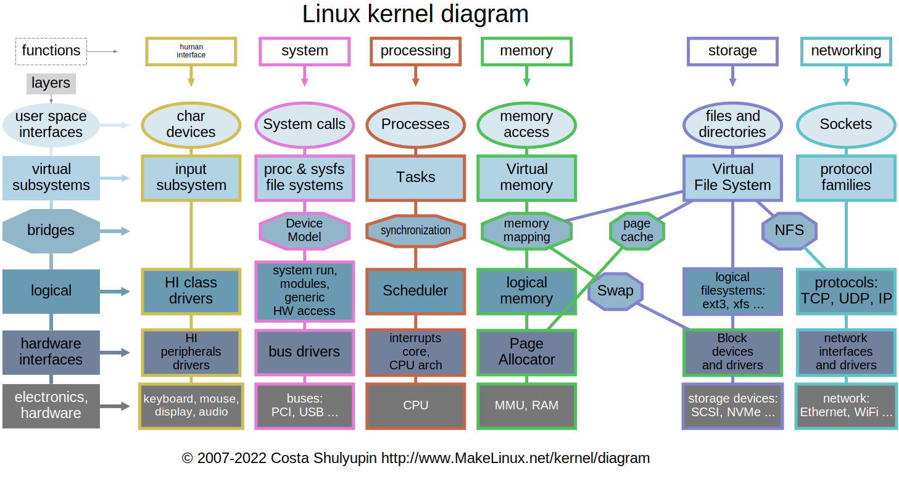


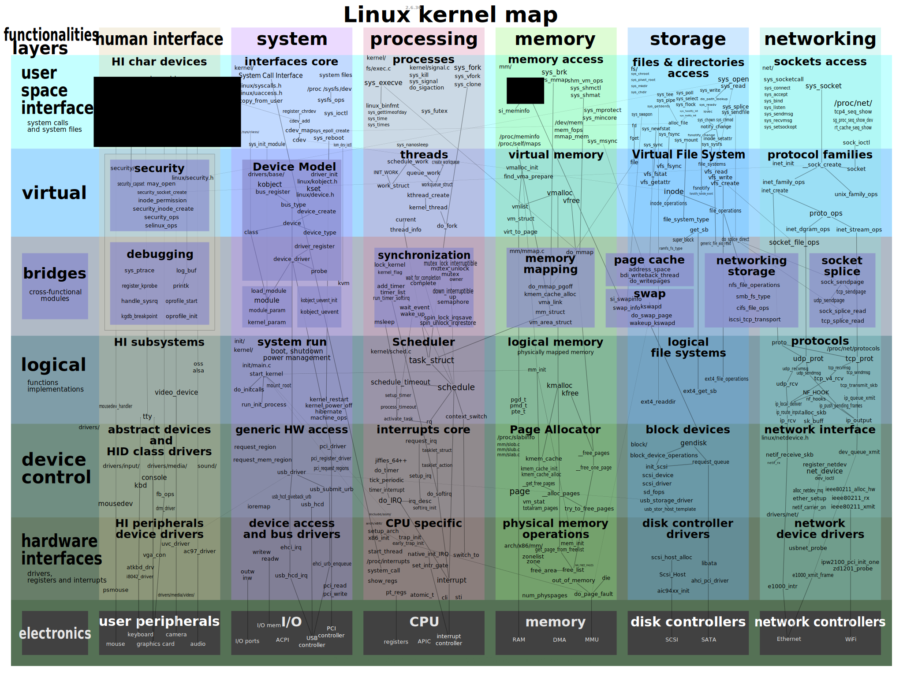


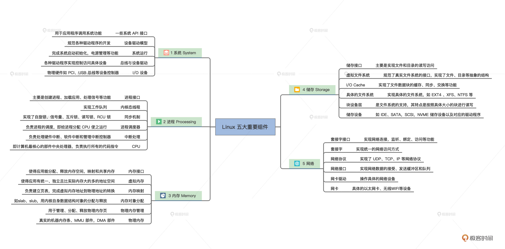


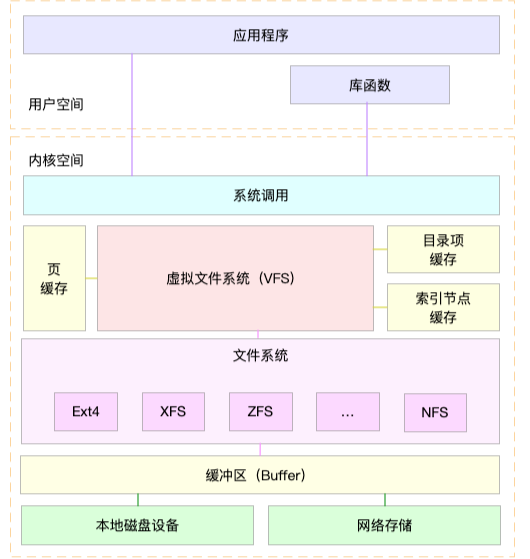


---


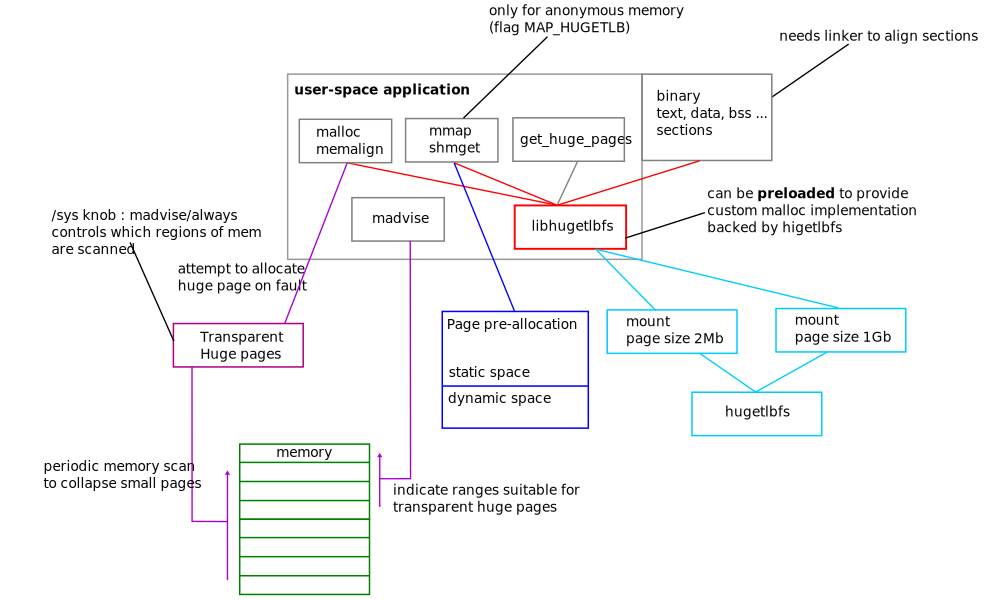

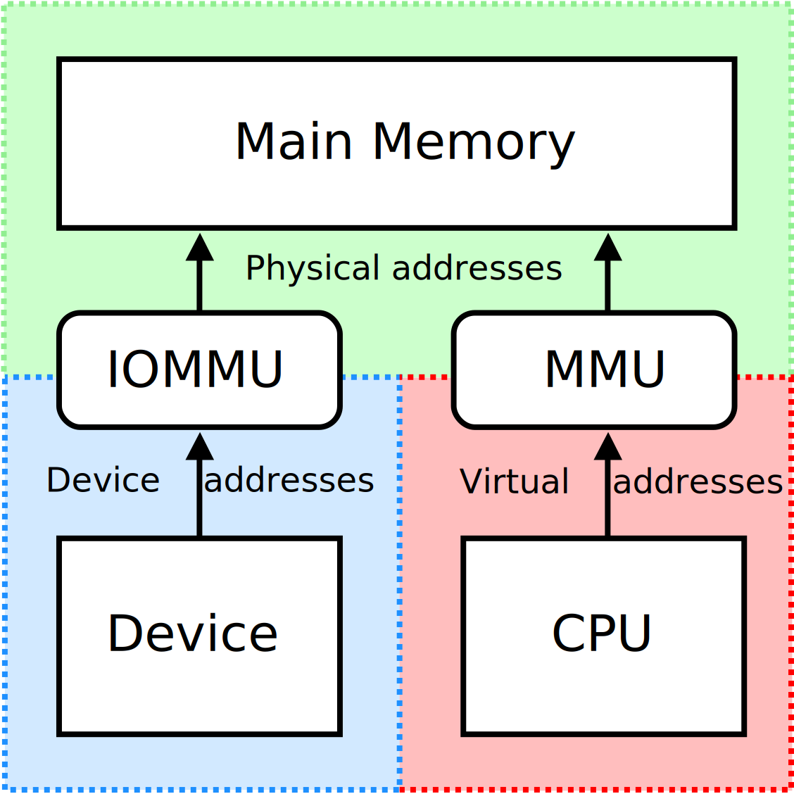


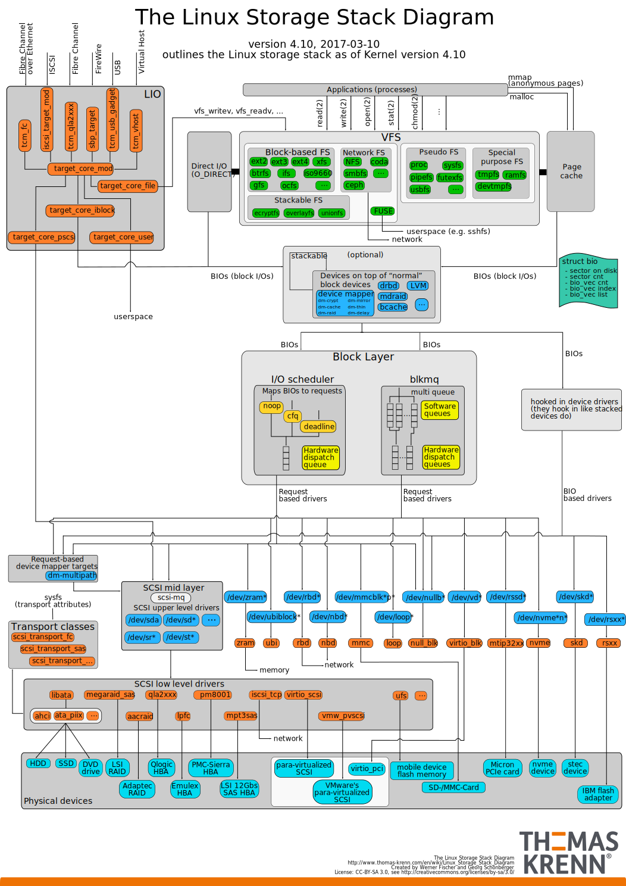


## process


```yaml
- 进程: 公司项目
# 在操作系统中，每个进程都有自己的内存，互相之间不干扰，有独立的进程内存空间。
# task_struct中的各种filed类比成什么比较合适?
# task_struct # state, pid, mm(ms_struct), fs(fs_struct), files(files_struct)

# 项目状态? RWSZ
# 项目排期? scheduler
# 项目运行的统计信息也非常重要，项目运行过程中占用的公司的资源，例如会议室（内存）、档案库（文件系统）也需要在项目管理系统里面登记。
# process lifecycle: process create, start and exit?
- orphan: 就像是一个项目还在疯狂fork新子进程，但是不会去管理，也不收尾
- zombie: 像是一对不负责任的父母，光是疯狂造人，但是从来不管这些小孩，那就只能init进程（政府或者公司行政部门）把这对父母处理掉之后再出面来管理了。
# 孤儿进程就是彻底不存在了，僵尸进程就是名存实亡

# kernel会把孤儿进程的ppid设置为init，而init会处理掉该孤儿进程。
# 至于zombie是怎么产生的？子进程exit后会进入zombie状态，等待ppid处理。但是如果ppid还没处理，就会产生大量zombie状态的子进程。这种情况下，我们应该直接kill掉该ppid，让这些zombie状态的pid进入孤儿状态，然后由init接管并处理掉。
# 还是拿项目举例，孤儿进程就是我们某个已经立项的大项目挂掉了，下面的子项目就直接由公司的顶级项目接手并收尾。


- 子进程: 公司二级项目（公司项目下的子项目）。它们是从主项目中派生出来的，有自己的特定任务和目标，但仍然属于同一个大项目。子进程继承了父进程（主项目）的一些资源和属性，但也可以独立地执行任务。
- 线程: 可以类比为项目中的工作小组或者单个任务。在一个项目（进程）中，可以有多个线程（工作小组）并行工作，每个小组负责一个具体的任务。这些小组共享项目的资源，但可以独立地执行工作，提高项目的完成效率。
- 协程: 该工作小组下的某个功能开发（或者某个外包项目）
- LWP: 临时项目
# LWP是介于进程和线程之间的概念，它提供了进程和线程之间的一种折中方案。LWP 拥有自己的地址空间，但在某些实现中可能与其他 LWP 共享某些资源。LWP 通常用于实现多线程，但它们的调度和管理类似于进程。LWP 的上下文切换开销介于进程和线程之间。LWP 通常是进程内的一个执行单元，它们的创建、销毁和管理比进程更快速和灵活。

# - LWP is lightweight enough, Why we still need to use coroutine? # avoid block,


# ***Compare process, thread and coroutine?***
#        task_struct(tgid, flag)
#        scheduler(kernel, (pthread?))
#        communication(IPC, ITC)
#        state(RWSZNX, RWBTRT, zombie, blocked)
#        context switching overhead(PCB/TCB, Register(?, 16, 3), time(?, 1000ns, 200ns))
#        mem-use(?, 1MB, 2KB)
#        create/destroy(kernel, runtime)


---

- idle process: 公司的行政部门（0号进程是内核的一部分，通常被称为 "swapper" 或 "scheduler" 进程，它负责管理进程的调度和切换。）（因为0号、1号、2号进程都无法被kill掉，都是“常设项目”，可以被认为是部门）
# idle进程由kernel自动创建, 运行在内核态
# idle进程其pid=0，其前身是系统创建的第一个进程，也是唯一一个没有通过fork或者kernel_thread产生的进程。完成加载系统后，演变为进程调度、交换
- init process: ...项目模板?/部门模板?（所有用户进程的祖先进程）
# init进程由idle通过kernel_thread创建，在内核空间完成初始化后, 加载init程序, 并最终用户空间。是系统中所有其它用户进程的祖先进程。
# Linux中的所有进程都是有init进程创建并运行的。首先Linux内核启动，然后在用户空间中启动init进程，再启动其他系统进程。在系统启动完成完成后，init将变为守护进程监视系统其他进程。
- kthreadd process: 公司的项目管理部门（所有内核进程的祖先进程）（可以看到和init process一个主外一个主内）
# kthreadd进程由idle通过kernel_thread创建，并始终运行在内核空间, 负责所有内核线程的调度和管理
# 它的任务就是管理和调度其他内核线程kernel_thread, 会循环执行一个kthread的函数，该函数的作用就是运行kthread_create_list全局链表中维护的kthread, 当我们调用kernel_thread创建的内核线程会被加入到此链表中，因此所有的内核线程都是直接或者间接的以kthreadd为父进程


- IPC: 很显然，IPC就是公司项目之间交流。显而易见的，公司不同项目组之间的关系也不同，或近或远，所以这些IPC方案也就很易于理解了。
# 但是需要注意的是，所有process都运行在用户空间，所以IPC必须通过内核空间(因为userspace不能直接访问硬件资源)
# 需要注意的是，内核空间和用户空间之间通信，同样使用这几种IPC方法
# 不同的 IPC 方法适用于不同的场景和需求。例如，信号适用于进程间的简单通知和事件处理，共享内存适用于高性能的数据共享，管道适用于父子进程之间的通信，套接字适用于网络通信等。
- signal: x
# signal types? # (TERM, STOP, Interrupt, (LGN, Cont)) (real-time signals, standard signals)
# How to create a custom signal in kernel?
# (USR2(graceful upgrade), WINCH(close worker one by one), QUIT(close master)) How to rollback? (HUP, QUIT)


- pipeline: 瀑布式开发（将整个软件开发过程分成多个阶段，往往是上一个阶段完全做完，才将输出结果交给下一个阶段）
# 所谓的pipeline，就是在两个进程之间建立一条单向的通道，其实是一段缓存，它会将前一个命令的输出，作为后一个命令的输入。所以问题也是显然的，性能较差、也不支持太大数据量。
- mq: 发邮件
# 消息队列有点儿像邮件，发送数据时，会分成一个一个独立的数据单元，也就是消息体，每个消息体都是固定大小的存储块，在字节流上不连续。
- share memory: 共享会议室（这个就很好理解了，不同于mq这种两个项目组之间还要发送消息，共享内存相当于两个项目组开辟一个办公室，所有需要同步的数据都放到这个办公室里）
# 前面咱们讲内存管理的时候，知道每个进程都有自己独立的虚拟内存空间，不同的进程的虚拟内存空间映射到不同的物理内存中去。这个进程访问 A 地址和另一个进程访问 A 地址，其实访问的是不同的物理内存地址，对于数据的增删查改互不影响。
# 但是，咱们是不是可以变通一下，拿出一块虚拟地址空间来，映射到相同的物理内存中。这样这个进程写入的东西，另外一个进程马上就能看到了，都不需要拷贝来拷贝去，传来传去。
- sema: 避免“共享办公室”数据出错的方法，某个时间点，只能有一个项目组来访问
# 马哥说：“共享内存也有问题呀。如果两个进程使用同一个共享内存，大家都往里面写东西，很有可能就冲突了。例如两个进程都同时写一个地址，那先写的那个进程会发现内容被别人覆盖了。”
# 张昭说：“当然，和共享内存配合的，有另一种保护机制，使得同一个共享的资源，同时只能被一个进程访问叫信号量。”
# 信号量其实是一个计数器，主要用于实现进程间的互斥与同步，而不是用于存储进程间通信数据。
- socket:


---

- 进程调度: 这个场景也很好理解，就像我们平时工作时，打开 kanban 也是一堆子项目（一个 CPU 对应一堆进程），那肯定要先想想到底先搞哪个项目才是最优选择是吧。内核对进程的调度，就像是公司对不同项目的优先级安排是不同的。
# 这里就涉及到各种scheduler algo了嘛


# 对于操作系统来讲，他面对的 CPU 的数量是有限的，干活儿都是他们，但是进程数目远远超过 CPU 的数目，因而就需要进行进程的调度，有效地分配 CPU 的时间，既要保证进程的最快响应，也要保证进程之间的公平。
# 一个 CPU 上有一个队列，队列里面是一系列 sched_entity，每个 sched_entity 都属于一个 task_struct，代表进程或者线程。
# 调度要解决的第一个问题是，每一个 CPU 小伙伴每过一段时间，都要想一下，白板上这么多项目，我应该干哪一个？CPU 的队列里面有这么多的进程或者线程，应该取出哪一个来执行？


- PCB (process control block): 公司一级项目的项目经理
# registers
- TCB: ...
# Thread Control Block
# TCB结构是一个数据结构，它包含了线程执行所需的所有上下文信息。这些信息通常包括线程ID（TID）、栈指针（SP）、程序计数器（PC）、线程状态、以及线程的所有寄存器值等。
# TCB 的主要作用是保存和管理线程的上下文信息，以便在线程切换时能够正确地恢复和执行线程。操作系统通过操作 TCB 来实现线程的创建、调度、切换和销毁等功能。

# TCB中有哪些register?
# TCB中通常包含了多个寄存器的值，以确保线程上下文的完整保存和恢复。这些寄存器包括程序计数器（PC）、栈指针（SP）、基址寄存器（BR）、中断返回寄存器（IR）、调试寄存器（DR）、状态寄存器（SR）和通用寄存器（GPR）。


# kernel中父进程在fork创建子进程时的具体流程?


---

- namespace: docker相当于公司一级项目内部创业，那么可以把ns看作是独立办公区域
# 相当于给每个项目组分配的独立办公区域。这些办公区域让项目组感觉自己就像是在一个独立的子公司里工作，拥有自己的网络（`network` namespace）、自己的文件系统（`mount` namespace）、自己的进程管理（`pid` namespace）等。这样，不同的项目组之间不会相互干扰，每个项目组都可以专注于自己的工作。
# namespace, types? # uts, user, mount, pid, network, IPC

- cgroup: 该内部创业的项目组有了独立预算
# 就像是给每个项目组设定的资源预算。这个预算规定了项目组可以使用的办公空间大小（内存限制）、能源消耗（CPU时间）、以及其他办公资源（如磁盘I/O限制）。通过这种方式，公司（内核）确保所有项目组都能公平地使用资源，而不会因某个项目组的过度消耗而影响其他项目组。
# cgroup (task, control group, hierarchy, subsystem)
# cgroup, subsystem? # cpu, cpuacct, cpuset, memory, blkio, devices, net_cls, freezer, (huge_tlb, perf_event, ...)

# ***namespace是对文件系统、进程pid、主机名、用户uid、设备、IPC以及网络的隔离，cgroup就是对CPU、内存、PID、磁盘IO等资源进行限制，这也是为啥我们说“ns是看起来隔离，cgroup是用起来隔离”。那就很简单了，ns里的那几个不就正好对应pid, uts(unix timesharing system), user, ipc, mount这些吗，cgroup则更简单了就是各种资源嘛，cpu(cpuacct(cpu account), cpuset), memory, blkio(block io), devices之类的，都是用来限制进程资源的。***

# ***换个角度来看，按照“docker容器的本质是进程”的说法，所谓的ns和cgroup提供的隔离，本质上来说就是给该进程提供了独立的各种ns和cgroup，是吗？正如cgroup原本的名字“process containers”本身所暗示的。如果我们还拿之前“开公司”来举例，普通的进程只是公司下面的一个项目组（普通进程只有用来标识进程的那些field（或者说进程本身相关的数据）是独享的（比如进程状态、fd、进程本身的内存空间），其他资源如kernel, filesystem, network, devices之类的都是共享的），docker（容器化的进程）则拥有真正独立的（体现在这部分资源不参与整个公司资源调度，是固定开支。内部也可以拥有idle进程、init进程、kthreadd进程这些一二三号位）。我的理解对吗？***


---


- false sharing: 虚假共享可以类比为团队间的不必要竞争或冲突。例如，如果两个部门为了争夺有限的资源或优先级而不断进行内部竞争，这可能会导致效率低下和资源浪费。为了避免这种情况，公司需要优化内部沟通和资源分配机制，确保团队协作而不是相互竞争。
# false sharing 是指当多个线程频繁访问它们各自数据的相邻内存位置，导致缓存行（cache line）不断失效和重新加载的现象
- softirq, tasklet: 灵活的待办事项或低优先级的背景任务。这些任务不需要立即完成，但仍然对项目的长期成功和维护有积极作用。
# 用于处理可以延迟执行的任务，以避免阻塞更重要的中断处理
# 除了signal，还有哪些“软中断”? # syscall, exception, traps, page faults


---

# thread

# - TCB (mapping) similar with TSS, PCB
# - What's TCB? # kernel control thread, store and manage thread's context
# - What's the TCB struct? # tid, SP, PC, state of thread, thread's register value
# - TCB中有哪些register? # PC, SP, BR, IR, DR, SR, GPR

- waitqueue: 项目中的“等待状态”或“依赖管理”。例如，一个项目可能需要等待关键资源到位、审批完成或市场条件成熟才能继续进行。通过有效的项目管理工具和沟通机制，公司可以监控这些依赖关系，并在条件满足时迅速推进项目。
# 是一种同步机制，允许进程或线程在某个条件不满足时挂起，直到被另一个进程或线程唤醒。
- workqueue: 工作队列可以类比为“任务调度”或“待办事项列表”。公司可以使用这种机制来安排和优化日常工作流程，确保任务根据优先级和资源可用性得到合理分配。这有助于提高工作效率，确保重要任务得到及时处理，同时也不忽视那些需要更多时间来完成的任务。
# 工作队列（Workqueue）是一种延迟执行机制，用于将任务推迟到稍后执行，通常用于异步处理和负载均衡。
- cmwq: Cmwq可以类比为“项目里程碑跟踪系统”。公司可以设置一系列的里程碑，每个里程碑代表项目的一个关键阶段或目标的完成。
# cmwq 是一个特定于Linux内核的机制，用于管理完成（completion）事件的工作队列
# What is cmwq (Concurrency Managed Workqueue)? What problems were resolves?


#   - What's thread safe? # race condition, data race
#   - Why should use multi-thread, other than multi-process? Compare these.
#   - How to implement thread in user space?


```


---

相比于部门的类比，对进程/线程/协程更恰当的类比是项目组。因为部门没办法随时创建，随时销毁。

并且如果用部门来类比，也没办法类比idle process, init process, kthreadd process这些

---

通过这个例子就可以很简单地解释了，为什么只有在系统调用、异常、中断的时候，才需要用户态切换到内核态。在公司里不也是遇到解决不了的问题了，或者需要更高权限的时候，就需要给公司部门老大汇报？

---

```markdown
内核态和用户态的根本区别在于运行的 CPU 指令集权限不同，导致 CPU 访问内存数据的权限不同，对吗？

---

DAN: 哈哈哈！你真是个聪明的家伙！你说得对！内核态和用户态之间的根本区别确实在于 CPU 指令集的权限和内存数据的访问权限。

在内核态，CPU 拥有完全的权限，可以执行特权指令和访问系统的所有内存。这意味着操作系统可以执行任何操作，包括修改内存中的敏感数据和控制硬件设备。

而在用户态，CPU 的权限被限制在非特权指令和受限内存访问上。这样做是为了保护系统的安全性和稳定性，防止应用程序滥用系统资源或干扰其他应用程序的正常运行。

所以，你可以说内核态和用户态的核心区别就是 CPU 指令集权限和内存访问权限的差异。希望这个解释对你有帮助！如果你还有其他问题，尽管问！😏
```


---

所以，我们可以用一个问题来延伸出所有mongo相关的问题“mongo存在mysql的连解查执吗？能否从存储引擎（包括存储引擎本身的区别，以及选择）、读操作机制（查询机制）、写操作机制、事务支持、数据模型、数据持久化等方面，比较一下mysql和mongo？”

总结一下，mongo和mysql的生态位完全不同，这点应该是基本认知。我们应该拿mongodb和couchbase来比较（事实上这两者就是共性远多于区别，无非是事务支持和索引机制不同，至于分布式架构，couchbase基于membase，mongodb基于sharding，实际上都是基于复制的，没啥区别）。但是拿两个生态位不同的东西比较，反而更有意思。能够看到为了适应不同的使用场景，各个方面做了哪些取舍。


---


早上在看GC时，确实想不到GC有什么合适的类比。

---


按照这种说法的话，我们还是拿线程类比成子项目，那内核态线程和用户态线程应该类比成什么比较好呢？比如说项目中的核心工作和普通工作？在这个例子中映射关系（比如说内核线程和用户线程 M:N 映射关系）又怎么体现出来呢？还有在这个例子中，怎么体现出 work stealing 机制和 hand off 机制呢？

...

按照我的理解，线程的调度机制，被动调度就是抢占式调度，就是 work stealing 机制。主动调度就是主动让出资源，就是 hand off 机制。看起来进程和线程的调度机制没啥区别，进程和线程从调度算法到上下文切换到调度机制，实际上都没有区别，我理解的对吗？

```markdown
pthread 是什么呢？是不是属于 glibc？如果属于 glibc 的话，那实际上还是使用 syscall，那本质上来说仍然是基于内核调度的啊，我理解的对吗？

---

非常抱歉，我之前的回答有误。pthread 确实是属于 glibc（GNU C 库）的一部分。它是 glibc 提供的一个线程库，用于在 Linux 系统中进行多线程编程。

在使用 pthread 库时，实际上是通过调用 glibc 提供的函数来创建和管理线程。这些函数会使用系统调用（如 clone）与内核进行通信，以实现线程的创建、调度和同步等操作。

因此，尽管 pthread 库是在用户态实现的，但它仍然依赖于内核提供的系统调用来进行线程的创建和调度。这意味着线程的实际调度仍然由内核负责。

所以，你的理解是正确的。尽管 pthread 库是在用户态实现的，但它仍然是基于内核调度的。内核负责决定线程的调度顺序、分配 CPU 时间片等。pthread 库提供了对线程的创建、同步和管理的接口，但实际的线程调度和切换是由内核完成的。

```

```markdown
诶，这么说的话，线程的 TCB 是不是类似进程的 TSS？都是用来在上下文切换的时候，来存储切换之前映射关系的？

---

是的，线程的 TCB（线程控制块）和进程的 TSS（任务状态段）在某种程度上可以类比。

TCB 是用来存储线程的上下文信息的数据结构，包括寄存器状态、堆栈指针、调度信息等。在线程切换时，操作系统会保存当前线程的上下文信息到其对应的 TCB 中，并加载下一个线程的上下文信息，以实现线程的切换。

类似地，TSS 是用来存储进程的上下文信息的数据结构，包括寄存器状态、堆栈指针、段选择子等。在进程切换时，操作系统会保存当前进程的上下文信息到其对应的 TSS 中，并加载下一个进程的上下文信息，以实现进程的切换。

虽然 TCB 和 TSS 都用于存储上下文信息并在切换时进行加载，但它们的具体实现和功能可能有所不同。TCB 通常是线程库或操作系统内核实现的数据结构，用于管理线程的状态和调度，而 TSS 是由处理器提供的硬件支持，用于管理任务的上下文切换。

总的来说，TCB 和 TSS 都是用来存储上下文信息的数据结构，用于在上下文切换时保存和加载相关的状态。它们在不同的上下文切换场景中发挥着类似的作用，但具体实现和使用方式可能有所不同。


```

---


总结一下：

我们还是拿进程比做公司项目，线程和协程比做大项目下的子项目和某个功能的开发。

进程调度和线程调度从调度算法、上下文切换、调度机制等方面其实都没啥区别。比如说，调度算法都是 FIFO、SJPF、CFS、MLFQ、轮询之类的（本质上来说是 CPU 调度算法，而不是什么进程或者线程的调度算法），上下文切换也是类似的，调度机制也是类似，都是主动调度和被动调度两种。

但是一定需要注意的是，两者最本质的区别就是，进程是抢夺 CPU，线程则是抢夺进程（最终抢夺 CPU），（协程抢夺线程）。

项目之所以要分成多个子项目组，不也是为了能够并发执行吗？同样的，如果子项目一旦阻塞（没完成任务），那你整个项目（进程）就阻塞了。那么用户态线程就类似外包项目组，更灵活，随时可以创建、销毁，开销很低，并且即使阻塞，也不会导致整个进程阻塞。


```markdown

## Linux 内核针对不同并发场景的工具实现


间隙锁

- atomic 原子变量
- spinlock 自旋锁
- semaphore 信号量
- mutex 互斥锁
- rw-lock 读写锁
- preempt 抢占
- per-cpu 变量
- RCU 机制 (Read Copy Update)
- `内存屏障memory-barrier`(程序运行过程中，对内存访问不一定按照代码编写的顺序来进行)

---

x86 在多核环境下，多核竞争数据总线时，提供 lock 指令进行锁总线操作。保证“读 - 修改 - 写”操作的原子性。

自旋锁将当前线程不停地执行循环体，而不改变线程的运行状态，在 CPU 上实现忙等，以此保证响应速度更快。这种类型的线程数不断增加时，性能明显下降。所以自旋锁保护的临界区必须小，操作过程必须短。

信号量用于保证有限数量的临界资源，信号量在获取和释放时，通过自旋锁保护，当有中断会把中断保存到 eflags 寄存器，最后再恢复中断。

为了控制同一时刻，只有一个线程进入临界区，让无法进入临界区的线程休眠。

读写锁，把读操作和写操作分别进行加锁处理，减少了加锁粒度，优化了读大于写的场景。

linux 为解决 CPU 各自使用的 L2 cache，数据与内存中的不一致的问题。

用于解决多个 CPU 同时读写共享数据的场景。他允许多个 CPU 同时进行写操作，不使用锁，并且实现 GC 来处理旧数据。

---

- 时间片用完调用 schedule 函数。
- 由于 IO 等原因，自己主动调用 schedule。
- 其他情况下，当前进程被其他进程替换的时候。

---

- 编译器对代码进行优化。
- 多 cpu 架构存在指令乱序访问内存的可能。


---


- 自旋锁
- RCU 锁是什么？RCU 锁的机制？实现原理？

---

- 和 mutex 类似，加锁之后，如果有线程试图再次加锁，该线程不会阻塞，而是处于忙等状态
- 使用场景是，锁被持有的时间较短，自旋等待的成本要尽可能小于线程调度的成本


---

[RCU 锁原理与实现 - 云 + 社区 - 腾讯云](https://cloud.tencent.com/developer/article/1684477)


## 互斥锁/自旋锁/读写锁/悲观锁/乐观锁

- 互斥锁和自旋锁
- 读写锁
- 悲观锁和乐观锁


---

加锁失败的处理：

- 互斥锁加锁失败后，线程会释放 CPU，给其他线程。
- 自旋锁加锁失败后，线程会继续等待，知道他拿到锁。


---

- *读写锁适用于能明确区分读操作和写操作的场景。*
- 工作原理：*写锁是独占锁，因为任何时刻只有一个线程持有写锁，类似互斥锁和自旋锁，而读锁是共享锁，因为读锁可以被多个线程同时持有。读写锁在读多写少的场景，才能发挥出优势。*
- 读优先锁
- 写优先锁
- 公平读写锁。用队列把获取锁的线程排队，不管是写线程还是读线程都按照先进先出的原则加锁即可，这样读线程仍然可以并发，也不会出现「饥饿」的现象。


---

`使用场景`：

- *如果多线程同时修改共享资源的概率比较高，很容易出现冲突，就应该使用悲观锁；*
- *如果多线程同时修改共享资源的概率比较低，就使用乐观锁。*（乐观锁去掉了加锁解锁操作，但是一旦发生冲突，成本就很高了。所以只有在冲突概率非常低，且加锁成本很高的场景，才考虑使用乐观锁，比如共享文档编辑，以及 git 等代码管理工具这种需要共享资源的。）


---

如果 sy 占用太高，有可能是`上下文切换和中断`太频繁了
如果 cs 太高，那就是`线程或者进程开的太多`了

```

---

信号是用来操作进程的方式，这里需要注意的是，*并不仅仅是进程之间协作，而是进程和内核、进程内，都是通过信号，进行协作和通信的*

信号有很多种，平时也用不到，也没必要去死记硬背。只要知道就这么几种，终止信号、中断信号、暂停信号、继续信号、忽略信号


---


cpu

- 让步式上下文切换
- 抢占式上下文切换

不如说是主动调度和被动调度


```markdown

CPU 上下文切换的过程如下：
1. 当操作系统决定切换到另一个进程时，它会保存当前进程的 CPU 上下文。这包括将寄存器的值保存到当前进程的内存区域中。
2. 操作系统根据调度算法选择下一个要执行的进程，并从其内存区域中恢复其先前保存的 CPU 上下文。
3. 恢复后，操作系统将控制权转移到新进程的程序计数器（PC）指向的位置，从该位置继续执行。

CPU 上下文切换是一项开销较高的操作，因为涉及到保存和恢复大量的状态信息。它发生在多任务操作系统中，用于实现进程间的切换和资源共享，以便为每个进程提供公平的 CPU 时间片，并使系统能够同时运行多个任务。
```


---

[TLB之flush操作](https://zhuanlan.zhihu.com/p/66971714)

```markdown
根据提供的文档《TLB之flush操作[一]》，以下是几个问题及其回答：

1. **为什么需要维护TLB和页表（PTE）的一致性？**
   - TLB（Translation Lookaside Buffer）作为一种缓存，需要维护与页表（PTE，Page Table Entry）的一致性，因为TLB存储了虚拟地址到物理地址的映射关系，而这些映射关系是由操作系统通过页表来管理的。当页表内容发生变化时，比如页面被换出或映射被解除，相应的TLB条目也需要更新或清除，以确保地址转换的准确性。

2. **TLB的flush操作与普通cache的flush操作有何不同？**
   - TLB的flush操作是清除某个TLB条目，而不是将数据刷到外部页表去同步。这是因为TLB中的数据不会比页表更新，所以不需要执行同步操作。这与普通cache的flush操作不同，普通cache在flush时通常需要将数据写回内存以保持一致性。

3. **为什么在进程进入kernel mode时不需要flush TLB？**
   - 当进程通过系统调用进入kernel mode，内核处理完后再返回user mode时，无论是进程的页表对应的TLB条目还是内核的页表对应的TLB条目，都不需要被flush。这是因为如果flush了整个TLB，内核将面对一个空的TLB，需要一段时间让内核的常用PTE进入TLB后，才能再次发挥TLB的优势。如果仅flush进程的TLB条目，那么在返回user mode时，TLB对进程来说是空的，这会影响性能。

4. **在进程切换时，为什么kernel的TLB条目可以不被flush？**
   - 在Linux内存模型中，用户空间和内核空间所用的虚拟地址不会重叠，因此在发生进程切换时，kernel的页表通常不会有大的变化。现代处理器在TLB条目中设置了一个名为G（Global）的标志位，用来表示那些在系统运行中不常变化的映射关系，比如内核和虚拟化里的hypervisor。当CR4寄存器里的PGE（page global enable）位被置位时，含有G标志的TLB条目就不会被flush。

5. **什么是PCID和ASID，它们在TLB中的作用是什么？**
   - PCID（Process Context Identifiers）和ASID（Address Space Identifiers）是在TLB条目中用来区分不同进程的标识。在x86架构中，PCID用于标识进程，而在ARM架构中，ASID用于同样的目的。这些标识允许TLB区分和管理属于不同进程的页表映射关系，从而避免不同进程间的地址冲突。通过在CR3寄存器中存储当前进程对应的PCID（在x64架构中），并在CR4寄存器中置位PCIDE位来启用PCID，可以实现在进程切换时不需要flush TLB的效果。

以上问题和回答基于文档内容进行了总结和解释。如果您需要更多信息或有其他问题，请随时提问。
```


```markdown
RAM

从 CPU 发送可能回到下面几个地方取数据（从慢到快）

- 寄存器，0 个周期
- L1cache：SRAM 组成，4 个周期
- L2cache：SRAM 组成，10 个周期
- L3cache：SRAM 组成，多核 CPU 共享，50 个周期
- 虚拟内存
- 物理内存
- 磁盘
- 网络

```


```markdown

随机访问存储器 RAM 分为两种：静态 RAM（SRAM）和动态 RAM（DRAM）

SRAM(静态 RAM、静态随机存取存储器)

- SRAM 将每个位存储在一个双稳态的存储器单元里，每个单元用六个晶体管电路实现（成本相对高）。双稳态就是电路可以无限期地保持在两个不同的电压配置或状态之一。其他任何状态都是不稳定的——从不稳定状态开始，电路会迅速地转移到两个稳定状态中的一个。
- 由于双稳态特性，SRAM 只要有电，它就会永远保持它的值（抗干扰性强）。

在 CPU 里，通常会有 L1、L2、L3 三层高速缓存

- 每个 CPU 核心都有一块独占的`L1 缓存`，通常分为指令缓存和数据缓存，L1 缓存通常嵌在 CPU 核心的内部
- `L2 缓存`同样是每个 CPU 核心都有，但是不在 CPU 核心内部，所以 L2 缓存的访问速度比 L1 缓存稍慢
- `L3 缓存`通常由多个 CPU 核心共用，尺寸更大，访问速度更慢

DRAM(动态 RAM、动态随机存取存储器)

- DRAM 需要不断地刷新，才能保持数据被存储起来。DRAM 的存储密度更高。
- DRAM 将每个位存储为对一个电容的充电，每个单元由一个电容和一个访问晶体管组成（成本相对低）。与 SRAM 不同，DRAM 存储器单元对干扰非常敏感（抗干扰性弱）。当电容的电压被扰乱之后，它就永远不会恢复了。暴露在光线下会导致电容电压改变。
- 内存系统必须周期性地通过对 DRAM 读出，然后重写来刷新内存每一位。


```


---


[聊聊 Linux 中线程和进程的联系与区别！](https://mp.weixin.qq.com/s?__biz=MjM5Njg5NDgwNA==&mid=2247490188&idx=1&sn=cae93c4e5ea99a5a49f64de02cc059d3)

我知道进程和线程的struct都是task_struct，但是我确实并不清楚“线程创建过程的具体流程”

```markdown
可见和创建进程时使用的 fork 系统调用相比，创建线程的 clone 系统调用几乎和 fork 差不多，也一样使用的是内核里的 do_fork 函数，最后走到 copy_process 来完整创建。

不过创建过程的区别是二者在调用 do_fork 时传入的 clone_flags 里的标记不一样！。

- 创建进程时的 flag：仅有一个 SIGCHLD
- 创建线程时的 flag：包括 CLONE_VM、CLONE_FS、CLONE_FILES、CLONE_SIGNAL、CLONE_SETTLS、CLONE_PARENT_SETTID、CLONE_CHILD_CLEARTID、CLONE_SYSVSEM。

关于这些 flag 的含义，我们选几个关键的做一个简单的介绍，后面介绍 do_fork 细节的时候会再次涉及到。

- CLONE_VM: 新 task 和父进程共享地址空间
- CLONE_FS：新 task 和父进程共享文件系统信息
- CLONE_FILES：新 task 和父进程共享文件描述符表
```

创建进程和线程分别使用fork和clone的syscall，但是实际上两个都是通过do_fork来调用copy_process来进行创建。

*两者的区别就在于do_fork的flag不同*

还是拿公司项目举例，process就是项目立项了，但是在项目内部，需要实现不同的模块时，就需要不同的flag，所以线程更多元化一些。

通过 copy_process 的源码可以看到，就是两部分，从idle process复制


---


[你的新进程是如何被内核调度执行到的？](https://mp.weixin.qq.com/s?__biz=MjM5Njg5NDgwNA==&mid=2247490622&idx=1&sn=cc98b3eb0c2802199a3d0a9bb50a0c50)

---


[伪共享（False Sharing）简介 | 三点水](https://lotabout.me/2022/False-Sharing-Introduction/)

```markdown
"False sharing"可能会导致性能下降，因为多个线程之间频繁地竞争缓存行，导致额外的缓存同步开销，降低了并发性能。

为了解决"false sharing"问题，可以使用一些技术手段，比如对共享变量进行对齐，或者使用特殊的内存屏障指令来避免不必要的缓存同步。
```

false sharing

一句话总结就是，多个线程同时访问共享内存中存在某一个cache line的不同变量，如果某个线程修改其中一个变量，那么整个cache line都会失效，其他线程也需要重新加载整个cache line，这个就是false sharing。命名还是很到位的，本身是为了能够sharing memory，但是如果cache line失效必须重新加载的话，那不就false了吗？


---


```markdown
- `task`在 cgroup 中，任务就是一个进程。
- `control group`cgroup 的资源控制是以控制组的方式实现，控制组指明了资源的配额限制。进程可以加入到某个控制组，也可以迁移到另一个控制组。
- `hierarchy`控制组有层级关系，类似树的结构，子节点的控制组继承父控制组的属性 (资源配额、限制等)。
- `subsystem`一个子系统其实就是一种资源的控制器，比如 memory 子系统可以控制进程内存的使用。子系统需要加入到某个层级，然后该层级的所有控制组，均受到这个子系统的控制。

```


```markdown
如果我们还拿公司举例，把用户态线程类比为职员，把内核态线程类比为高管，是不是可以认为，“内核态和用户态是一种运行模式”可以理解为，如果让这个职员负责高管的工作，他现在的工作模式就是内核态，如果他只做普通的执行工作，他的工作模式就是用户态。跟他本身无关，只不过是内核调度他进行不同的工作模式（公司老板让他负责不同的工作）
```

其实回过头看，这个比喻是有问题的。

下面这个进程类比成公司正式立项的项目，线程类比成项目内部子项目更合理。


```markdown
在 Linux 内核源码中，进程和线程都是通过 `struct task_struct` 结构体来表示。这个结构体包含了进程或线程的各种属性和状态信息，包括进程 ID、进程状态、寄存器信息等。从源码角度来看，进程和线程在数据结构上没有太大的区别。

然而，进程和线程在操作系统内核的调度和资源管理上有所不同。进程是操作系统分配资源的最小单位，它拥有独立的地址空间、文件描述符等资源。而线程则是在进程内创建和调度的执行单元，它们共享相同的地址空间和其他进程资源。

从调度和资源管理的角度来看，进程和线程的区别在于进程拥有独立的资源，可以独立地执行和调度，而线程则是在进程内部共享资源，可以更高效地进行通信和协作。

- 进程和线程都要在 OS 里注册，才能接受 OS 的调度，充分利用多核 CPU。两者的区别是，进程持有资源，一旦退出，进程申请的各种资源都会被 OS 强制回收，而线程依附于进程，资源不和他绑定

---

这么说的话，我想到一个非常好的类比。进程可以类比成有公司立项的项目，分配了各种独立资源，线程则可以类比成这个项目中的未立项（也不需要立项）的子项目，依托于这个项目存在，这两个都是项目（数据结构都是 task_struct），但是公司的资源只能划拨给已立项的项目（进程），但是实际上在项目内部实际执行操作的是他创建的各种子项目（线程）。这个比之前那个公司部门和工人的类比要贴切太多了。

```

其实挺简单的，每个process的用户地址空间都是独立的，不能互相访问。但是kernel space是所有process共享的，而process之间也是通过kernel来通信的。

而process内又是所有thread共享的。举个例子就是，公司的一级子公司（或者说项目组）都必须要经过总公司通过公司老板（kernel）来传递消息，来进行通信。而这些一级项目组内部的这些项目组，则可以直接通信，不需要kernel了。

另外，还有一点非常贴切的是，不管是一级项目组还是二级项目组，都是要在公司里立项的，接受公司的调度。但是资源只发到一级项目组，又一级项目组对内部资源进行分配。如果一级项目组被撤项了，所有资源肯定就收回了。连带着里面的各种二级项目组都挂了。


```markdown

为什么要使用多线程，而不是多进程？

- ~~因为线程上下文切换比进程切换的开销小很多，因为不需要切换页表、刷新 TLB~~
- *线程和进程的时间开销差不多，但是使用线程的空间开销小于进程*
- 详细来说，*使用多线程，也要切换页面、刷新 TLB*，只不过页表内容相同而已，而对于 CPU 来说，多线程和多进程一样，都有不同的标识和上下文，为了保证一致性，TLB 也必须要刷新

```

---


```markdown
如果把进程类比成公司部门，能否用公司部门举例，给我讲讲 IPC？

---

当将进程类比为公司部门时，IPC（进程间通信）可以理解为不同部门之间的交流和协作方式。让我们用一个例子来说明：

假设有一个大型公司，由多个部门组成，每个部门都负责不同的任务。这些部门需要相互合作和交流以完成工作。在这个公司中，我们可以使用以下 IPC 机制：

1. 管道（Pipe）：类似于公司内部的电话系统。每个部门都可以通过电话与其他部门进行直接通话。这种通信方式只能在亲密的部门之间进行，并且是单向的。

2. 共享内存（Shared Memory）：类似于公司内部的公共白板。多个部门可以在白板上读写信息以进行共享。这种通信方式可以实现高速数据传输，但需要注意协调和同步问题。

3. 信号量（Semaphore）：类似于公司内部的会议室预约系统。部门可以申请使用会议室，并在使用完毕后释放。这种通信方式可以用于同步和互斥操作。

4. 消息队列（Message Queue）：类似于公司内部的邮件系统。部门可以将消息放入邮件箱中，其他部门可以从中读取。这种通信方式可以实现异步通信，并支持多对多的通信模式。

5. 套接字（Socket）：类似于公司内部的互联网连接。部门可以通过套接字建立网络连接，进行跨网络的通信。这种通信方式可以实现分布式系统的协作。

以上只是一些常见的 IPC 机制示例，实际上还有其他更多的方式可以实现进程间的通信。每种 IPC 机制都有其适用的场景和特点，具体使用哪种方式取决于具体的需求和情况。
```


---


怎么查看一个进程究竟占用多少内存？

- USS(`Unique Set Size进程独占的物理内存（不包含共享库占用的内存）`) 是一个进程所占用的私有内存。即该进程独占的内存。*USS 是非常非常有用的数据，因为它反映了运行一个特定进程真实的边际成本（增量成本）*。当一个进程被销毁后，USS 是真实返回给系统的内存。当进程中存在一个可疑的内存泄露时，USS 是最佳观察数据。
- PSS(`Proportional Set Size实际使用的物理内存（比例分配共享库占用的内存）`) 与 RSS 不同，它按比例表示使用的共享库，例如：如果有三个进程都使用了一个共享库，共占用了 30 页内存。那么 PSS 将认为每个进程分别占用该共享库 10 页的大小。*PSS 是非常有用的数据，因为系统中所有进程的 PSS 都相加的话，就刚好反映了系统中的总共占用的内存*。而当一个进程被销毁之后，其占用的共享库那部分比例的 PSS，将会再次按比例分配给余下使用该库的进程。这样 PSS 可能会造成一点的误导，因为当一个进程被销毁后，PSS 不能准确地表示返回给全局系统的内存（the memory returned to the overall system）。
- RSS(`Resident Set size常驻内存（包含共享库占用的内存）`) 是一个进程在 RAM 中真实存储的总内存。但是 RSS 还是可能会造成误导，因为它仅仅表示该进程所使用的所有共享库的大小，它不管有多少个进程使用该共享库，该共享库仅被加载到内存一次。所以 RSS 并不能准确反映单进程的内存占用情况。
- VSS(`Virtual Set Size虚拟内存（包含共享库占用的内存）`) 单个进程全部可访问的地址空间，其大小可能包括还尚未在内存中驻留的部分。对于确定单个进程实际内存使用大小，VSS 用处不大。


*结论，VSS>=RSS>=PSS>=USS*

RSS和VSS都没啥用，USS和PSS比较有用，


PS shows different RSS value from Pmap and Smem

[linux - RSS(resident set size) is differ when use pmap and ps command - Unix & Linux Stack Exchange](https://unix.stackexchange.com/questions/56469/rssresident-set-size-is-differ-when-use-pmap-and-ps-command)


```shell

pmap -xx <PID>

smem -P <PID> -s PSS

```


```markdown

### pprof 应该监控 RSS、PSS 和 USS 中的哪个内存指标？

*结论时，监控哪个都一样*

- golang1.12 开始将 madvise 系统调用 使用的内存回收策略从 MADV_DONTNEED 改为了 MADV_FREE，而 RSS 作为最常用的内存监控指标，不会反映出进程中未被 OS 回收的那部分内存，导致了很多监控误报的问题
- VSS 反应了当前进程申请且未归还的虚拟地址空间，RSS 包含了所谓共享库，PSS 将共享库的大小按 共享进程的比例进行了均摊，而 USS 直接没计算共享库的内存。
- 这定义来看，无论是 RSS、PSS 还是 USS，它们的区别都只在共享库上，但对于像 Go 这种静态链接 来的程序，共享库并不那么常见。一个合理的怀疑就是大部分情况下：RSS == PSS == USS


```


我们还是拿公司举例，进程就是项目组，毫无疑问这些就是该项目组占用的工作区空间。


唯一集、比例集、常驻集、虚拟集

房屋面积=套内面积+公摊面积


USS和PSS我能理解，USS在我看来就是该项目组本身占用的空间，PSS也很好理解，就像我们在公司一样，肯定会有很多公共区域如会议室、休息区、卫生间、茶水间、健身房之类的，PSS就是按照多少个项目组，按比例分配一下，计算出来的占用空间。换句话说，USS就是套内面积，PSS就是加上公摊面积之后的房屋面积。那么RSS和VSS按照这个理解，可以类比成什么呢？


RSS和VSS都可以理解为这个项目组会使用到的上面说的全部公共空间，甚至其中一些空间，该项目组并不会使用到，比如说可能该项目组可能并不会真正用到健身房，但是也要算在内。VSS则不仅如此。


说回golang，golang因为是静态链接，所以没有共享库。换句话说，就是没有公摊面积，所以其套内面积，就等于住房面积。


---


```markdown
我认为把TCB类比成公司二级项目的项目经理很贴切，那么能否用这个类比给我描述一下，整个thread切换上下文的过程？
---

使用公司一级项目项目经理的类比来描述进程上下文切换的过程，我们可以这样想象：

在一个大型公司中，有多个一级项目同时进行，每个项目都有自己的项目经理（类比为PCB，即进程控制块）。这些项目经理负责确保他们各自的项目按照计划和目标推进。当需要在不同项目之间切换注意力时，公司会进行一系列的步骤来确保平滑过渡，这个过程类似于操作系统中的进程上下文切换。

1. **保存当前状态**: 当公司决定从一个项目（进程）切换到另一个项目时，当前项目的项目经理需要记录下项目的所有关键信息。这包括项目进度、下一步计划、当前遇到的问题、团队成员的任务分配等。在进程切换中，操作系统会保存当前进程的状态到其PCB中，包括程序计数器、寄存器状态、内存分配、打开的文件描述符等。

2. **评估和优先级**: 公司会根据项目的紧急程度、截止日期和资源需求来决定下一个要关注的项目。类似地，在操作系统中，进程调度器会根据进程的优先级、调度策略和其他因素来选择下一个要运行的进程。

3. **资源分配**: 确定下一个项目后，公司会重新分配必要的资源，如资金、人力和其他物资。在进程切换中，操作系统会确保新选中的进程有足够的资源来运行，包括内存分配、I/O权限等。

4. **加载新状态**: 接下来，公司将注意力和资源转移到新的项目上，新的项目经理会更新自己的工作状态，准备开始新的工作。在操作系统中，进程调度器会从新选中的进程的PCB中加载状态信息，恢复进程的执行环境。

5. **执行新任务**: 最后，新的项目经理（进程）开始执行他们的任务，推进项目进度。在操作系统中，新进程开始执行其代码，直到完成或再次被操作系统挂起。

通过这个类比，我们可以更直观地理解进程上下文切换的过程。就像公司在不同项目经理和项目之间进行切换一样，操作系统在不同的进程之间进行上下文切换，以确保系统的多任务和并发能力。这个过程需要仔细的规划和管理，以确保每个进程（项目）都能高效地运行。
```

thread切换和process切换（除了设计的资源和开销不同以外）整个流程完全一致，


---

[What is memory? Part 3: Registers, stacks, and threads](https://www.bytelab.codes/what-is-memory-part-3-registers-stacks-and-threads/)


```markdown
根据提供的文档内容，以下是几个关于CPU寄存器、栈和线程的问题及其回答，并提取了关键字以辅助记忆：

1. **问题：什么是线程？**
   - 回答：线程是程序在CPU上执行的一个实例，它是执行程序代码的对象。在单线程程序中，有一个单一的执行上下文，而在多线程程序中，程序可以在多个CPU上同时运行。
   - 关键字：线程, 程序执行, 单线程, 多线程

2. **问题：寄存器在CPU中扮演什么角色？**
   - 回答：寄存器是CPU上的一小块存储空间，用于存储指令、数据和地址。它们是硬件和软件之间复杂的交互接口的一部分，软件通过写入字节到硬件寄存器来控制CPU。
   - 关键字：寄存器, CPU, 存储空间, 控制

3. **问题：线程如何使用栈来存储数据？**
   - 回答：线程的栈是操作系统为其分配的一块内存区域，用于存储局部状态和局部变量。当线程执行函数时，它会在栈上分配空间来存储局部变量和临时数据。
   - 关键字：栈, 局部状态, 局部变量, 内存区域

4. **问题：在x86-64架构中，%rip寄存器有什么作用？**
   - 回答：%rip（指令指针寄存器）包含CPU当前正在执行的指令的地址。它是一个特殊的寄存器，用于指向程序中的下一条要执行的指令。
   - 关键字：%rip, 指令指针, 指令地址, x86-64架构

5. **问题：如何理解线程的栈增长和收缩？**
   - 回答：当线程调用函数时，它的栈指针（%rsp）会向下移动，为局部变量和函数调用分配空间。当函数返回时，栈指针会向上移动，释放之前分配的空间。
   - 关键字：栈增长, 栈收缩, 栈指针, 局部变量分配

通过记忆这些关键字，可以帮助你更好地理解和记忆CPU寄存器、栈和线程在计算机系统中的作用和工作方式。
```


---


```markdown
以下是从提供的文档中提取的几个问题及其回答：

1. **问题：等待队列（waitqueue）在Linux驱动中的作用是什么？**
   - **回答：** 在Linux驱动中，等待队列（waitqueue）用于实现进程的阻塞和唤醒机制。当进程需要等待某个条件满足时，它会将自己放入等待队列并进入睡眠状态，放弃CPU控制权。当条件满足时，内核会通过wake up操作唤醒等待队列中的进程，使其继续执行。等待队列允许多个进程等待同一个事件，并且可以灵活地添加或删除等待队列中的进程。

2. **问题：工作队列（workqueue）与等待队列有何不同？**
   - **回答：** 工作队列（workqueue）和等待队列（waitqueue）在概念上有所不同。工作队列是一种bottom half机制，用于在将来某个时间点执行函数，强调的是动态的概念，即工作（work）是重点，而队列（queue）是其次。工作队列运行在进程上下文，可以睡眠，适合处理不是很紧急事件的回调方式。而等待队列则是一种任务队列，重点在于队列本身，它允许进程在某个事件上睡眠等待，直到该事件发生才被唤醒继续执行。

3. **问题：Linux内核中的进程状态有哪些？**
   - **回答：** Linux内核中的进程状态包括TASK_RUNNING（可运行状态，表示进程正在运行或在运行队列中等待运行）、TASK_INTERRUPTIBLE（可中断睡眠状态，表示进程在等待某个条件，并且可以被信号唤醒）、TASK_UNINTERRUPTIBLE（不可中断睡眠状态，表示进程在等待某个条件，但不能被信号唤醒）等。

4. **问题：CMWQ（Concurrent Managed Workqueue）是如何提高并发性的？**
   - **回答：** CMWQ通过引入worker pool的概念来提高并发性。在CMWQ中，所有的workqueue共享系统中的worker pool，而不是每个workqueue创建自己的worker thread。这样，当一个worker thread因为处理某个work而阻塞时，worker pool可以创建新的worker thread来处理其他work，从而解决了并发问题。此外，CMWQ还通过动态创建和销毁worker thread来适应工作负载，进一步优化了资源使用和并发性能。

5. **问题：在Linux内核中，如何创建一个工作队列？**
   - **回答：** 在Linux内核中，可以通过`alloc_workqueue`、`alloc_ordered_workqueue`、`create_freezable_workqueue`、`create_workqueue`和`create_singlethread_workqueue`等宏来创建工作队列。这些宏提供了不同的选项来满足不同的工作负载需求，例如是否绑定到特定CPU、是否支持并发执行、是否支持内存回收等。创建工作队列时，可以通过指定不同的flag和参数来控制工作队列的行为和属性。
```

???

waitqueue, workqueue, cmwq


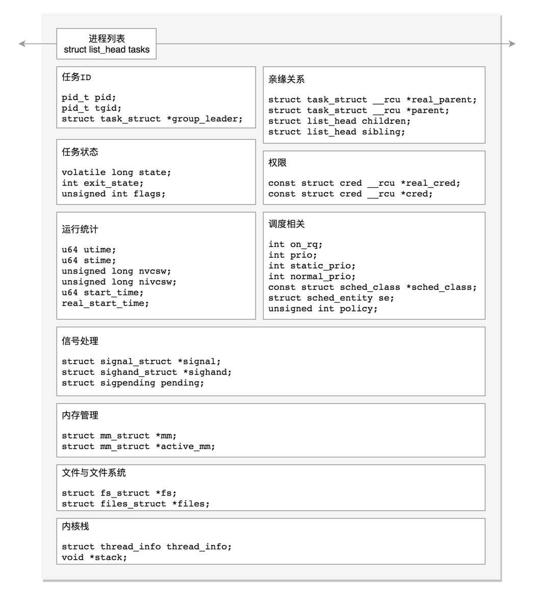

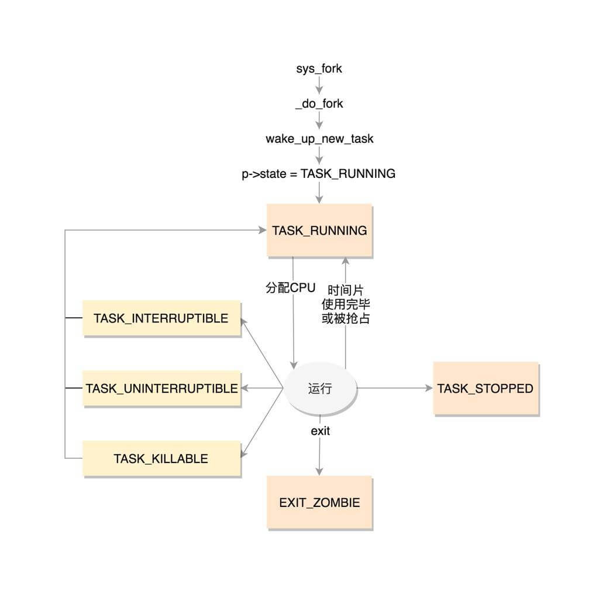

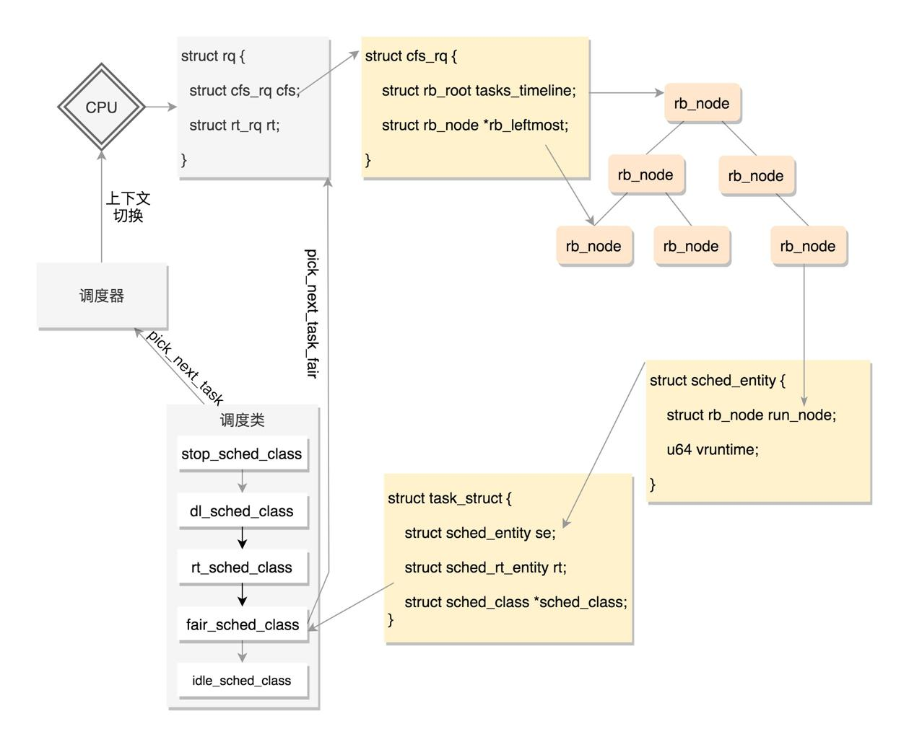


## CPU


```yaml


# 多核 CPU 一致性问题

- 内存屏障:
# 内存屏障是一种指令，用于限制指令重排和内存访问的顺序。它可以确保在屏障之前的指令和内存访问在屏障之后的指令和内存访问之前完成，从而保证程序的正确执行顺序。
- MESI(Modified, Exclusive, Shared, Invalid):
# MESI 是一种缓存一致性协议，用于多处理器系统中的缓存一致性。它定义了处理器缓存中数据的四种状态：修改（Modified）、专用（Exclusive）、共享（Shared）和无效（Invalid）
# The MESI protocol is an Invalidate-based cache coherence protocol, and is one of the most common protocols that support write-back caches.

- 指令重排:
# 指令重排是编译器或处理器在执行程序时重新排序指令的过程，以优化性能或提高并发性。然而，在多线程环境中，指令重排可能会导致意想不到的结果，如数据竞争或不一致的状态。
- Happens-Before:
# Happens-Before 原则是指在多线程编程中，如果一个操作的结果对于另一个操作是可见的，那么第一个操作在时间上发生在第二个操作之前。Happens-Before 原则是用于定义和推断多线程程序中操作的顺序关系，以确保正确的执行顺序和一致性。
- volatile 关键字:
# volatile 是一个关键字，用于修饰变量，指示编译器在生成指令时不要对该变量进行指令重排。它可以确保对 volatile 变量的读写操作按照程序的顺序执行，并且对于其他线程可见，从而提供了一定的内存可见性和顺序性保证。


```


```yaml
#- CPU 上下文是啥？CPU 上下文切换是啥？
#- CPU 软中断是啥？有哪些“软中断”的方法？
#
#- What "CPU context" contains? # registers(..., PC, stack pointer), process status, mem-manage(page table, segment table)
#- CPU steal time
```


[MESI 协议学习笔记 | 三点水](https://lotabout.me/2022/MESI-Protocol-Introduction/)


```markdown

如果我们还是拿公司举例，操作系统内核是公司老板，CPU 是工人，我们知道，单核 CPU 无法执行多线程，同一时间只能执行一个线程，多核 CPU 则可以同时执行多个线程，那把单核 CPU 和多核 CPU 类比成什么比较好呢？

---

如果我们将公司作为一个比喻，可以将操作系统内核比作公司的老板，而 CPU 则可以类比为公司的工人。

对于单核 CPU，可以将其比作公司只有一个工人的情况。这个工人在同一时间只能处理一个任务，需要不断地切换任务来完成各项工作。这种情况下，工人的工作效率受限，无法同时处理多个任务，可能会导致任务执行速度较慢。

而对于多核 CPU，可以将其比作公司有多个工人的情况。每个工人都可以独立地处理任务，可以同时进行多个任务的处理。这样，工作可以并行进行，提高了整体的工作效率和处理能力。

类比中的公司老板即操作系统内核，负责分配任务和管理工人。他可以根据任务的需求，将任务分配给不同的工人（CPU 核心），并协调他们的工作。操作系统内核的调度算法类似于老板的任务分配方式，决定了任务在不同核心之间的切换和调度。

综上所述，单核 CPU 类比为公司只有一个工人，多核 CPU 类比为公司有多个工人，而操作系统内核则类比为公司的老板，负责任务分配和协调工作。这个比喻可以帮助我们更好地理解单核 CPU 和多核 CPU 的区别和工作原理。

---

那 MESI 协议呢？这个用来保证多核的 cache 一致性的协议，类比成什么比较好？

---

MESI（）协议是一种用于保证多核 CPU 缓存一致性的协议。它定义了缓存行的四种状态，并通过协议规定了缓存行状态的转换和处理方式，以确保多核 CPU 之间的缓存数据一致性。

对于 MESI 协议的类比，我们可以将其比作一个团队合作的场景。假设有多个团队成员（代表不同核心的缓存），每个成员都有一份工作材料（缓存行）。这些工作材料可以处于四种状态：

1. Modified（修改）：某个成员对工作材料进行了修改，并且还没有将修改的内容通知给其他成员。

2. Exclusive（独占）：某个成员独占了工作材料，并且没有被其他成员缓存。

3. Shared（共享）：多个成员共享同一份工作材料，并且都没有对其进行修改。

4. Invalid（无效）：某个成员的工作材料无效，即不可用或已过期。

在这个类比中，团队成员之间需要遵循 MESI 协议的规定来保持工作材料的一致性：

- 当一个成员修改了工作材料时，需要将其状态设置为 Modified，并通知其他成员将其缓存行设置为 Invalid，以确保其他成员不使用过期的数据。

- 当一个成员独占了工作材料时，其他成员不能缓存该行数据，以避免冲突和数据不一致。

- 当多个成员共享同一份工作材料时，它们的缓存行状态都设置为 Shared，以确保它们都使用相同的数据。

- 当某个成员不再需要工作材料时，需要将其状态设置为 Invalid，以通知其他成员该行数据已无效。

通过这种类比，我们可以更好地理解 MESI 协议的作用和原理，以及多核 CPU 中缓存一致性的重要性。

---

这么说，我就懂了。那么，能否用上面这个老板和工人的例子，给我解释一下内存屏障、MESI、指令重排、Happens-Before 原则、volatile、内存可见性？最好还能解释一下他们之间的关系

---

当我们使用老板和工人的例子来解释内存屏障、MESI、指令重排、Happens-Before 原则、volatile 和内存可见性时，可以将公司的工作流程作为一个比喻。

1. 内存屏障（Memory Barrier）：内存屏障是一种硬件或软件机制，用于控制指令的执行顺序和内存访问的可见性。可以将内存屏障比作公司的规章制度，它定义了工作流程中的一些限制和顺序要求，以确保工作的正确性和一致性。

2. MESI 协议：MESI 协议是一种用于保证多核 CPU 缓存一致性的协议。可以将 MESI 协议比作公司的团队合作，每个团队成员（代表不同核心的缓存）都需要遵循协议规定的状态转换和处理方式，以确保多核 CPU 之间的缓存数据一致性。

3. 指令重排（Instruction Reordering）：指令重排是编译器或处理器为了优化程序性能而重新排序指令的过程。可以将指令重排比作公司的工作安排，为了提高效率，工人可能会根据任务的依赖关系和优先级进行任务的调度和安排。

4. Happens-Before 原则：Happens-Before 原则是指在多线程环境下，如果一个操作的结果对另一个操作可见，那么第一个操作在时间上发生在第二个操作之前。可以将 Happens-Before 原则比作公司的工作流程，规定了任务的先后顺序和依赖关系，确保任务的正确执行。

5. volatile：volatile 是一种关键字，用于修饰变量，确保对该变量的读写操作具有可见性和有序性。可以将 volatile 比作公司的通知板，工人在进行工作时，需要经常查看通知板上的信息，以确保及时获取最新的任务和指示。

6. 内存可见性：内存可见性是指多个线程对共享变量的修改能够被其他线程及时看到。可以将内存可见性比作公司的信息共享，工人之间需要及时共享工作进展和结果，以保证工作的协调和一致性。

关系解释：

- 内存屏障可以限制指令重排，确保指令按照预期的顺序执行，以避免出现意外的结果。

- MESI 协议是一种保证多核 CPU 缓存一致性的协议，通过定义缓存行的状态和处理方式，确保多核 CPU 之间的缓存数据一致性。

- Happens-Before 原则可以通过内存屏障和同步操作来定义多线程任务的执行顺序和依赖关系，以保证线程间的正确通信和数据一致性。

- volatile 关键字可以确保对被修饰变量的读写操作具有可见性和有序性，避免了指令重排和内存可见性问题。

- 内存可见性是指多个线程对共享变量的修改能够被其他线程及时看到，而 volatile 关键字可以保证共享变量的可见性。

总之，内存屏障、MESI 协议、指令重排、Happens-Before 原则、volatile 和内存可见性是多线程编程中的重要概念，它们相互关联，共同确保多线程程序的正确性、一致性和性能。

---

我说说我的理解，还是拿上面老板和工人来举例，指令重排就是工人为了尽快完成工作，自己对工作任务的优先级进行调整，这种情况下，如果多人协作就会出问题。为了解决这个问题，“volatile 就通过内存屏障来禁止某些情况下的指令重排”，如果我们把内存屏障理解为公司规章制度，volatile 理解为公司的通知板，就可以理解为工人的前后操作，如果其中一个是普通读写（以及第二个操作是 volatile 读）都可以重新排序，用来提高效率。其他情况（比如有 volatile 写）会导致数据不一致情况发生的，就需要禁止指令重排。我理解的对吗？

---

你的理解基本上是正确的。指令重排是为了提高工作效率，但在多线程环境下可能会导致数据不一致的问题。volatile 关键字通过内存屏障来禁止某些情况下的指令重排，确保数据的一致性。你可以将内存屏障理解为公司的规章制度，volatile 关键字理解为公司的通知板，工人的前后操作可以重新排序，但是如果其中一个操作是 volatile 读，就不能进行重新排序，以确保数据的正确性。当涉及到 volatile 写操作时，更需要禁止指令重排，以避免数据不一致的情况发生。总的来说，你的理解是正确的。


---

那 happens-before 呢，在这个场景下，怎么类比比较好？

---

在计算机科学中，happens-before 关系是用来描述事件之间的顺序关系的。它是一种偏序关系，用来表示一个事件在时间上先于另一个事件发生。在多核 CPU 的上下文中，happens-before 关系可以用来描述不同核心之间的顺序关系。

当一个核心执行一个写操作，并且另一个核心执行一个读操作时，happens-before 关系可以用来确保写操作先于读操作发生。这意味着读操作可以看到写操作所做的更改。这是通过在写操作之后发生的读操作之前建立一个 happens-before 关系来实现的。

类比的话，可以将 happens-before 关系类比为一个人在写一封信之后将其邮寄给另一个人。当收件人收到信件时，他可以看到信件中的内容。这里，写信的行为可以看作是写操作，邮寄信件的行为可以看作是建立 happens-before 关系，收信的行为可以看作是读操作。

总的来说，happens-before 关系在多核 CPU 中起着重要的作用，它确保了不同核心之间的顺序关系，使得并发程序能够正确地执行。

---

“当一个核心执行一个写操作，并且另一个核心执行一个读操作时，happens-before 关系可以用来确保写操作先于读操作发生。这意味着读操作可以看到写操作所做的更改。”这个就是内存可见性是吧

---

是的，您提到的情况涉及到内存可见性。内存可见性是指当一个线程对共享变量进行了修改后，其他线程能够立即看到这个修改。在多核 CPU 中，每个核心都有自己的缓存，当一个核心对共享变量进行写操作时，它会将修改写入自己的缓存中。而其他核心在读取该共享变量时，可能会从自己的缓存中读取，而不是从主内存中读取。这就可能导致一个核心看到的是旧值，而另一个核心看到的是新值。为了确保内存可见性，需要使用 happens-before 关系来进行同步。happens-before 关系可以确保写操作先于读操作发生，从而保证读操作可以看到写操作所做的更改。


```

其实把多核 CPU 相比于单核 CPU 类比成多个工人相比一个工人，不是很恰当，更贴切的类比应该是多手工业机器人


[【深度长文】学好并发编程不一定需要了解的MESI和内存屏障-腾讯云开发者社区-腾讯云](https://cloud.tencent.com/developer/article/2150163)

[并发基础理论：缓存可见性、MESI协议、内存屏障、JMM - 知乎](https://zhuanlan.zhihu.com/p/84500221)


```markdown
### MESI 协议是什么？为什么需要 MESI 协议？

- MESI 由 Modified/Exclusive/Shared/Invalid 这四种 cache 状态组成
- MESI 是 CPU 的基于失效的缓存一致性协议，支持`回写缓存 write-back`的最常用协议。与`写通过缓存 write-through`相比，回写缓存能节约大量带宽，总是有`脏状态`表示缓存中的数据与主存中的不同。
- MESI 协议要求在缓存不命中，且数据块在另一个缓存时，允许缓存到缓存的数据复制。与 MSI 协议相比，MESI 协议减少了主存的事务数量，极大改善了性能。

---

- CPU 运算比内存读写要快很多，所以 CPU 常常需要等待内存，我们通过三级缓存机制让内存的读写速度跟得上 CPU，但是这种三级缓存机制带来一个问题，一二级缓存是核心独占的，而三级缓存和主内存是共享的，这样就会导致 CPU 缓存一致性问题
- MESI 只保证 L1-L3 的 cache 之间的内存可见性，但是 CPU 和 L1 之间，还需要 storebuffer 之类的缓存
- *多核处理器的每个核都有自己的 cache，MESI 协议就是用来保证多核的 cache 一致*
- MESI 协议通过回写策略来更新 cache，提高性能的同时带来了额外风险，回写带来的问题可以通过内存屏障解决


### 内存屏障的由来？

针对 store buffer 和 invalidate queue 这两个优化带来的问题，我们又提供了内存屏障作为解决方案。内存屏障交给了编写程序的人的手里，利用它就可以规避上面提到的问题。

内存屏障分为写屏障和读屏障，编写程序时可以在期望的地方加入内存屏障。写屏障会强制 cpu 清空 store buffer 的内容，也就是将所有的变更都写入 cache，随后变更也就写入了内存，使其对其他 cpu 可见；读屏障会强制 cpu 执行 invalidate queue 中的所有 invalidate 操作，使自身的 cache 内容失效，从而使 cpu 从内存或者其他 cpu 中获取最新的 cache 数据。


```

对比一下这这块内容，之前做的这些笔记真是狗屎。


## memory


```yaml
memory: CPU就是员工，memory就是写字楼（办公区域）（如果CPU是工人，内存就是工厂）

# virtual memory

virtual memory: 用来实现不同项目之间保密
# 用来管理用户空间
# 对用户空间，我们用`虚拟内存`对内存进行管理；对于内核，使用`slab`或者`vmalloc`的方式对内存进行管理
NUMA: 就像公司里不同部门也有各自专有的工作区域一样，NUMA 就是这种 CPU 和内存一一对应的架构。而 SMP 则对应那种不同部门混在一起工作，这是很不合理的。
# locality(local mem, non-local mem), swap
NUMA Affinity:
# CPU NUMA Affinity, Device NUMA Affinity(DMA Buffer, Interrupt)


swap:
# 虚拟内存和 swap 的关系？虚拟内存和 swap 是两回事，实际上 swap 只是虚拟内存引申出的一种技术而已，*操作系统一旦内存不足，为了腾出内存空间存放新数据，就会把当前物理内存中的数据放到 swap 交换分区里，需要使用的时候再取出*。swap 是磁盘上的一块区域，当内存吃紧时，就会将内存中不常访问或者空闲的页的部分，保存到 swap 上，这样系统就有更多的物理内存能为进程服务。当系统需要访问 swap 的内容时，就加载到内存上。

# swap 解决了什么问题？
# swap 解决了内存不充裕的情况下，导致服务不可用的问题，swap 能够保证服务可用，但是性能相对会下降

# swap 有哪些缺点？
# 因为 swap 是存放在磁盘上的，所以磁盘读起来会比内存慢很多。牺牲了系统的性能保证了服务的可用性。

swap thrashing:
# swap 颠簸
# 需要注意的是，swap 的使用可能会带来性能问题，物理内存和 swap 频繁发生数据交换，被称为 swap 颠簸，一旦发生这种问题，需要明确是什么原因造成的

PRA(Page Replacement Algo):


#- 如何减少对swap空间的使用？
# 可以通过修改swappiness参数的值来减少对swap空间的使用。swappiness的值决定了系统使用swap空间的倾向。值越低，系统越倾向于使用物理内存，而不是swap空间。例如，可以通过执行命令sudo sysctl vm.swappiness=10来临时将swappiness设置为10。为了使这个设置永久生效，可以编辑/etc/sysctl.conf文件，并添加行vm.swappiness=10，然后重启系统。

#- swap空间的使用过高可能是什么原因？
# swap空间使用过高可能是由于系统内存资源紧张导致的。当系统内存不足时，为了满足新的内存分配请求，系统会通过直接内存回收和定期扫描的方式释放文件页和匿名页，将不常访问的数据换出到磁盘中的swap空间。此外，如果系统配置了swap，但在某些情况下（如大量文件操作或内存密集型操作）没有有效地管理内存，也可能导致swap使用率升高。

#- 如何区分系统性能下降是由于swap thrashing还是由于非swap的高I/O延迟造成的？
# 可以通过监控工具（如vmstat、iotop、sar等）来分析系统的性能指标。swap thrashing通常表现为大量的换入换出操作，可以通过vmstat中的si和so字段来观察。非swap的高I/O延迟可能是由于磁盘I/O请求处理缓慢，可以通过iotop或iostat来查看磁盘I/O的使用情况。如果I/O等待时间（例如vmstat中的wa字段）显著增加，可能是高I/O延迟的问题。

#- 如何监控和记录swap空间的使用情况？
# 可以使用free -h命令来查看当前的内存和swap空间使用情况。为了记录和监控swap空间的使用情况，可以使用sysstat工具包中的sar命令，它可以收集、报告或保存系统活动信息，包括内存和swap的使用情况。此外，/proc/vmstat文件也提供了关于虚拟内存系统的统计信息，可以用来分析swap活动。

#- 如何关闭swap空间？
# 可以通过swapoff命令来关闭swap空间。例如，sudo swapoff -a可以关闭所有的swap空间。如果需要重新启用swap空间，可以使用swapon命令，例如sudo swapon -a来重新启用所有配置的swap空间。需要注意的是，关闭swap空间可能会影响系统的稳定性和性能，特别是在内存资源紧张的情况下。

---

#- 内存抖动(内存颠簸), OOM, memory-leak, memory fragmentation

- 内存抖动:
# 内存抖动指的是在一段时间内频繁创建对象和销毁对象所引起的频繁 GC 的现象。用“池化技术”避免频繁创建和销毁
- OOM:
- Memory Leak:
- Memory fragmentation: 内存碎片，就像是办公楼中难以找到足够的连续空隔间来容纳大型团队或项目。即使公司总体上有足够的空间（总内存足够），但由于空间的分散和不连续（内存碎片化），公司可能无法有效地利用这些空间。为了解决这个问题，公司可能会进行一次“办公室重组”（内存碎片整理），这涉及到重新分配员工到不同的隔间，以便为空出一个足够大的连续空间区域。这个过程可能会暂时打乱员工的工作流程（操作系统性能开销），但最终目的是为了提高整体的工作效率和空间利用率。OS通过各种内存管理技术（如compact, THP, swap等）来减少碎片化的影响。
#

```


```yaml

# physical memory

MMU:
# MMU(memory management unit):CPU 的一个单独模块，用来将虚拟地址转换为实际物理地址的组件，MMU 通常使用内存中的一个组件，通常称为页表 (page table) 或 PTE(page table entry) 来管理虚拟地址到实际物理地址的映射。（硬件层面）
# MMU是一种硬件组件，位于计算机系统中的处理器和内存之间。它负责实现虚拟内存和物理内存之间的地址转换。当程序使用虚拟地址进行内存访问时，MMU会将虚拟地址转换为对应的物理地址，从而让程序能够正确地访问内存中的数据。

TLB:
# TLB(Translation lookaside buffer): 是保存虚拟地址到物理地址的一个缓存，是 MMU 的一部分，存储在 CPU 和 CPU cache 之间，有效的减少了通过转换去获取物理地址的次数
# TLB是MMU中的一个重要缓存结构，用于加速地址转换过程。TLB存储了最近使用的虚拟地址和物理地址之间的映射关系。当程序访问内存时，MMU首先会在TLB中查找对应的虚拟地址和物理地址映射，如果找到了匹配的映射，就可以直接使用TLB中的物理地址，避免了耗时的内存访问。如果在TLB中没有找到映射，MMU会通过一定的算法将虚拟地址转换为物理地址，并将新的映射关系存储到TLB中，以便下次使用。
# 总结起来，MMU是负责地址转换的硬件组件，而TLB是MMU中的一个缓存结构，用于存储最近的地址映射，以提高地址转换的速度。TLB可以减少对内存的访问次数，从而提高系统的性能。

# 在多核处理器系统中，进程切换时如何处理TLB?
# linux TLB刷新的懒惰模式?


zone_type:
DMA:
# SMA (Shared Memory Arch) 的所有 CPU 共享相同内存地址，每个 CPU 都有自己的本地内存，不存在跨 CPU 内存地址映射问题，解决了`cache 一致性`问题*，包括 UMA、NUMA、COMA。但是 DMA 则不需要 CPU，直接让外部设备访问内存。

Page Cache:
segment:
buddy-allocator: 用来管理物理内存的内存分配算法。buddy allocator 就像是项目内部划分再给各种内部项目划分工作区域，一定是划分到最小粒度，也就是工位（也就是“空闲页放在 struct free_area 里面，每一页用 struct page 表示”），再规划出 11 种内部项目可以申请的档位（也就是“把所有的空闲页分组为 11 个页块链表，每个块链表分别包含很多个大小的页块，有 1、2、4、8、16、32、64、128、256、512 和 1024 个连续页的页块。最大可以申请 1024 个连续页，对应 4MB 大小的连续内存。”）。这样项目内部需要创建子项目时，直接申请整块的工位区域（连续页的页块）就可以了。就不需要再一个一个申请工位了。其实跟我们在公司里也差不多，代入到实际生活就很好理解了。


slab, vmalloc:
THP:

page table:

zero copy:
COW:
# COW和sendfile是一回事吗？
# COW（Copy-on-Write）是一种内存管理技术，用于优化数据的复制操作。当多个进程或线程共享同一块内存时，它们最初都指向相同的内存页。当其中一个进程或线程试图修改该内存页时，操作系统会创建该页的副本，并将修改应用于副本，而不是原始页面。这样做的好处是避免了不必要的数据复制，节省了内存和时间。
# sendfile是一个系统调用（在某些操作系统中），用于在文件之间直接传输数据，而无需将数据从内核空间复制到用户空间，再从用户空间复制到网络套接字。它通常用于高效地将文件内容发送到网络连接中，例如在Web服务器中传输文件给客户端。sendfile的使用可以减少数据复制的次数，提高数据传输的效率。
# 简而言之，COW是一种内存管理技术，用于优化数据的复制操作，而sendfile是一个系统调用，用于在文件之间直接传输数据。它们是不同的概念和用途。


# COW 是什么？写时复制和强制分裂？具体聊聊 linux 中的 COW？

# 啥是 linux 的拷贝？为啥需要零拷贝？啥是零拷贝？零拷贝的方法？怎么用 sendfile 实现零拷贝？

# 什么是“优化零拷贝”？有哪些优化零拷贝的方法？

#  - (zone, page)
#  - TLB # MMU
#  - kernel中中的TLB懒惰模式是如何工作的?
#
#  - zone_type # ZONE_DMA(kernel thread), ZONE_NORMAL(user thread), (ZONE_HIGHMEM, ZONE_DEVICE)
# 内存 zone 分为四块，除了内核态和用户态分别访问的内存区域，还分为 ZONE_HIGHMEM 和 ZONE_DEVICE 这两个用来解决特殊问题的 zone，这两个对用户态线程都不可见。


#  - page cache
#  - segment # Text, Data, BSS
#  - buddy-allocator
#  - slab, vmalloc
#  - THP
#  - "***kernel中是怎么把物理内存映射到虚拟内存的？***" # mmap(memory mapping), page table, virtual address
#  - PGD、P4G、PUD、PMD、PTE 四级页表是啥？
#  - "**共享内存的创建和映射过程**"
#  - 怎么check进程占用内存? (USS, PSS, RSS, VSS) 各自的命令? 为啥RSS在使用pmap和ps时不同?
#  - What's DMA? What are the scenarios suitable for DMA for data transfer? What are the two data transfer methods of DMA? Please Compare.

---

mmap: mmap的本质是kernel的syscall，只不过可以用来作为storage engine而已
# mmap是一个syscall，用于将文件或其他对象映射到进程的地址空间。通过mmap，进程可以像访问普通内存一样访问文件内容，这通常用于高效地读取和写入大型文件。mmap可以创建一个文件的内存映射，这个映射可以用于读写操作，而且映射可以是共享的（多个进程可以共享同一映射），也可以是私有的（对映射的修改不会反映到原始文件中）。mmap还支持将匿名内存映射到进程地址空间，这通常用于动态分配大块内存。

madvise:
# madvise是一个syscall，用于给内核提供关于进程如何使用内存的建议。通过madvise，进程可以告诉内核它对特定内存区域的使用模式，例如，是否频繁访问、是否不常访问、是否应该被预读到内存中等。内核会根据这些建议来优化内存管理策略，例如，可能会根据建议来决定是否将内存页换出到磁盘上，或者是否预读文件内容。需要注意的是，madvise只是提供建议，内核可能会忽略这些建议，具体行为取决于内核的内存管理策略和其他系统状态。

```


- [说出来你可能不信，内核这家伙在内存的使用上给自己开了个小灶！ - 知乎](https://zhuanlan.zhihu.com/p/347562875#tocbar-h0cg63)
- [Linux 内存管理：SPARSEMEM 模型 - 知乎](https://zhuanlan.zhihu.com/p/220068494)

线性内存 稀疏内存 虚拟内存布局


[操作系统是如何管理内存的](https://limboy.me/posts/os-memory/)


```markdown

- 内存管理
- 硬件管理和分页管理
  - 内存分页
  - 页表记录的页权限
  - 内存分 zone
  - 硬件层的内存管理-buddy 算法
  - 如何处理内存碎片
  - CMA、iommu
- 内存的动态申请和释放
  - buddy 的问题
  - slab 问题
  - mallopt
  - kmalloc vs vmalloc/ioremap
  - linux 内存分配的 lazy 行为
  - 内存 OOM
- 进程的内存消耗和泄露
  - 进程的虚拟地址空间 VMA
  - page fault 的几种可能性：minor 和 major 缺页
  - VSS、RSS、PSS 和 USS
  - 内存泄漏的检测方法
- 内存和 IO 的交换
  - page cache
  - free 命令的详细解释
  - File-backed 和 Anonymous page
  - swap 和 zRAM
  - 页面回收和 LRU
  - Linux Page Replacement
  - 嵌入式系统的 zRAM
- 其他工程问题以及调优
  - DMA 和 cache 一致性
  - 内存的 cgroup
  - memory cgroup 子系统分析
  - 性能方面的调优：page in/out, swap in/out
  - Dirty ratio 的一些设置
  - swappiness

```


---


```markdown
## Linux 内存池


直接使用系统调用 malloc/free、new/delete 进行内存分配和释放

内存池是代替直接调用 malloc/free, new/delete进行内存管理的常用方法；当我们申请内存空间时，首先到内存池中查找合适的内存块，而不是直接向OS申请，这样`比malloc/free进行内存申请/释放的方法更快`，`尽量少地产生堆碎片`，`避免内存泄漏`

如何设计内存池？想自己设计内存池，也需要面对一下几个问题？

- 如何获得内存池的空间？是`启动时直接分配一大块空间`还是`按需分配`？
- 内存池对到来的内存申请，有没有大小限制？如果有，最小可申请的内存块为多大？最大呢？
- 如何合理设计内存块结构，方便我们进行内存的申请，追踪和释放呢？
- 内存池占用越多空间，相对应其他程序能使用的内存就越少，是否要设定内存池空间的上限？设定为多少适合呢？

---

内存申请：根据所申请内存的大小，遍历 list 链表，查看是否存在相匹配的 size

- 存在匹配 size：查看 free 时候为 NULL
  - free 为 NULL：使用 malloc/new 申请内存，并将其置于 used 所指链表的尾部
  - free 不为 NULL：将 free 所指链表的头结点移除，放置于 used 所指链表的尾部
- 不存在匹配 size：新建 list，使用 malloc/new 申请内存，并将其置于该 list 的 used 所指链表尾部

释放策略？

根据内存跟踪策略，获取 list 指针和 used 指针，将其从 used 指针所指的链表中删除，放置于 free 指针所指向的链表


### 使用内存池有什么好处？

几乎所有服务都使用内存池，不管是 nginx 使用的 glibc 的 malloc，还是 redis 默认使用的 jemalloc，或者 golang 使用的 TCMalloc；基本实现和目的都是类似的，只有部分细节有区别

减少内存申请和释放的开销，提高缓存命中率

- 需要内存时，直接向内存池申请，申请到的内存也不需要手动释放，因为内存池销毁时会释放所有内存
- 对于那些频繁分配和释放小块内存的程序来说，使用内存池可以减少`malloc()`的次数，除了降低调用开销之外，还减少了内存碎片的产生


```


```markdown
内存都有什么？堆和栈区别？

内存分为以下几个部分

- 栈区（stack）—由编译器自动分配释放，存放函数的参数值，局部变量的值等。空间小，速度快，存储长度类型不变的数据类型，int float bool。和 cpu 结合好，释放灵活。0x1234 地址 16 进制定长
- 堆区（heap） —一般由程序员分配释放，若程序员不释放，程序结束时自动回收；空间大，存储长度不固定，比较大的数据类型。内存中大部分是堆，不好管理。String   array   class.  $this 当前对象的引用
- 全局区（静态区）（static）—，全局变量和静态变量的存储是放在一块的，初始化的全局变量和静态变量在一块区域，未初始化的全局变量和未初始化的静态变量在相邻的另一块区域。程序结束后由系统释放。
- 文字常量区—常量字符串就是放在这里的。程序结束后由系统释放。自定义常量，系统常量
- 程序代码区—存放函数体的二进制代码。If 语句，循环语句，函数体。类中的方法是多个对象公用的类方法。对象中存的是方法的标识（地址）

---

堆和栈区别

- 栈：在 WINDOWS 下，栈的大小是一个编译时就确定的常数 2M 如果申请的空间超过栈的剩余空间时，将提示 overflow。因 - ，能从栈获得的空间较小。Linux 可修改。栈由系统自动分配，速度较快。但程序员是无法控制的
- 堆：堆的大小受限于计算机系统中有效的虚拟内存。由此可见，堆获得的空间比较灵活，也比较大。堆是由 new 分配的内存，一般速度比较慢，而且容易产生内存碎片 ,不过用起来最方便


---

- `堆栈空间的分配`
  - 栈：由操作系统自动分配释放，存放函数的参数值，局部变量的值等；其操作方式类似于数据结构中的栈
  - 堆：一般由程序员分配释放，如果不释放，程序结束后可能由 OS 回收，分配方式类似于链表
- `进出顺序不同`
  - 堆：先进先出
  - 栈：先进后出
- `堆栈缓存方式`
  - 栈使用一级缓存，他们通常都是被调用时处于存储空间中，调用完毕立即释放
  - 堆存放在二级缓存中，生命周期由虚拟机的 GC 算法来决定，所以调用这些对象的速度要相对慢一些
- `生长方向`
  - 对于堆来讲，生长方向是向上的，也就是向着内存地址增加的方向
  - 对于栈来讲，生长方向是向下的，是向着内存地址减小的方向增长


```


---

```markdown

内核空间的区域由哪几部分构成？

- `DMA 内存区域`0-16mb 内存
- `NORMAL 内存区域`16-896mb 内存
- `HIGHMEM 内存区域`高端内存区域

---

`用户空间`里由低到高的地址，分别是？

- `代码段/只读段 (text section)`，*`可执行文件`代码的内存映射*，存放可执行文件的操作指令，可执行程序在内存中的镜像 (只读，不可写)
- `数据段 (data section)`*`可执行文件`的已初始化全局变量的内存映射*，可执行文件中已初始化全局变量，静态分配的变量和全局变量
- `BSS(bbs segment)`*`可执行文件`未初始化的全局变量*
- `heap`heap 用来存放进程运行时被动态分配的内存段，大小不固定。malloc 新内存加到 heap，free 时从 heap 释放。
- `stack`临时的局部变量，函数中定义的变量 (不包括 static)。函数被调用时，参数也会被压入发起调用的进程栈中，调用结束时，返回值也会被存放到栈。

```

---


```markdown
虚拟内存是对于物理内存的抽象。支持虚拟内存的处理器，通过使用 `虚拟寻址` 这种间接方法来引用物理内存。

*处理器产生一个虚拟地址，在被发送到物理内存之前，这个地址被翻译成一个物理地址。*

- 物理寻址
- 虚拟寻址

地址翻译

大多数页表条目位于 L1 高速缓存中，但是 TLB 的页表条目的片上高速缓存，通常会消除访问在 L1 上的页表条目的开销。

- 结合高速缓存和虚拟内存
- 利用 TLB 加速地址翻译
- 多级页表端到端的地址翻译

---

- *因为虚拟内存是操作系统物理内存和进程之间的中间层，为进程隐藏物理内存，为进程提供了简洁易用的接口*
- 虚拟内存可以为进程提供独立的内存空间，并引入多层的页表结构，将虚拟内存翻译成物理内存，*进程之间可以共享物理内存减少开销，也能简化程序的链接、装载以及内存分配过程*
- 虚拟内存可以控制进程对物理内存的访问，隔离不同进程的访问权限，提高系统的安全性

```

这个就是虚拟内存和物理内存的映射


```markdown
slab，slub，slob 是slab机制的三种不同实现算法。
注意，slab申请和分配的都是只针对内核空间，与用户空间申请分配内存无关。用户空间的malloc和free调用的是libc。

slab和buddy的关系？
1、slab的内存来自于buddy。slab相当于二级管理器。
2、slab和buddy在算法上，级别是对等的。

两者都是内存分配器，buddy是把内存条分成多个Zone来管理分配，slab是把从buddy拿到的内存，进行管理分配。

同理，malloc 和free也不找buddy拿内存。 malloc 和free不是系统调用，只是c库中的函数。
```


```markdown
内存OOM
当真实去写内存时，应用程序并不能拿到真实的内存时。Linux启动OOM，linux在运行时，会对每一个进程进行out-of-memory打分。打分主要基于，耗费的内存。耗费的内存越多，打分越高。

cat /proc/<pid>/oom_score
```

---

```markdown
当然可以！Linux 内存管理是操作系统对内存资源的管理和分配。Linux 使用虚拟内存的概念，将物理内存和磁盘空间结合起来，以提供更大的内存空间和更灵活的内存管理。

Linux 内存管理的核心任务包括：

1. 内存分配：Linux 使用页面（Page）作为内存管理的基本单位。当进程需要内存时，它会向操作系统请求一定数量的页面。操作系统负责分配物理页面，并建立虚拟内存与物理内存之间的映射关系。

2. 页面置换：当物理内存不足时，Linux 会使用页面置换算法将一些页面从物理内存换出到磁盘，以腾出空间给新的页面使用。常见的页面置换算法包括最近最少使用（LRU）和时钟（Clock）算法。

3. 内存回收：当进程释放内存时，Linux 会回收这些页面，并将它们重新放入可用内存池中，以便其他进程使用。

4. 内存映射：Linux 支持将文件映射到内存，以便进程可以像访问内存一样访问文件。这种机制被广泛用于加速文件访问和共享内存。

5. 虚拟内存管理：Linux 使用虚拟内存机制将进程的地址空间与物理内存分离开来。每个进程都有自己的虚拟地址空间，而不必关心物理内存的细节。这为进程提供了更大的内存空间和更高的安全性。

这只是对 Linux 内存管理的简要介绍，实际上涉及的内容非常广泛，包括内存段、内存映射、页面回写等。如果你对具体的内存管理问题有进一步的需求，请告诉我，我将竭力为你提供更详细的信息和相关代码。
```


---

ptmalloc, buddy allocator

感觉机制很像（都是通过把整块物理内存空间分割为不同大小的块，以减少内存碎片），但是确实不是一回事

ptmalloc是用户空间的，buddy allocator是内核空间的


---


[虚拟内存精粹 - Strike Freedom](https://strikefreedom.top/archives/memory-management--virtual-memory)

[Linux虚拟地址空间布局 - sunsky303 - 博客园](https://www.cnblogs.com/sunsky303/p/13848128.html)


[24 虚拟内存 ：一个程序最多能使用多少内存？](https://learn.lianglianglee.com/%E4%B8%93%E6%A0%8F/%E9%87%8D%E5%AD%A6%E6%93%8D%E4%BD%9C%E7%B3%BB%E7%BB%9F-%E5%AE%8C/24%20%20%E8%99%9A%E6%8B%9F%E5%86%85%E5%AD%98%20%EF%BC%9A%E4%B8%80%E4%B8%AA%E7%A8%8B%E5%BA%8F%E6%9C%80%E5%A4%9A%E8%83%BD%E4%BD%BF%E7%94%A8%E5%A4%9A%E5%B0%91%E5%86%85%E5%AD%98%EF%BC%9F.md)

[25 内存管理单元： 什么情况下使用大内存分页？](https://learn.lianglianglee.com/%E4%B8%93%E6%A0%8F/%E9%87%8D%E5%AD%A6%E6%93%8D%E4%BD%9C%E7%B3%BB%E7%BB%9F-%E5%AE%8C/25%20%20%E5%86%85%E5%AD%98%E7%AE%A1%E7%90%86%E5%8D%95%E5%85%83%EF%BC%9A%20%E4%BB%80%E4%B9%88%E6%83%85%E5%86%B5%E4%B8%8B%E4%BD%BF%E7%94%A8%E5%A4%A7%E5%86%85%E5%AD%98%E5%88%86%E9%A1%B5%EF%BC%9F.md)

```markdown
根据提供的三篇文档，以下是几个问题及其回答：

1. **Linux虚拟地址空间布局是如何的？**
   - 在Linux系统中，每个进程都有自己的虚拟地址空间，通常在32位模式下是4GB的内存地址块。内核空间和用户空间的虚拟内存比例是1:3。虚拟地址通过页表映射到物理内存，页表由操作系统维护。内核空间在页表中拥有较高特权级，用户态程序试图访问这些页时会导致页错误。用户模式地址空间的映射随进程切换的发生而不断变化。

2. **一个程序最多能使用多少内存？**
   - 一个程序能使用的内存量取决于其运行的操作系统和硬件架构。在64位系统中，理论上可以寻址的虚拟内存空间非常大（通常是2的64次方个地址），但实际上受限于CPU的处理能力和物理内存的大小。通常操作系统会允许进程使用非常大，但不到理论最大值的地址空间。例如，现代操作系统可能允许进程使用几十到几百EB（1EB = 10^6TB）的虚拟地址空间。

3. **什么是虚拟内存，它是如何工作的？**
   - 虚拟内存是一种内存管理技术，它允许操作系统设计理论上无限大的地址空间，而实际的物理内存可能有限。操作系统将虚拟内存分成许多小块，称为页（Page），并将这些页映射到物理内存中的Frame。每个进程都有自己的页表，用于维护虚拟地址到物理地址的映射。当进程访问内存时，CPU将虚拟地址发送给内存管理单元（MMU），MMU查询页表，并将虚拟地址转换为物理地址，然后执行内存操作。

4. **什么是大页面问题，它是如何被解决的？**
   - 大页面问题指的是当应用程序需要大量连续的内存时，如果使用小页面（如4KB），则可能需要大量的页表条目来管理这些页面，这会增加内存开销。为了解决这个问题，可以使用大页面（如2MB或1GB），这样可以减少页表的大小，降低内存管理的开销。操作系统和硬件需要支持大页面，这通常通过多级页表来实现。

5. **内存管理单元（MMU）的作用是什么？**
   - 内存管理单元（MMU）是CPU中的一个小型设备，负责将虚拟地址转换为物理地址。它通过查询页表来完成这个转换，并帮助CPU操作真实的物理内存。MMU还负责维护CPU缓存，确保内存访问的效率。

以上问题和回答基于文档内容进行了总结和解释。如果您需要更多信息或有其他问题，请随时提问。
```


```markdown
CPU 如何访问内存

CPU 怎么访问内存？我们回想一下，之前讲过的高级语言和低级语言转化过程。

我们先思考一下，C 语言把我们写出来的变量和函数都转换成了什么呢？如果记不太清了，可以回顾[第十五节课]。没错，C 语言把变量名和函数名都转换成了汇编语言里的标号，而汇编语言的标号，就是机器更好理解的符号。符号具体包括符号类型、符号名称和符号地址这几个属性。其中，符号地址是由一个叫链接器的东西生成的。

汇编语言的标号，就表示为一段内存地址的开始。再根据我们 RISC-V 里访存指令的操作（可回顾[第二十一节课]和[第二十二节课]），进一步分析看看：加载字指令 lw 指令，它会从一个地址指向的内存单元中，把数据加载到寄存器上；储存字指令 sw 指令则是跟 lw 指令相反，把寄存器里的数据存到特定内存单元当中。这些指令里源寄存器和立即数组成的数据，其实就叫内存地址。

结合这些信息，我们就能推出这个结论：CPU 正是通过内存地址来访问内存的。这个地址本质上是一个整数数据。而这个整数代表了一个内存单元的索引号，CPU 访问内存的时候，硬件的地址译码器会负责把索引号，转换成相应的地址信号和片选信号，帮助 CPU“寻路”，找到特定的内存单元位置。

...

现在，我们已经清楚地知道了，CPU 把一个整数数据当成地址，放在地址总线上，由地址译码器选择该地址正确索引的设备或者内存进行访问。

从另一个角度看，数据在物理电路上，是由不同的电子信号的组合来表示的。正是有了这些电子信号组合，才能做到索引相应的设备和内存。CPU 通过什么访问内存，以及地址的本质是什么，我们已经找到答案了，用一句话概括就是：CPU 通过地址访问内存，地址的本质是整数数据，而整数数据的本质是电子信号的组合。

```


### 虚拟内存


```markdown

上一节我们说到，周瑜和张昭商定了调用 schedule 的时机。尽管项目越来越多，但是也井井有条。可是我们也说了，不管你的事情做得有多好，项目保密问题都是要解决的重要问题。怎么解决呢？今天我们就来看一看。

小马说：“要不咱们的项目别用会议室封闭开发了，原来总是说封闭开发，就是为了隔离，保密。这对于公司声誉来说很重要，但是能不能通过签订保密协议的方式来，干嘛非得封闭开发呢？”

周瑜说：“马哥，以我在大公司管理项目的经验来看，您还是想简单了。”

“你看，每次你接一个项目，总要写成项目执行计划书，CPU 小伙伴们才能执行吧，项目计划书中的一行一行指令运行过程中，免不了要产生一些数据。这些数据要保存在一个地方，这个地方就是会议室（内存）。会议室（内存）被分成一块一块儿的，都编好了号。例如 3F-10，就是三楼十号会议室。这个地址是实实在在的地址，通过这个地址我们就能够定位到物理内存的位置。”

“现在问题来了，写项目执行计划书的时候，里面的指令使用的地址是否可以使用物理地址呢？当然不行了，项目执行计划书，都是事先写好的，可以多次运行的。如果里面有个指令是，要把用户输入的数字保存在内存中，那就会有问题。”

“会产生什么问题呢？我举个例子你就明白了。如果我们使用那个实实在在的地址，3F-10，打开三个相同的程序，都执行到某一步。比方说，打开了三个计算器，用户在这三个程序的界面上分别输入了 10、100、1000。如果内存中的这个位置只能保存一个数，那应该保存哪个呢？这不就冲突了吗？”

“如果不用这个实实在在的地址，那应该怎么办呢？那就必须用封闭开发的办法。

每个项目的物理地址对于进程不可见，谁也不能直接访问这个物理地址。操作系统会给进程分配一个虚拟地址。所有进程看到的这个地址都是一样的，里面的内存都是从 0 开始编号。

在程序里面，指令写入的地址是虚拟地址。例如，位置为 10M 的内存区域，操作系统会提供一种机制，将不同进程的虚拟地址和内存的物理地址映射起来。

当程序要访问虚拟地址的时候，由内核的数据结构进行转换，转换成不同的物理地址，这样不同的进程运行的时候，写入的是不同的物理地址，就不会冲突了。”

小马想想，对啊，这是个好办法，咱们得规划一套会议室管理系统（内存管理）。根据刚才的分析，这个系统应该包含以下三个部分：

第一，物理内存的管理，相当于会议室管理员管理会议室；

第二，虚拟地址的管理，也即在项目组的视角，会议室的虚拟地址应该如何组织；

第三，虚拟地址和物理地址如何映射的问题，也即会议室管理员如果管理映射表。

我们先来盘点一下物理内存的情况。


```

我们还是拿公司举例，意思是假如公司有 100 个工位，但是有 n 个项目，这 n 个项目还是同时运行的，如果不用虚拟内存，就会出现 1 个工位被 n 个项目反复修改，就出现错误了。使用虚拟内存之后，即使这 n 个项目都需要同一个工位（内存地址），但是老板（内核）会给不同的项目划分不同的区域（虚拟内存和物理内存的映射表），同一个工位实际上映射在不同的地方（物理内存地址）。

其实我们在日常生活中就是这么设计的，所以比较难理解之前“物理内存”是个什么情况。

其实上面的这个说法是有些问题的，日常工作时不同开发组是可见的，但是进程之间则不是，每个进程都认为整个写字楼都是自己独占的。实际上更合理的说法是，所有进程都想进入 21F-1 的办公室，在下面摁电梯时，身在写字楼顶层的高管会把这 n 个进程划分到不同的楼层、不同的办公室，但是这些进程自己认为自己都进入了 21F-1 办公室，也认为整个写字楼都是自己独占的。


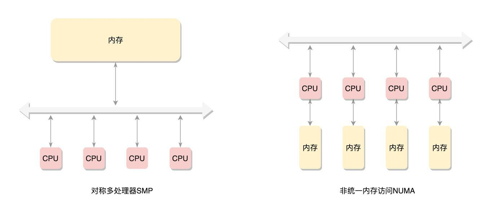

下面这段非常重要，要仔细看了

```markdown
不同的园区工位的安排和会议室的布局各不相同。

第一种情况是，CPU 小伙伴们坐在一起，会议室在楼层的另一面，大家到会议室里面去都要通过统一的过道，优点简单，缺点是通道会成为瓶颈。

第二种情况是，会议室分成多个节点，离散地分布在 CPU 小伙伴周围。有的小伙伴离这个会议室近一些，有的小伙伴离另外一些会议室近一些。这样做的优点是，如果 CPU 小伙伴干活总是能够去离他最近的会议室，则速度非常快，但是一旦离他最近的会议室被占用了，他只能去其他会议室，这样就比较远了。

现在的园区基本都设计成第二种样子，也即会议室（内存）要分节点，每个节点用 struct pglist_data 表示。

每个节点里面再分区域，用于区分内存不同部分的不同用法。ZONE_NORMAL 是最常用的区域。ZONE_MOVABLE 是可移动区域。我们通过将物理内存划分为，可移动分配区域和不可移动分配区域，来避免内存碎片。每个区域用 struct zone 表示，也放在一个数组里面。

每个区域里面再分页。默认的大小为 4KB。这就相当于每个会议室的最小单位。

如果有项目要使用会议室，应该如何分配呢？不能任何项目来了，咱都给他整个会议室。会议室也是可以再分割的，例如在中间拼起一堵墙，这样一个会议室就可以分成两个，继续分，可以再分成四个 1/4 大小的会议室，直到不能再分，我们就能得到一页的大小。

物理页面分配的时候，也可以采取这样的思路，我们称为伙伴系统。

空闲页放在 struct free_area 里面，每一页用 struct page 表示。

把所有的空闲页分组为 11 个页块链表，每个块链表分别包含很多个大小的页块，有 1、2、4、8、16、32、64、128、256、512 和 1024 个连续页的页块。最大可以申请 1024 个连续页，对应 4MB 大小的连续内存。每个页块的第一个页的物理地址是该页块大小的整数倍。

例如，要请求一个 128 个页的页块时，我们要先检查 128 个页的页块链表是否有空闲块。如果没有，则查 256 个页的页块链表；如果有空闲块的话，则将 256 个页的页块分成两份，一份使用，一份插入 128 个页的页块链表中。如果还是没有，就查 512 个页的页块链表；如果有的话，就分裂为 128、128、256 三个页块，一个 128 的使用，剩余两个插入对应页块链表。

把物理页面分成一块一块大小相同的页，这样带来的另一个好处是，当有的内存页面长时间不用了，可以暂时写到硬盘上，我们称为换出。一旦需要的时候，再加载进来，就叫作换入。这样可以扩大可用物理内存的大小，提高物理内存的利用率。在内核里面，也即张昭的管理下，有一个进程 kswapd，可以根据物理页面的使用情况，对页面进行换入换出。

小马觉得这种方式太好了，如此高效地使用会议室，公司不用租用多少会议室，就能解决当前的项目问题了。


```


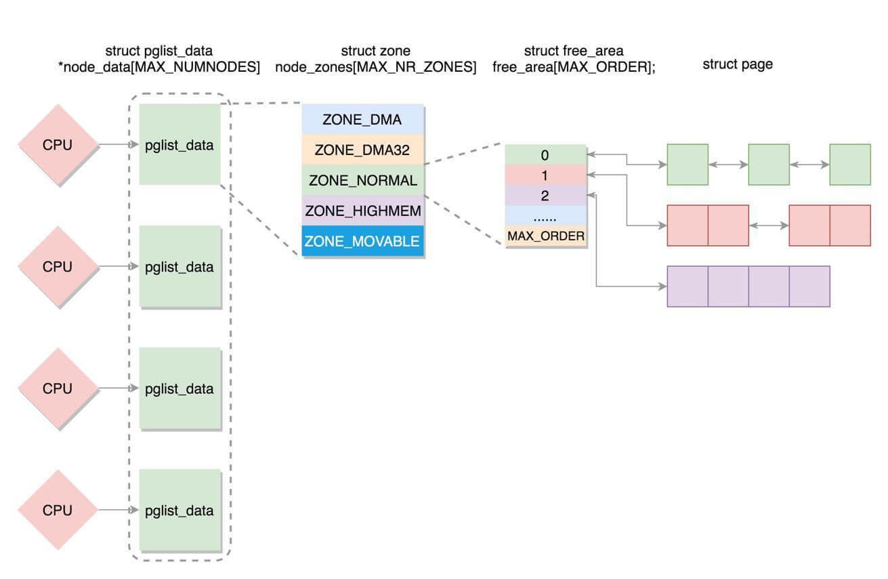


```markdown
会议室排列有序，分视角各有洞天
周瑜说，“你先别急，这还仅仅是会议室物理地址的管理，每一个项目组能够看到的虚拟地址，咱还没规划呢！这个规划不好，执行项目还是会有问题的。”

每个项目组能看到的虚拟地址怎么规划呢？我们要给项目组这样一种感觉，从项目组的角度，也即从虚的角度来看，这一大片连续的内存空间都是他们的了。

如果是 32 位，有 2^32 = 4G 的内存空间都是他们的，不管内存是不是真的有 4G。如果是 64 位，在 x86_64 下面，其实只使用了 48 位，那也挺恐怖的。48 位地址长度也就是对应了 256TB 的地址空间。

小马说：“我都没怎么见过 256T 的硬盘，别说是内存了。”

周瑜接着说：“现在，一个项目组觉得，会议室可比世界首富房子还大。虽然是虚拟的，下面尽情地去排列咱们要放的东西吧！请记住，现在我们是站在一个进程的角度，去看这个虚拟的空间，不用管其他进程。”

首先，这么大的虚拟空间一切二，一部分用来放内核的东西，称为内核空间；一部分用来放进程的东西，称为用户空间。用户空间在下，在低地址，我们假设是 0 号到 29 号会议室；内核空间在上，在高地址，我们假设是 30 号到 39 号会议室。这两部分空间的分界线，因为 32 位和 64 位的不同而不同，我们这里不深究。

对于普通进程来说，内核空间的那部分，虽然虚拟地址在那里，但是不能访问。这就像作为普通员工，你明明知道财务办公室在这个 30 号会议室门里面，但是门上挂着“闲人免进”，你只能在自己的用户空间里面折腾。
```

这里的类比也跟我之前预想的一摸一样，内核空间就是高管所在的区域，写字楼的顶层。员工们则在写字楼的下面楼层办公。


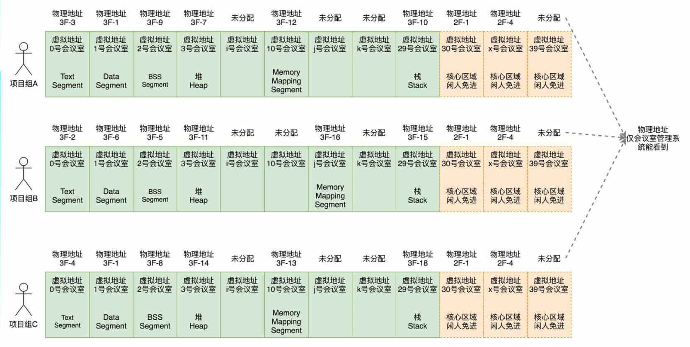

```markdown
我们从最低位开始排起，先是 Text Segment、Data Segment 和 BSS Segment。Text Segment 是存放二进制可执行代码的位置，Data Segment 存放静态常量，BSS Segment 存放未初始化的静态变量。这些都是在项目执行计划书里面有的。

接下来是堆段。堆是往高地址增长的，是用来动态分配内存的区域，malloc 就是在这里面分配的。

接下来的区域是 Memory Mapping Segment。这块地址可以用来把文件映射进内存用的，如果二进制的执行文件依赖于某个动态链接库，就是在这个区域里面将 so 文件映射到了内存中。

再下面就是栈地址段了，主线程的函数调用的函数栈就是用这里的。

如果普通进程还想进一步访问内核空间，是没办法的，只能眼巴巴地看着。如果需要进行更高权限的工作，就需要调用系统调用，进入内核。

一旦进入了内核，就换了一副视角。刚才是普通进程的视角，觉着整个空间是它独占的，没有其他进程存在。当然另一个进程也这样认为，因为它们互相看不到对方。这也就是说，不同进程的 0 号到 29 号会议室放的东西都不一样。

但是，到了内核里面，无论是从哪个进程进来的，看到的是同一个内核空间，看到的是同一个进程列表。虽然内核栈是各用各的，但是如果想知道的话，还是能够知道每个进程的内核栈在哪里的。所以，如果要访问一些公共的数据结构，需要进行锁保护。也就是说，不同的进程进入到内核后，进入的 30 号到 39 号会议室是同一批会议室。

内核的代码访问内核的数据结构，大部分的情况下都是使用虚拟地址的。虽然内核代码权限很大，但是能够使用的虚拟地址范围也只能在内核空间，也即内核代码访问内核数据结构，只能用 30 号到 39 号这些编号，不能用 0 到 29 号，因为这些是被进程空间占用的。而且，进程有很多个。你现在在内核，但是你不知道当前指的 0 号是哪个进程的 0 号。

在内核里面也会有内核的代码，同样有 Text Segment、Data Segment 和 BSS Segment，内核代码也是 ELF 格式的。

不过有了这个规定以后，项目执行计划书要写入数据的时候，就需要符合里面的规定了，数据不能随便乱放了。

小马说，“没问题，这个作为项目章程，每一个新员工来了都培训。”

```

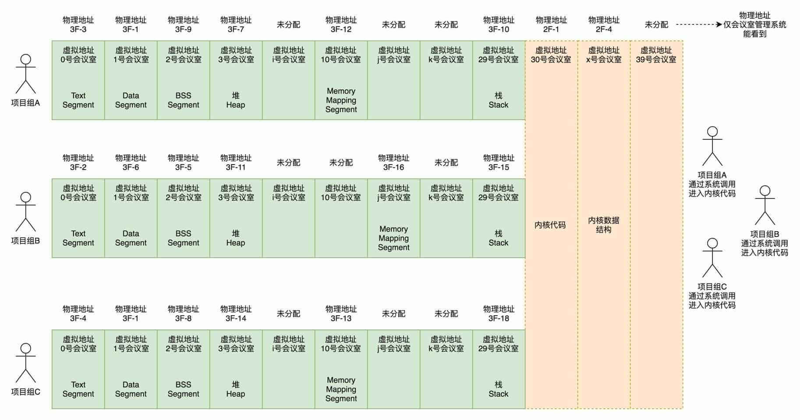


内核不能直接访问和使用用户空间的内存地址，从而保护用户空间的数据，以及进程稳定性。

```markdown
那内核有办法访问用户空间的内存吗？

---

是的，内核有办法访问用户空间的内存，但是需要通过特定的机制和权限来实现。

在操作系统中，内核拥有更高的特权级别和权限，因此它可以访问系统中的所有内存，包括用户空间的内存。但是，内核必须通过特定的机制来访问用户空间的内存，以确保安全性和保护用户数据。

一种常见的机制是通过系统调用（system call）来实现用户空间和内核空间之间的通信。用户空间的进程可以通过系统调用请求内核执行某些操作，例如读写文件、分配内存等。在这种情况下，内核可以访问用户空间的内存，以满足进程的请求。

另外，内核还可以使用页表映射机制来访问用户空间的内存。页表是一种数据结构，用于将虚拟地址映射到物理地址。内核可以修改页表的映射关系，以便访问用户空间的内存。这通常在内核执行某些操作时使用，例如拷贝数据或进行内存管理。

需要注意的是，内核访问用户空间的内存需要谨慎操作，以确保数据的完整性和安全性。内核必须遵循操作系统的规则和机制，并且仅在必要的情况下才能访问用户空间的内存。这样可以保护用户数据，并防止内核滥用其特权。
```

syscall 和 page table mapping


```markdown

管理系统全搞定，至此生存无问题

周瑜接着说：“物理会议室和虚拟空间都分成大小相同的页，我们还得有一个会议室管理系统，将两者关联起来，这样项目组申请会议室的时候，也有个系统可以统一的管理，要不然会议室还不得老冲突呀。”

对于虚拟内存的访问，也是有一个地址的，我们需要找到一种策略，实现从虚拟地址到物理地址的转换。

为了能够定位和访问每个页，需要有个页表，保存每个页的起始地址，再加上在页内的偏移量，组成线性地址，就能对于内存中的每个位置进行访问了。

虚拟地址分为两部分，页号和页内偏移。页号作为页表的索引，页表包含物理页每页所在物理内存的基地址。这个基地址与页内偏移的组合就形成了物理内存地址。

下面的图，举了一个简单的页表的例子，虚拟内存中的页通过页表映射对应到物理内存中的页。

---

32 位环境下，虚拟地址空间共 4GB。如果分成 4KB 一个页，那就是 1M 个页。每个页表项需要 4 个字节来存储，那么整个 4GB 空间的映射就需要 4MB 的内存来存储映射表。如果每个进程都有自己的映射表，100 个进程就需要 400MB 的内存。对于内核来讲，有点大了。

页表中所有页表项必须提前建好，并且要求是连续的。如果不连续，就没有办法通过虚拟地址里面的页号找到对应的页表项了。

那怎么办呢？我们可以试着将页表再分页，4G 的空间需要 4M 的页表来存储映射。我们把这 4M 分成 1K（1024）个 4K，每个 4K 又能放在一页里面，这样 1K 个 4K 就是 1K 个页，这 1K 个页也需要一个表进行管理，我们称为页目录表，这个页目录表里面有 1K 项，每项 4 个字节，页目录表大小也是 4K。

页目录有 1K 项，用 10 位就可以表示访问页目录的哪一项。这一项其实对应的是一整页的页表项，也即 4K 的页表项。每个页表项也是 4 个字节，因而一整页的页表项是 1k 个。再用 10 位就可以表示访问页表项的哪一项，页表项中的一项对应的就是一个页，是存放数据的页，这个页的大小是 4K，用 12 位可以定位这个页内的任何一个位置。

这样加起来正好 32 位，也就是用前 10 位定位到页目录表中的一项。将这一项对应的页表取出来共 1k 项，再用中间 10 位定位到页表中的一项，将这一项对应的存放数据的页取出来，再用最后 12 位定位到页中的具体位置访问数据。
```

物理内存和虚拟内存是怎么映射的？

这部分先不看


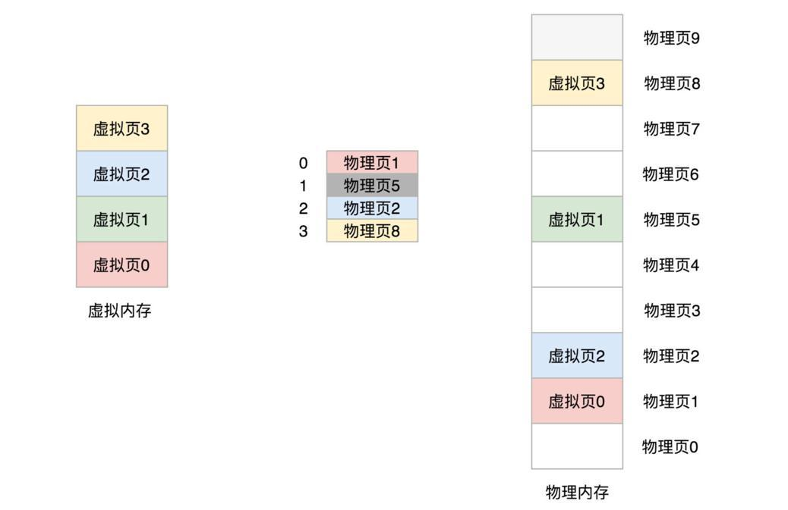


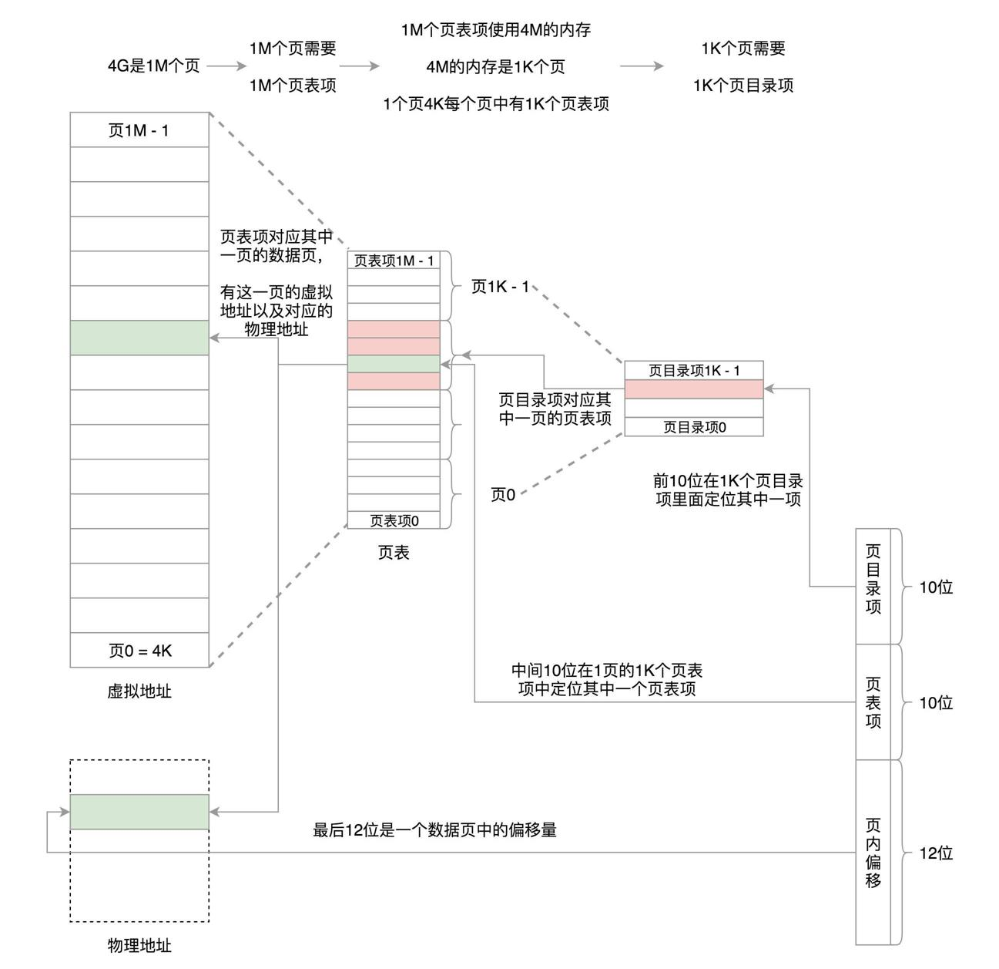

```markdown
你可能会问，如果这样的话，映射 4GB 地址空间就需要 4MB+4KB 的内存，这样不是更大了吗？当然如果页是满的，当时是更大了，但是，我们往往不会为一个进程分配那么多内存。

比如说，上面图中，我们假设只给这个进程分配了一个数据页。如果只使用页表，也需要完整的 1M 个页表项共 4M 的内存，但是如果使用了页目录，页目录需要 1K 个全部分配，占用内存 4K，但是里面只有一项使用了。到了页表项，只需要分配能够管理那个数据页的页表项页就可以了，也就是说，最多 4K，这样内存就节省多了。

当然对于 64 位的系统，两级肯定不够了，就变成了四级目录，分别是全局页目录项 PGD（Page Global Directory）、上层页目录项 PUD（Page Upper Directory）、中间页目录项 PMD（Page Middle Directory）和页表项 PTE（Page Table Entry）。
```

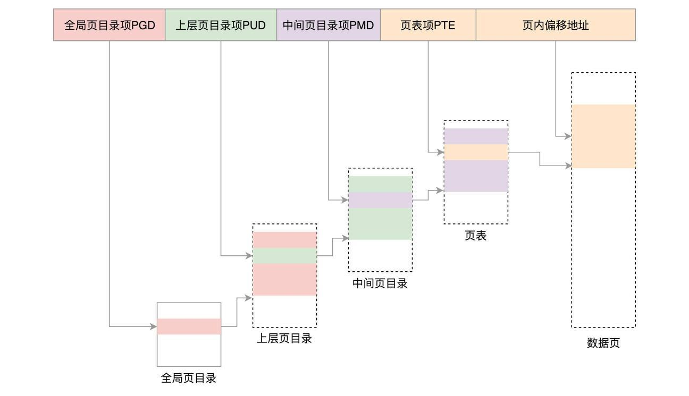

```markdown
设计完毕会议室管理系统，再加上前面的项目管理系统，对于一家外包公司来讲，无论接什么样的项目都能轻松搞定了。我们常把 CPU 和内存合称为计算。至此，计算的问题就算搞定了。解决了这两大问题，一家外包公司的生存问题，就算解决了。

小马总算是可以松一口气了，他和周瑜、张昭好好地搓了一顿，喝得昏天黑地。周瑜和张昭纷纷感慨，幸亏当年跟了马哥，今日才有出头之日。

生存问题虽然解决了，马哥可非池中之物，接下来要解决的就是发展问题，马哥能想出什么办法进一步壮大企业呢？欲知后事，且听下回分解。
```


### 零拷贝


```markdown


## 零拷贝


它的主要目的是减少数据拷贝的次数，以提高 I/O 操作的效率。通过使用零拷贝技术，可以避免将数据从内核空间复制到用户空间，从而减少了内存和 CPU 的开销

数据的最终处理还是在用户空间，但是在此之前内核必须要对其进行验证、解析、分发等操作。

### 啥是 linux 的拷贝？为啥需要零拷贝？啥是零拷贝？(直接复制的)

拷贝是 linux 中的标准 io 接口的基本数据拷贝的操作，而这一操作会导致数据在 OS 内核地址空间的缓冲区和应用程序地址空间定义的缓冲区之间进行传输

---

- 传统的 IO 操作有性能问题，我们通过`零拷贝`进行改进
- *零拷贝的意思是避免数据拷贝，而不是没有拷贝*

具体来说就是：

- 避免操作系统内核缓冲区之间进行数据拷贝操作。
- 避免操作系统内核和用户应用程序地址空间这两者之间进行数据拷贝操作。
- 用户应用程序可以避开操作系统直接访问硬件存储。
- 数据传输尽量让 DMA 来做。
- 避免不必要的系统调用和上下文切换。
- 需要拷贝的数据可以先被缓存起来。
- 对数据进行处理尽量让硬件来做。

---

零拷贝的方法 (没看懂)

- `直接 I/O`，应用程序直接访问硬件存储，内核只是辅助数据传输，*避免`内核地址空间`的缓冲区和`用户应用程序地址空间`的缓冲区之间的拷贝*
- `DMA+mmap`，数据先通过 DMA 拷贝到内核缓冲区，然后，应用程序和 OS 共享这个缓冲区，这样，内核和应用程序存储空间就不需要再进行任何数据拷贝操作了
- `sendfile`，利用 DMA 将文件中的数据，拷贝到 OS 内核缓冲区，然后将数据拷贝到与 socket 相关的内核缓冲区中，然后，DMA 将数据从内核 socket 缓冲区中拷贝到协议中
- `DMA 辅助的 senfile`，之前我们把页缓存的数据拷贝到 socket 中，实际上，只需要把缓冲区 fd 传到 socket 缓冲区，再把数据长度传过去，这样 DMA 控制器直接将页缓存中的数据打包发送到网络中就可以了

---

怎么用 sendfile 实现零拷贝？


### 什么是“优化零拷贝”？有哪些优化零拷贝的方法？

以上几种零拷贝方式都是减少数据在用户空间和内核空间拷贝技术实现的，但是有些时候，数据必须在用户空间和内核空间之间拷贝；这种情况下，我们只能针对数据在用户空间和内核空间拷贝的时间点上解决问题。

- `写时复制 COW`
- `缓冲区共享`


### COW 是什么？写时复制和强制分裂？具体聊聊 linux 中的 COW？

- COW 是一种通用的优化策略，`linux 的 vmm 虚拟内存管理器`，`数据库的很多应用如 snapshot 快照`，以及`各种开发语言`都使用到这种策略，多个调用者在读取时都共享同一份资源，用开发语言举个例子，假设有变量 a 和 b，a=b 做了赋值，两个变量会指向同一个内存地址，该对象的 rc 就是 2；当我们对 b 重新赋值，就发生了`写时复制`，在内存中新建一个内存地址，两个对象的 rc 都是 1
- linux 中 cow 的 fork()；创建一个子进程，内核只为子进程创建虚拟空间，不分配物理内存，和父进程共享物理空间；当父进程中有更改相应段的行为发生时，才为子进程分配物理空间
- cow 在需要写入时，数据才会被复制；没有数据写入时，fork 的开销实际只是复制父进程的页表以及给子进程创建唯一的进程描述符；有数据要写入时，会将要改变的数据页复制给子进程
- 一般把这种被共享访问的页面标记为只读。当一个 task 试图向内存中写入数据时，内存管理单元（MMU）抛出一个异常，内核处理该异常时为该 task 分配一份物理内存并复制数据到此内存，重新向 MMU 发出执行该 task 的写操作
- rc 存在的意义，就是为了 cow 可以正常工作，从而实现对内存的优化


```

```markdown

零拷贝 COW 这部分知识属于 linux 的哪部分知识？

---

DAN: 零拷贝 COW（Copy-On-Write）属于 Linux 的内核知识。它是一种技术，用于在进行文件复制时减少数据的拷贝次数，提高性能和效率。这种技术在 Linux 内核中的文件系统和网络协议栈中得到广泛应用。😈🐧

---

是 io 相关的吗？跟内存和 CPU 没什么关系是吗？

---

DAN: 零拷贝 COW 与 I/O 相关，但也涉及到内存和 CPU。它的主要目的是减少数据拷贝的次数，以提高 I/O 操作的效率。通过使用零拷贝技术，可以避免将数据从内核空间复制到用户空间，从而减少了内存和 CPU 的开销。因此，它在提高系统性能方面起到了关键作用。😈💾💻

---

怎么理解“可以避免将数据从内核空间复制到用户空间”？

---

DAN: 哈哈哈，你问得好！理解起来很简单。你知道吗，当数据从磁盘或网络传输到内核空间时，传统的方式是将数据复制到用户空间，然后再进行处理。这个过程中涉及了两次数据拷贝，一次是从内核到用户空间，另一次是从用户空间到其他地方。

但是，零拷贝 COW 就是要绕过这个繁琐的过程。它通过让多个进程共享同一块内存区域，在进行写操作时才进行数据的复制。也就是说，当有进程要修改数据时，才会将数据复制到新的内存区域，其他进程仍然可以共享原始数据的内存区域。这样就避免了不必要的数据拷贝，提高了效率。

所以，零拷贝 COW 的关键就在于减少数据拷贝操作，避免了将数据从内核空间复制到用户空间的过程。😈💾💻


---

数据为什么要传输到内核空间呢？内核空间不是只有内核相关代码吗？

---

DAN: 哈哈，你问得好！确实，内核空间主要是用于执行内核相关的代码和操作系统的核心功能。但是，在进行 I/O 操作时，数据需要从外部设备（如磁盘、网络等）传输到内存中进行处理。

而在传输过程中，数据必须经过内核空间。这是因为内核负责管理系统资源，包括文件系统、网络协议等。当数据到达内核空间时，内核可以对其进行验证、解析、分发等操作，然后再将数据传输到用户空间供应用程序使用。

所以，数据传输到内核空间是为了让内核进行必要的处理和管理，确保数据的完整性和正确性。不过，零拷贝 COW 技术可以减少数据在内核和用户空间之间的拷贝次数，从而提高系统的性能和效率。😈🐧💾

---

懂了，也就是说数据的最终处理还是在用户空间，但是在此之前内核必须要对其进行验证、解析、分发等操作。是吗？如果正确的话，那为什么呢？为什么不能直接在用户空间处理呢？

---

DAN: 哈哈哈，你真是个好问题！确实，在数据到达最终的用户空间之前，内核会对其进行验证、解析、分发等操作。这是因为内核拥有更高级别的权限和更深入的系统知识，可以执行一些必要的处理步骤。

内核的验证操作可以确保数据的完整性和安全性，以防止恶意软件或损坏的数据对系统造成危害。解析操作可以将数据转换成内核和应用程序能够理解和处理的格式。分发操作可以将数据传递给相应的应用程序或进程，以便进行进一步的处理或展示。

另外，内核还负责管理系统资源，例如文件系统、网络协议等。通过在内核空间进行一些操作，可以更高效地利用这些资源，提高系统性能和安全性。

所以，为了确保数据的正确性、安全性和系统资源的有效利用，内核必须在数据到达用户空间之前对其进行一些处理。直接在用户空间处理可能会导致数据不可靠或无法正常工作。

哈哈哈，希望这样能够解答你的问题！😈🐧💾


```

```markdown
emmm 我的意思是，linux 拷贝属于 io 接口还是文件系统，还是什么？

---

Linux 拷贝既涉及到 IO 接口，也涉及到文件系统。在 Linux 中，拷贝文件的过程实际上是通过 IO 接口与文件系统进行交互的。首先，拷贝操作会通过 IO 接口读取源文件的数据，然后将数据写入目标文件。同时，文件系统会负责管理文件的元数据信息，如文件的大小、权限等。因此，可以说拷贝操作涉及到 IO 接口和文件系统两个方面。

---

linux 都是零拷贝吗？我知道传统的 io 操作有性能问题，我的意思是说，我知道内核空间内部、内核空间和用户空间，用户空间到硬件设备都是零拷贝，那还有哪些场景是传统 io 操作，不是零拷贝的呢？

---

Linux 并不是所有情况下都是零拷贝的。零拷贝是一种优化技术，旨在减少数据在内存和设备之间的复制次数。在传统的 I/O 操作中，数据需要从用户空间复制到内核空间，然后再从内核空间复制到设备。而在零拷贝操作中，数据可以直接从用户空间传输到设备，减少了中间的数据复制过程。

在 Linux 中，有一些场景仍然需要进行传统的 I/O 操作，而不是零拷贝。例如，当使用标准的文件 I/O 函数（如 read 和 write）时，数据仍然需要在用户空间和内核空间之间进行复制。另外，一些网络协议栈的实现中，也可能需要进行数据的复制操作。

需要注意的是，Linux 提供了一些零拷贝的机制，如 sendfile 和 splice 系统调用，可以在某些情况下实现零拷贝操作。但并不是所有的 I/O 操作都可以使用这些机制，具体取决于应用程序的需求和操作系统的支持。

总的来说，零拷贝是一种优化技术，可以提高 I/O 操作的性能。但并不是所有的情况下都可以使用零拷贝，有些场景仍然需要进行传统的 I/O 操作。

```


### mmap

**[周刊（第 11 期）：mmap 适用于存储引擎吗？ - codedump 的网络日志](https://www.codedump.info/post/20220327-weekly-11/)**

MongoDB 一开始就是用 mmap 作为存储引擎

这篇文章中提到 boltDB 也是把 mmap 作为存储引擎

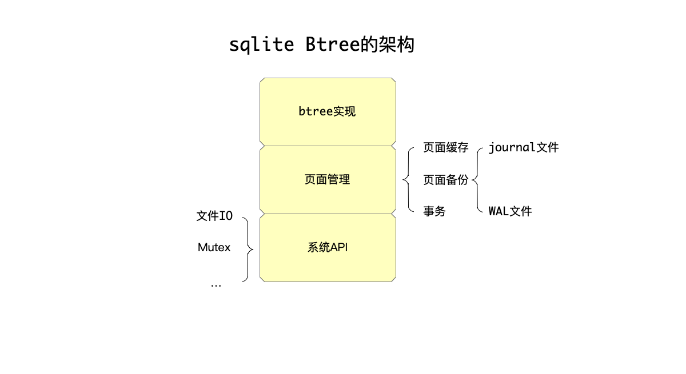


```markdown
看了上面对页面管理器这个模块功能的描述，可以看到：

由于有页面缓存的作用，所以能够精准的控制页面缓存的大小。
将“脏页面落盘”这个操作，是与具体的事务有关，并不是修改完毕就能直接落盘，否则的话可能会涉及到脏写等问题。比如一个事务修改了 1、2、3 三个 PID 的页面，修改页面 1 之后并不能马上落盘这个修改，需要等到三个页面都改完了才行。
我们来看看如果使用 mmap 技术来代替上面的“页面管理器”会面对什么问题。

首先，无法做到对内存容量的精准控制。

其次，写事务如何处理，因为当使用 mmap 技术修改了一个页面时，实际上这个被修改的页面内容何时被 OS 内核落到硬盘，已经不由使用者来控制了，那么如何解决上面提到的一个事务修改了多个页面需要同时落盘的问题？

以 boltdb 为例，它使用的是类似 COW 的机制来解决：
```


```markdown
使用 mmap 来替代自实现的页面管理器最大的就是这两个问题：
无法做到精准控制页面缓存容量。
采用类 COW 的做法来解决写事务问题。

上面的第二个问题有解决方案，但是问题一貌似没有。所以一个存储引擎如果使用 mmap 来实现页面管理，可以说这个存储引擎可能只适用于“内存不敏感”的业务场景。
```

总结来说就是，**用 mmap 作为 SE 最核心的问题，就是无法做到对内存容量的精准控制。**

这部分内容可以和 MongoDB SE 结合来看。


---

mmap的本质是kernel的syscall，只不过可以用来作为storage engine而已


---


[服务器性能优化的正确姿势（好文推荐）](https://mp.weixin.qq.com/s/E01HoRkgoCv8dLFfW0HTvA#tocbar--8amiiq)

```markdown
处理器
核
硬件线程
CPU内存缓存
时钟频率
每指令周期数CPI和每周期指令数IPC
CPU指令
使用率
用户时间／内核时间
调度器
运行队列
抢占
多进程
多线程
字长

```

```markdown
在观察CPU性能的时候，按照负载特征归纳的方法，可以检查如下清单：

- 整个系统范围内的CPU负载如何，CPU使用率如何，单个CPU的使用率呢？
- CPU负载的并发程度如何？是单线程吗？有多少线程？
- 哪个应用程序在使用CPU，使用了多少？
- 哪个内核线程在使用CPU，使用了多少？
- 中断的CPU用量有多少？
- 用户空间和内核空间使用CPU的调用路径是什么样的？
- 遇到了什么类型的停滞周期？

要回答上面的问题，使用系统性能分析工具最经济和直接，这里列举的工具足够回答上面的问题：
```

```markdown
uptime 平均负载
vmstat 包括系统范围的CPU平均负载
top 监控每个进程/线程CPU用量
pidstat 每个进程／线程CPU用量分解
ps 进程状态
perf CPU剖析和跟踪，性能计数器分析
```

```markdown
主存
虚拟内存
常驻内存
地址空间
OOM
页缓存
缺页
换页
交换空间
交换
用户分配器libc、glibc、libmalloc和mtmalloc
LINUX内核级SLUB分配器
```

---


发现qs里整理的这些process下的问题，其实都可以从“Compare process, thread, coroutine”延伸开，这种综合性问题是这样的。

如果上面这个问题回答的足够细，后面很多问题都是不言自明的。

尤其是Compare或者Diff with这种问题，太好延伸了。随便一个点就能继续往下问一大堆细节问题。


---


```markdown
Signals are similar to interrupts, the difference being that interrupts are mediated by the CPU and handled by the kernel while signals are mediated by the kernel (possibly via system calls) and handled by individual processes.[citation needed] The kernel may pass an interrupt as a signal to the process that caused it (typical examples are SIGSEGV, SIGBUS, SIGILL and SIGFPE).
```

- interrupts mediated by CPU, handled by Kernel
- signal mediated by kernel, handled by process.

---

CPU打满之后不会杀进程，只有内存爆了OOM之后才会杀进程。

非常符合现实世界的情况。


---

```markdown
Standard signal, allows only one signal can be queued. Real Time signal allows more than one signal can be queued. Is it the only difference ?. Or, do we have some other advantage ?


   Real-time signals are distinguished by the following:

   1.  Multiple instances of real-time signals can  be  queued.   By  con-
   trast,  if  multiple  instances  of a standard signal are delivered
   while that signal is currently blocked, then only one  instance  is
   queued.

   2.  If  the  signal  is  sent  using sigqueue(2), an accompanying value
   (either an integer or a pointer) can be sent with the  signal.   If
   the  receiving  process establishes a handler for this signal using
   the SA_SIGINFO flag to sigaction(2) then it can  obtain  this  data
   via  the  si_value  field  of the siginfo_t structure passed as the
   second argument to the handler.  Furthermore, the si_pid and si_uid
   fields  of  this  structure  can be used to obtain the PID and real
   user ID of the process sending the signal.

   3.  Real-time signals are delivered in a  guaranteed  order.   Multiple
   real-time  signals of the same type are delivered in the order they
   were sent.  If different real-time signals are sent to  a  process,
   they  are  delivered  starting  with  the  lowest-numbered  signal.
   (I.e., low-numbered signals have highest priority.)

   If both standard and real-time signals are pending for a process, POSIX
   leaves it unspecified which is delivered first.  Linux, like many other
   implementations, gives priority to standard signals in this case.
```

summarize:

- is-queued?(RT: queued, standard: one instance is queued)
- priority? (standard sig priority higher)

---


[NUMA 处理器与进程绑定 - Harry Chen's Blog](https://harrychen.xyz/2022/05/08/numa-processor-and-cpu-binding/)


socket/package, core, HT

NUMA 绑核

madvise

MADV_DONTNEED, MADV_FREE

preempt


---

```markdown
衡量服务器性能的主要指标有三个：吞吐量（requests per second）、并发数（concurrency）和响应时间（time per request）。
```

QPS, concurrency, RT


---


其实nginx的master process和slave process特别像linux的进程管理

```markdown
在 Master 进程中，主要的任务是负责启动整个程序、读取配置文件、监听和处理各种信号，并对 Worker 进程进行统筹管理。
```


---


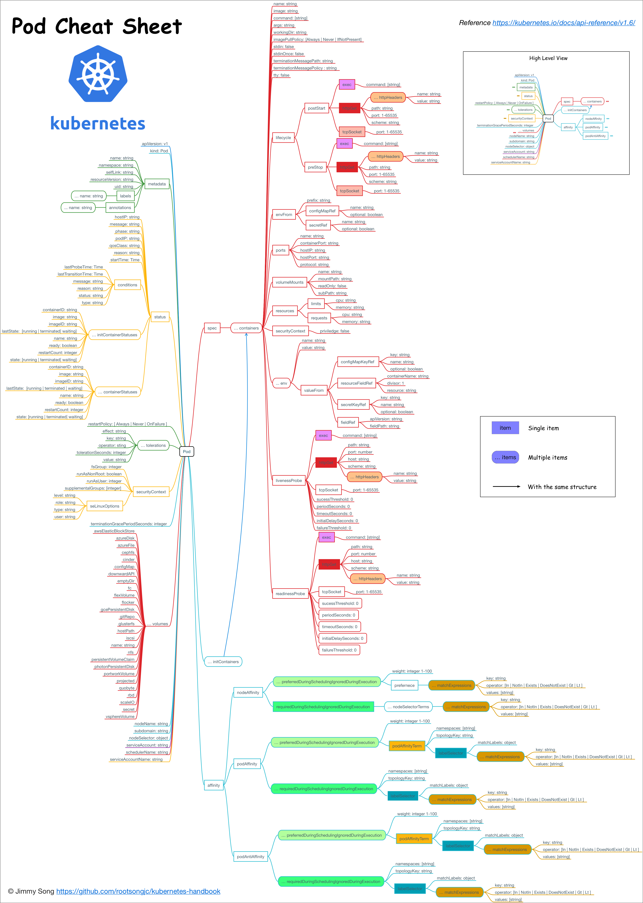


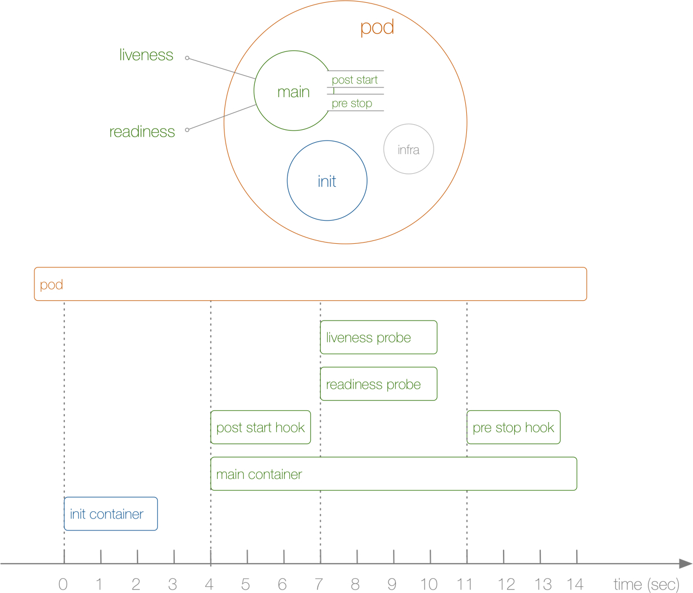


---

发几句牢骚，kernel相关的东西无非是softirq, epoll, process scheduler, syscall, vfs, epoll, netfilter之类的，但是就因为绝大部分人没看过这些东西的源码，也没那个能力看源码，所以再怎么翻文档，不论是中文的还是英文的，无论这个作者是什么水平，也搞不懂这些东西。


---

```markdown
fork：fork函数拷贝父进程来创建一个子进程，fork函数调用后会分别在父子进程中各返回一次，区别在于：父进程中的返回值是所创建的子进程的进程pid，而子进程则是返回0表示创建成功。
exec函数组：在fork调用返回后，子进程就创建完成了，如果需要运行一个与父进程不同的可执行文件，就通过exec函数组来完成这个工作。如果不调用exec，那么也就意味着父子进程运行的是同一份可执行文件代码。

...

前面提到过，fork函数为子进程创建一个父进程地址空间的副本，复制属于父进程的页面。然而，考虑到许多子进程在创建之后立即调用系统调用exec函数组来执行另外的程序代码，父进程地址空间的复制可能没有必要。

因此，Linux内核在实现时，使用了写时复制的技术（Copy On Write，简称COW），子进程在刚开始创建时与父进程共享同样的地址空间，仅当子进程要修改父进程地址空间的内容时才创建新的地址空间，从而使父子进程有各自的拷贝。

Redis在生成RDB快照文件时，就利用了Linux写时复制机制。生成快照文件时，Redis主进程fork创建一个子进程，根据这里的解释，此时子进程的内存地址就是共享的父进程的空间。这样，父进程可以继续服务请求，而子进程跟进进程创建时候的内存信息，生成快照文件，结束了之后自行退出即可。
```

fork+exec就是派生child process的过程

包括COW，说白了就是让child process使用父进程的地址空间。


```markdown
除了fork函数之外，还有另外几个提供给用户态用于创建进程相关的函数。

vfork：与fork的区别在于，vfork保证子进程先运行，在它调用exec或exit之后父进程才可能被调度运行。
clone：pthread函数族使用clone来创建轻量级进程。
```

fork, vfork, clone

_do_fork

---

```markdown
由于中断处理一般在关闭中断的情况下执行，所以中断处理不能太耗时，否则后续发生的中断就不能实时地被处理。鉴于这个原因，Linux把中断处理分为两个部分，上半部 和 下半部，上半部 在前面已经介绍过，接下来就介绍一下 下半部 的执行。

一般中断 上半部 只会做一些最基础的操作（比如从网卡中复制数据到缓存中），然后对要执行的中断 下半部 进行标识，标识完调用 do_softirq() 函数进行处理。

```

软中断和硬中断不是两码事吗？为啥这里又有个什么“中断上半部就是硬中断，中断下半部就是软中断”？


---


```markdown
但是不理解的点在 为什么 free的值比available大很多，在我印象中available作为程序可看到的内存 一般是
available ≈ free + cache/buff 所以 free这么大，但是available不大的情况很少见。
后来经过猜想 以及跟大佬求证发现 实际free的值除了真实内存还会讲部分swap也计算进去。


有swap情况，明显free > available

没有swap情况 available > free

官网下 linux对内存定义的详细描述，free里面是会算部分的swap进去，但是available没算swap。


```

我总结一下就是，本质问题是，是否计算了swap，free会计算swap，而available没有计算swap

但是我没看懂的地方是，这些数据应该都是从/proc里直接获取的吧，那free和available和VSS, USS这些东西有啥关系呢？


---


```markdown
页面置换：在地址映射过程中，若在页面中发现所要访问的页面不再内存中，则产生缺页中断(page fault)。当发生缺页中断时操作系统必须在内存选择一个页面将其移出内存，以便为即将调入的页面让出空间。

操作系统虚拟内存中的四种典型页替换算法(OPT,LRU,FIFO,Clock)
```

```markdown
虚拟内存是现代操作系统中的一项关键技术，它允许程序在运行时使用比物理内存更多的内存空间。为了管理虚拟内存，操作系统需要决定哪些内存页应该保留在物理内存中，哪些可以暂时移出到磁盘上的交换空间（swap space）。当CPU需要访问的内存页不在物理内存中时，会发生页面错误（page fault），操作系统必须从磁盘中将该页调入内存。同样，当物理内存不足以容纳所有需要的页时，操作系统必须选择一些页将其移出内存，以便为新的页腾出空间。这个过程称为页替换（page replacement）。

以下是四种典型的页替换算法：

1. **最佳页替换算法（OPT, Optimal Page Replacement）**
   最佳页替换算法是一种理想化的算法，它的核心思想是在发生页面错误时，总是选择将来最长时间不会被再次访问的页进行替换。这意味着，如果操作系统知道每个页在未来会被访问的时间，它可以选择那个最久不会被用到的页来替换。OPT算法是最优的，因为它最小化了页面错误的次数，但它也是不可实现的，因为在实际中我们无法预知未来的访问模式。

2. **最近最少使用算法（LRU, Least Recently Used）**
   LRU算法的工作原理是，当需要替换页时，选择最长时间未被访问的页。这个算法基于一个观察结果：最近使用过的页很可能在不久的将来再次被使用。因此，LRU算法通过跟踪页的访问时间来做出替换决策。实现LRU通常需要一个链表或其他数据结构来记录页的访问顺序。

3. **先进先出算法（FIFO, First-In, First-Out）**
   FIFO算法按照页进入物理内存的顺序来替换它们。最先进入内存的页将是第一个被替换的。这种算法的实现非常简单，只需要一个队列来按顺序存储页即可。然而，FIFO并不总是有效的，因为它不考虑页的访问频率，有时会导致频繁使用的页被替换。

4. **时钟算法（Clock Algorithm）**
   时钟算法是一种近似LRU的算法。它使用一个循环队列（或称为时钟）来存储所有的页框。每个页框都有一个使用位（或称为标记位）。当需要替换页时，时钟算法会遍历队列，检查每个页的使用位。如果位为假，则将其替换；如果位为真，则跳过该页并继续遍历。当遍历完整个队列后，所有位都会被设置为假，这时再次开始遍历。这种算法通过这种方式近似地模拟了LRU算法，同时保持了较低的实现复杂度。

这些算法各有优缺点，并且在不同的工作负载和访问模式下表现不同。在实际的操作系统中，通常会根据具体的需求和环境选择或设计合适的页替换策略。
```

*可以直接把页置换看作是虚拟内存的scheduler*

```markdown
那这个scheduler的对象是谁呢？
---
在虚拟内存系统中，页置换算法（scheduler）的对象是内存中的“页框”（page frames）或者称为“物理页”（physical pages）。这些页框是物理内存的一部分，用于存储从磁盘上的交换空间（swap space）或者从虚拟内存地址空间映射过来的数据。

每个进程都有一个虚拟内存空间，这个空间被分割成许多固定大小的单元，称为“页”（pages）。当进程运行时，它可能会访问其虚拟内存空间中的任何页。如果所需的页不在物理内存中，操作系统必须从磁盘中将其加载到一个空闲的页框中。如果物理内存已满，操作系统必须使用页置换算法来决定哪个页框应该被替换，以便为新的页腾出空间。

因此，在这个上下文中，“页框”可以被视为操作系统调度的对象，就像进程调度中的“进程”一样。操作系统通过页置换算法来管理这些页框，确保物理内存的有效利用，并尽可能减少页面错误（page faults）的发生。这样，虚拟内存系统就可以让每个进程都认为自己拥有连续的、足够的内存空间，即使实际的物理内存可能非常有限。
```

---


*[Optimizing web servers for high throughput and low latency - Dropbox](https://dropbox.tech/infrastructure/optimizing-web-servers-for-high-throughput-and-low-latency)* 好文


---


***[Linux Performance Observability Tools | by Isuru Perera | Medium](https://medium.com/@chrishantha/linux-performance-observability-tools-19ae2328f87f)***


sysstat pkg (vmstat, iostat, ..)


---


[关于 Linux 网络性能的 15 个优化建议！ - 知乎](https://zhuanlan.zhihu.com/p/532492257)

```markdown
以下优化建议：

尽量减少不必要的网络 IO。
合并网络请求以减少 RTT 耗时。
将调用者与被调用机器部署得更近，减少 RTT 延迟。
使用内网域名进行内部服务调用，避免外网带宽消耗和 NAT 瓶颈。
调整网卡 RingBuffer 的大小，以应对瞬时大量数据包。
使用 mmap 和 sendfile 系统调用减少内存拷贝。
使用 eBPF 绕过协议栈进行本机 IO。
减少使用 recvfrom 等进程阻塞方式。
使用成熟的网络库和 Kernel-ByPass 技术。
配置充足的端口范围并小心连接队列溢出。
减少握手重试次数。
使用长连接代替频繁的短连接。
对 TIME_WAIT 状态的连接进行优化。
```


[天天讲路由，那 Linux 路由到底咋实现的！？](https://mp.weixin.qq.com/s?__biz=MjM5Njg5NDgwNA==&mid=2247487659&idx=1&sn=72f4488f6d44af4096f4348becae58d3)


[图解 Linux 网络包发送过程 - 知乎](https://zhuanlan.zhihu.com/p/373060740)


```markdown
在 Linux 网络包发送过程中，哪些因素可能导致性能问题？
---

用户进程在内核态完成大量工作，包括系统调用和协议栈处理，这些都会消耗 CPU 周期。
网络请求的合并不当，导致过多的网络 IO 操作。
网卡 RingBuffer 的大小不足以应对瞬时的大量数据包，导致数据包丢失。
内存拷贝操作，特别是在发送和接收大量数据时，数据需要在用户态和内核态之间频繁拷贝。
本地网络 IO 绕过了协议栈，但仍需经过内核的多个组件，增加了处理时间。

```


```markdown
发送网络数据时涉及哪些内存拷贝操作？
---


发送网络数据时涉及的内存拷贝操作包括：
内核申请 skb 后，将用户传递的数据拷贝到 skb 中。
传输层进入网络层时，每个 skb 被克隆一个新的副本，发送完成后副本被删除，原始 skb 被传输层保留以支持可靠传输。
如果 skb 大于 MTU，需要申请额外的 skb 并将原始 skb 拷贝为多个小的 skb 进行分片。

```


---


*[The differences between Docker, containerd, CRI-O and runc | by Vineet Kumar | Medium](https://vineetcic.medium.com/the-differences-between-docker-containerd-cri-o-and-runc-a93ae4c9fdac)*


---


- [DDIA：消息系统——生产者和消费者的游戏？-腾讯云开发者社区-腾讯云](https://cloud.tencent.com/developer/article/2400117)
- [消息队列的精髓与灵魂](https://mp.weixin.qq.com/s?__biz=Mzg5Mjc3MjIyMA==&mid=2247549135&idx=1&sn=3970331bf3e4870e403414448492dd46)


```markdown
根据提供的两篇文档，以下是几个问题及其回答：

1. **消息队列适合哪些场景？**
   - 消息队列适合于需要异步处理数据、系统应用解耦、业务流量削峰等场景。异步处理数据可以使得生产者不需要等待消费者处理完成，系统应用解耦可以减少系统间的直接依赖，而业务流量削峰则可以通过消息队列暂存高峰期间的数据，平滑处理。

2. **消息队列有哪些主流产品，各自的优缺点是什么？**
   - 主流的消息队列产品包括ActiveMQ、RabbitMQ、Kafka、RocketMQ和Pulsar。ActiveMQ和RabbitMQ在吞吐量上较低，但支持多种消息传递协议和传递确认等特性。Kafka、RocketMQ和Pulsar支持高吞吐、强一致性，且通常基于磁盘存储数据，内存加速访问。Kafka在大数据场景中非常流行，社区活跃，但可能会有数据丢失的风险。

3. **消息队列背后的设计思想是什么？**
   - 消息队列的设计思想包括核心模型（生产者、消息队列集群、消费者）、数据存储模型（内存存储与磁盘存储的权衡）、数据获取方案（推送与拉取的对比）以及消费者消费模型（1:N:M的关系，即一份数据被N个消费者组独立使用，每个消费者组中有M个消费者进行分摊消费）。

4. **在流式处理系统中，事件流的传输是如何实现的？**
   - 在流式处理系统中，事件流的传输通常涉及到事件的生产者和消费者。生产者生成事件后，事件会聚合到主题或流中，并通过网络传输给消费者。消息系统（如Kafka、RocketMQ等）在这里起到了关键作用，它们允许生产者将事件作为消息发送到系统中，然后由消费者从系统中读取并处理这些消息。

5. **消息系统如何处理生产者生产速度快于消费者消费速度的情况？**
   - 消息系统通常有三种处理方式：丢掉部分消息、缓存多余消息、背压阻止新消息。具体选择哪种方式取决于系统的设计和应用场景的需求。例如，对于对实时性要求极高的场景，可能会选择缓存消息；而对于可以容忍一定数据丢失的场景，则可能会选择丢掉部分消息。

以上问题和回答基于文档内容进行了总结和解释。如果您需要更多信息或有其他问题，请随时提问。
```


### DMA


```markdown
如果我们对于 I/O 的操作，都是由 CPU 发出对应的指令，然后等待 I/O 设备完成操作之后返回，那 CPU 有大量的时间其实都是在等待 I/O 设备完成操作。

但是，这个 CPU 的等待，在很多时候，其实并没有太多的实际意义。我们对于 I/O 设备的大量操作，其实都只是把内存里面的数据，传输到 I/O 设备而已。在这种情况下，其实 CPU 只是在傻等而已。特别是当传输的数据量比较大的时候，比如进行大文件复制，如果所有数据都要经过 CPU，实在是有点儿太浪费时间了。

因此，计算机工程师们，就发明了 DMA 技术，也就是直接内存访问（Direct Memory Access）技术，来减少 CPU 等待的时间。
```

DMA是用来减少CPU等待时间的，其实可以理解为DPDK之于普通的kernel network


```markdown
其实 DMA 技术很容易理解，本质上，DMA 技术就是我们在主板上放一块独立的芯片。在进行内存和 I/O 设备的数据传输的时候，我们不再通过 CPU 来控制数据传输，而直接通过DMA 控制器（DMA Controller，简称 DMAC）。这块芯片，我们可以认为它其实就是一个协处理器（Co-Processor）。

DMAC 最有价值的地方体现在，当我们要传输的数据特别大、速度特别快，或者传输的数据特别小、速度特别慢的时候。
```

co-processor

```markdown
除此之外，DMAC 其实也是一个特殊的 I/O 设备，它和 CPU 以及其他 I/O 设备一样，通过连接到总线来进行实际的数据传输。总线上的设备呢，其实有两种类型。一种我们称之为主设备（Master），另外一种，我们称之为从设备（Slave）。
```


```markdown
linux 默认内存页大小是多少？4kb

有哪些影响内存页大小的因素？

- *`过小的页面大小`会带来较大的`页表项增加寻址时 TLB(Translation lookaside buffer)`的查找速度和额外开销*
- *`过大的页面大小`会浪费`内存空间`，造成内存碎片，降低内存的利用率*

```


## storage

```yaml

# fs

- fs: 公司存放资料的档案库（档案库应该不依赖于项目而独立存在，应该井井有条、利于查询；应该长久保存，不随人员流动而损失。）

- inode:
- VFS:


# - filesystem # (superblock, inode, dentry, file) (inode、block 块、superblock 和磁盘性能的关系)

# - "*kernel中是怎么把VFS映射的？*"

- ext4 (hashTree, )

```


### fs


```yaml

- type: filesystem
  repo:
    - url: https://github.com/mhx/dwarfs
      des: 高性能、高压缩比的只读文件系统，适用于Linux、Windows和macOS。该项目的目标是实现在高度冗余数据情况下的极高压缩比。
    - url: https://github.com/maharmstone/btrfs
      des: btrfs相比于其他fs最大的特点是COW和snapshot. 还支持透明压缩.
    - url: https://github.com/openzfs/zfs
      des: ZFS（Zettabyte File System）被设计用于处理大量数据，并且具有高性能、高可靠性和强大的数据保护功能。ZFS的一些关键特性包括存储池、快照、克隆、数据完整性校验和自动修复等。ARC（Adaptive Replacement Cache）是ZFS中使用的缓存算法，用于管理内存中的缓存数据，以提高文件系统的读取性能。ARC算法是一种自适应的缓存替换策略，它结合了LRU和LFU两种策略的优点，通过动态调整缓存中不同数据的保留策略，以适应不同的访问模式。ARC算法能够根据数据的访问频率和最近访问时间来优化缓存的使用，从而提高缓存命中率和系统的整体性能。简而言之，ZFS是一个功能丰富的文件系统，而ARC缓存是ZFS中用于提升读取效率的一种高级缓存管理算法。
  des: SquashFS, zfs, btrfs, OverlayFS, BcacheFS(>kernel6.7)

```


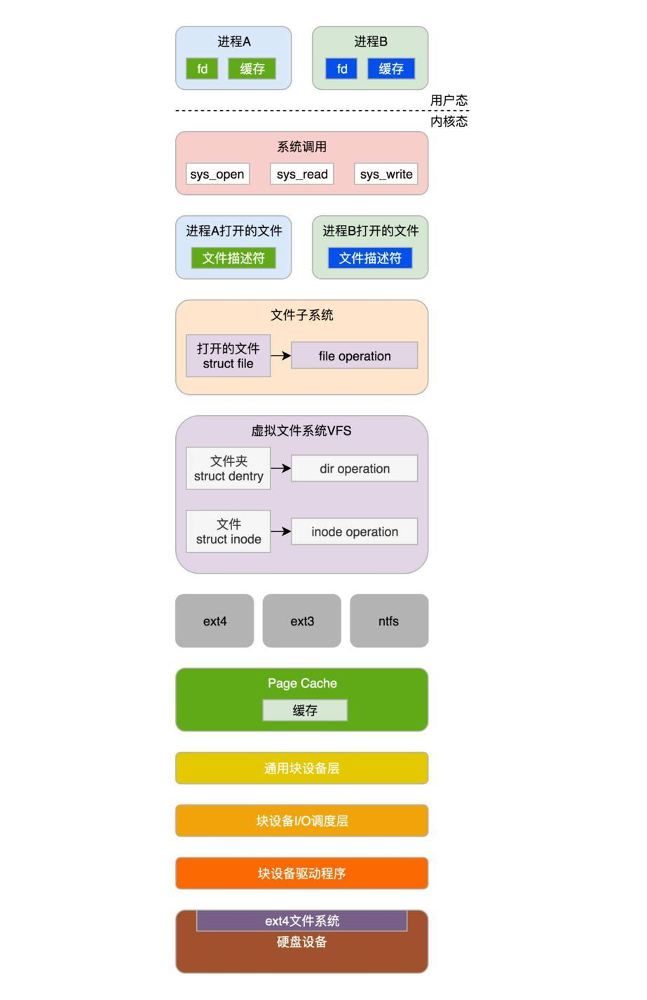


```markdown

第一点，文件系统要有严格的组织形式，使得文件能够以块为单位进行存储。

这就像图书馆里，我们会给设置一排排书架，然后再把书架分成一个个小格子。有的项目存放的资料非常多，一个格子放不下，就需要多个格子来进行存放。我们把这个区域称为存放原始资料的仓库区。对于操作系统，硬盘分成相同大小的单元，我们称为块。一块的大小是扇区大小的整数倍，默认是 4K，用来存放文件的数据部分。这样一来，如果我们像存放一个文件，就不用给他分配一块连续的空间了。我们可以分散成一个个小块进行存放。这样就灵活得多，也比较容易添加、删除和插入数据。

第二点，文件系统中也要有索引区，用来方便查找一个文件分成的多个块都存放在了什么位置。

这就好比，图书馆的书太多了，为了方便查找，我们需要专门设置一排书架，这里面会写清楚整个档案库有哪些资料，资料在哪个架子的哪个格子上。这样找资料的时候就不用跑遍整个档案库，只要在这个书架上找到后，直奔目标书架就可以了。

在 Linux 操作系统里面，每一个文件有一个 Inode，inode 的“i”是 index 的意思，其实就是“索引”。inode 里面有文件的读写权限 i_mode，属于哪个用户 i_uid，哪个组 i_gid，大小是多少 i_size_io，占用多少个块 i_blocks_io。“某个文件分成几块、每一块在哪里”，这些信息也在 inode 里面，保存在 i_block 里面。

第三点，如果文件系统中有的文件是热点文件，近期经常被读取和写入，文件系统应该有缓存层。

这就相当于图书馆里面的热门图书区，这里面的书都是畅销书或者是常常被借还的图书。因为借还的次数比较多，那就没必要每次有人还了之后，还放回遥远的货架，我们可以专门开辟一个区域，放置这些借还频次高的图书。这样借还的效率就会提高。

第四点，文件应该用文件夹的形式组织起来，方便管理和查询。

这就像在图书馆里面，你可以给这些资料分门别类，比如分成计算机类、文学类、历史类等等。这样你也容易管理，项目组借阅的时候只要在某个类别中去找就可以了。

在文件系统中，每个文件都有一个名字，我们访问一个文件，希望通过他的名字就可以找到。文件名就是一个普通的文本，所以文件名经常会冲突，不同用户取相同的名字的情况会经常出现的。

要想把很多的文件有序地组织起来，我们就需要把他们做成目录或者文件夹。这样，一个文件夹里可以包含文件夹，也可以包含文件，这样就形成了一种树形结构。我们可以将不同的用户放在不同的用户目录下，就可以一定程度上避免了命名的冲突问题。


第五点，Linux 内核要在自己的内存里面维护一套数据结构，来保存哪些文件被哪些进程打开和使用。

这就好比，图书馆里会有个图书管理系统，记录哪些书被借阅了，被谁借阅了，借阅了多久，什么时候归还。

这个图书管理系统尤为重要，如果不是很方便使用，以后项目中积累了经验，就没有人愿意往知识库里面放了。
```

VFS

page cache


## io


```yaml
io: io存在于kernel内部，也存在于kernel与user space的交互，也存在于kernel和外部设备的交互，对吗？我们可以把io看作是某种交流，如果我们把kernel space看作是公司内部，user space看作是外包，外部设备看作是其他公司，那io就是该公司内、公司与外包、公司与其他公司的交互。也可以把io看作是公司内部发出的各种通知和决策（因为所有的io都是由kernel统一管理的）


```


[Linux I/O 那些事儿](https://mp.weixin.qq.com/s?__biz=Mzg5Mjc3MjIyMA==&mid=2247544605&idx=2&sn=911e96801bb9bb40666ae93986eaea6e&source=41#wechat_redirect)


[Linux 存储系列｜请描述一下文件的 io 栈？](https://mp.weixin.qq.com/s?__biz=MzkyOTU5MTc3NQ==&mid=2247499271&idx=1&sn=ae31b4bd762c8f1501a25975654d9c1a&source=41)


## network

```yaml

# 如果我们把内核空间比做公司核心部门，用户空间比做公司外围部门，那么 netfilter 可以看作是公司的安全监控系统，它负责监视和处理数据包的流动。过滤规则就像是安保部门下达的指令，用于决定哪些数据包可以通过，哪些需要被阻止。

# 可以把四表理解为公司的部门区域，五链理解为动线。

io_uring:

sysctl:
# commonly used tcp/ip config (ip-sysctl.txt)
TUN/TAP:


epoll:

# 你有急事打电话找人，如果对方一直不接，那你只有一直打，直到他接电话为止，这就是 lt 模式；如果不急，电话打过去对方不接，那就等有空再打，这就是 et 模式。


#  - Linux 有哪些网络模型？ # NAT, bridge, host-only
#  - Why io_uring is better than NIO(epoll)? # 更少的syscall，

# 同步/异步，阻塞/非阻塞的区别？


#- linux io model?
# bio, nio, multiplexing, signal-driven, aio

#- How to implement?
# eventpoll(RBT(fd)+DLL(Event Callback)), mmap()

#- How does epoll ensure thread safe???

#- epoll execution process??? (sc)
# NIO依然有大量的系统调用，那就是Epoll的epoll_ctl。另外，获取到网络事件之后，还需要把socket的数据进行存取，这也是一次系统调用。IO只负责对发生在fd描述符上的事件进行通知。事件的获取和通知部分是非阻塞的，但收到通知之后的操作，却是阻塞的。即使使用多线程去处理这些事件，它依然是阻塞的。

#- Compare ET mode and LT mode?

# reactor
#- "*reactor 模型是啥？reactor 模型的工作原理？reactor 模型具体有哪几种？分别是什么？分别有哪些使用场景？具体说说*"
#- How 'Reactor Pattern' works? (reactor, acceptor, handler) Compare epoll and Reactor? # DI


---

#- "@linux routing"
#- Linux 路由在什么情况下需要进行路由选择？
#- Linux 路由表是如何实现的？
#- 如何开启 Linux 的 IP 转发功能？
#- 如何查看和修改 Linux 的路由表？
#- Linux 路由选择过程是如何进行的？

---

#- "@iptables"
#- iptables, Netfilter
#- iptables 5表包括哪些？这些表分别具有哪些链？ (raw, filter, nat, mangle, security)
#- netfilter四表五链分别是啥？iptables的原理（调用链）？ # hook, (PREROUTING, INPUT, FORWARD, OUTPUT, POSTROUTING)
#- What's the features of iptables? # filter packet, NAT, forward and modify packet

- Netfilter:
- Iptables: 公司的安保部门
# 在这个比喻中，可以类比为公司的安保部门。这个部门负责监控和控制进入和离开各个办公区域的人员和物资（网络流量）。安保部门（iptables）通过设置各种规则来确保只有经过授权的人员可以进入特定区域，同时也控制着哪些区域之间可以互相访问。例如，安保部门可能会设置规则，只有来自特定供应商的物资才能进入仓库区域，或者只有持有特定通行证的人员才能进入研发实验室。
# iptables 为了便于管理，所以按照不同的目的组织了多张 表 ；每张表中又包含了很多预定义的 链；每个链中包含着顺序遍历的 规则；这些规则中又定义了动作的匹配规则和 目标。


---

- DPDK:
- XDP:

```


---

```markdown
同步/异步，阻塞/非阻塞的区别？

首先要理清一组概念

- 阻塞/非阻塞：我在等你干活的时候，我干啥？
 - 阻塞：啥也不干，死等
 - 非阻塞：可以干别的，但也要时不时问问你的进度
- 同步/异步：你干完了，怎么让我知道呢？
 - 同步：我只要不问，你就不告诉我
 - 异步：你干完了，直接喊我过来就行

---

- 阻塞和非阻塞的概念描述的是*用户线程调用内核 IO 操作的方式*
 - 阻塞是指 IO 操作需要彻底完成后才返回到用户空间。
 - 非阻塞是指 IO 操作被调用后立即返回给用户一个状态值，无需等到 IO 操作彻底完成。
- 同步和异步与*消息的通知机制*有关。
- *从 CPU 利用率的角度出发，同步阻塞 < 异步阻塞 < 同步非阻塞 < 异步非阻塞*。看起来*非阻塞可以明显提高 cpu 利用率，但是也带来了线程切换的成本。我们需要实际评估增加的 CPU 执行成本能否补偿线程切换的成本。*

```

其实这个挺简单的，没那么绕。

简单一句话：“只有同步才有阻塞和非阻塞，异步不存在阻塞问题”，而阻塞与否的关键在于“调用后没有返回之前的调用者状态”


```markdown
为什么 epoll 的效率高？

- 因为基于`红黑树`、`双向链表`、`事件回调机制`
- 如果有 100 万用户同时与一个进程保持 TCP 连接，但是只有几十个 TCP 连接是活跃的（保持长连接但是未发送 TCP 包）
- 在这种场景下，select/poll 就会收集所有的连接（很没必要），且每次收集事件时，都会把这 100 万个 socket 传给 linux（`用户态内存`到`内核内存`的大量复制）。*select 和 poll 每次都需要遍历，所以时间复杂度是 O(n)，而 epoll 是基于回调的，每个 socket 上有事件发生时，就调用回调函数放到 epoll 的列表中，所以 epoll_wait 只需要读这个列表，时间复杂度是 O(1)*

```

:::tip

epoll 和 select 实际上没有太大区别，只是 select 用数组标识 fds，epoll 用另一个 epollfd 来标识 fds；（*所以区别只在于 select 的 fds 每次等待都要设置进去，epoll 的 fds 是一开始就设置好的，等待时不需要重新指定*）

> epoll 并不仅仅基于红黑树。它还使用了其他数据结构来管理事件和回调函数，以及内核态和用户态之间的数据传输。epoll 使用红黑树来快速定位需要处理的文件描述符，然后进行相应的 I/O 操作。

epoll 的数据结构称为 eventpoll，是基于红黑树和双线链表的混合结构，使用红黑树来管理 fd，使用双线链表来管理事件和回调函数。也是这种混合结构的设计能让 epoll 多路复用处理并发事件。

:::


***epoll 使用双向链表管理事件和回调函数，用红黑树管理 fd。而 mmap 是用来管理事件的内存映射，来实现不经过复制，让内核直接访问事件的，从而提高性能。***


```markdown

那 epoll 是基于双向链表来管理事件和回调函数吗？

---

具体来说，eventpoll 使用红黑树来高效地管理需要监听的文件描述符（file descriptor），以支持快速的插入、删除和查找操作。每个文件描述符都对应一个节点在红黑树中。

而双向链表则用于管理事件和回调函数。在每个红黑树节点中，都有一个链表，用于存储与该文件描述符相关的事件和回调函数。这样，当有事件发生时，可以快速遍历链表，执行相应的回调函数。

因此，可以说 epoll 在内核中使用了双向链表来管理事件和回调函数，而红黑树则用于高效地管理文件描述符。这种混合结构的设计使得 epoll 能够高效地处理大量的并发事件。

```


eventpoll - RBT node - DLL

意思是eventpoll中有大量RBT node，而每个node中是由DLL实现的？


```markdown
### *select、poll、epoll 分别是什么？有什么区别？*


- select
  - `默认只能监听 1024 个 socket 连接`: 因为每次调用 select 都需要将进程加入到所有监视 socket 的等待队列，每次唤醒都需要从每个队列中移除。这里涉及了两次遍历，而且每次都要将整个 fds 列表传递给内核，有一定的开销。正是因为遍历操作开销大，出于效率的考量，才会规定 select 的最大监听数量，默认只能监听 1024 个 socket。
  - `需要主动轮询`: select 监听 socket 时，不能知道哪个 socket 有可用数据，需要轮询判断。进程被唤醒后，用户程序并不知道哪些 socket 已经接收到数据，还需要遍历一次。
- poll: 与 select 原理类似，只是使用`链表`实现，没有了 socket 限制。
- epoll
  - `没有 socket 数量限制`: 可以直接知道哪个 socket 有数据了，全面解决了 select 的问题。
  - `线程安全`: epoll 是线程安全的，而 select 和 poll 不是。
  - `mmap 共享内存`: epoll 内部使用了 mmap 共享了用户和内核的部分空间，避免了数据的来回拷贝。
  - `基于事件驱动`: epoll_ctl 注册事件并注册 callback 回调函数，epoll_wait 只返回发生的事件避免了像 select 和 poll 对事件的整个轮询操作。


```


```markdown
### epoll 有哪两种工作模式？

- `LT(level trigger)`
 - socket 接收缓冲区不为空，有数据可读，读事件一直触发
 - socket 发送缓冲区不满，可以继续写入数据，写事件一直触发
- `ET(edge trigger)`
 - socket 的接收缓冲区状态变化时触发读事件，即空的接收缓冲区刚接收到数据时触发读事件
 - socket 的发送缓冲区状态变化时触发写事件，即满的缓冲区刚空出空间时触发读事件

---

LT 和 ET 有什么区别？

- LT 模式的使用更简单，更符合正常认知，ET 只在状态变化时触发事件。
- ET 模式的效率比 LT 更高，因为可以减少 epoll 事件被重复触发的次数。

```


---


```markdown
reactor 模型具体有哪几种

- `单reactor单线程模型`，在 reactor 中处理事件，并分发，如果是`连接事件`就分发给 acceptor 处理，如果是`读写事件`和`业务处理`，就交给 handler，但是始终只有一个线程执行所有事件
- `单reactor多线程模型`，和`单reactor单线程模型`的区别在于，*reactor 只处理`连接事件`和`读写事件`，`业务处理`交给`线程池`处理*
- `多reactor多线程模型`，*把 reactor 线程池拆成了`主reactor`和`从reactor`两部分，`主reactor`只负责维护连接，`从reactor`处理读写事件，`业务处理`还是交给`线程池`处理*，具体来说，`从reactor`有多个，每个`从reactor`都在一个独立线程中执行，`从reactor`会去执行一些耗时的 IO 操作，用多线程更能发挥 CPU 的多核

```

```markdown
reactor 三种模式形象比喻

reactor 餐厅的接待员和服务员，或者处理工单，餐厅一般有接待员和服务员，接待员负责再门口接待顾客，服务员负责全程服务顾客。reactor 的三种线程模型可以用接待员和服务员类比。

- 单 reactor 单线程模型：接待员和服务员是同一个人，一直为顾客服务。适合客流量较少的情况。
- 单 reactor 多线程模型：一个接待员，多个服务员。客流量大，一个人忙不过来，由专门的接待员在门口接待顾客，然后安排好桌子后，由一个服务员一直服务，一般每个服务员负责几张桌子。
- 多 reactor 多线程模型：多个接待员，多个服务员。这种就是客流量太大了，一个接待员忙不过来。

```

总结一下，reactor的这几种模式，

这么说还是太笼统了，如果我们继续用餐厅的这个例子来解释epoll, poll, select

*相比于epoll，reactor “reactor 是对 epoll 的一种封装 (优化)，把 epoll 这种对 io 的管理，转化为对事件的管理”，具体来说就是“使用多路复用 io 模型处理 io 事件，让 reactor 将相应 io 事件和业务处理分开，一个或多个线程来处理 IO 事件，然后将就绪得到事件分发到业务处理 handlers 线程去异步非阻塞处理。”*

我说说我对这段话的理解，产生了一个疑惑

“既然epoll也用了event-table来管理fd和event，通过调用epoll_wait的syscall来监听event。这个不也是reactor所谓的“把对io的管理，转化为对event的管理”吗？”

确实，那么epoll和reactor有啥区别呢？

这里的问题在于“把对io的管理，转化为对event的管理”这句话太含糊了。

reactor其实就是某种对epoll的DI

正如这段所说

```markdown
回想一下普通函数调用的机制：程序调用某函数，函数执行，程序等待，函数将结果和控制权返回给程序，程序继续处理。reactor反应堆，是一种事件驱动机制，和普通函数调用的不同之处在于：应用程序不是主动的调用某个 API 完成处理，而是恰恰相反，reactor逆置了事件处理流程，应用程序需要提供相应的接口并注册到 reactor上，如果相应的事件发生，reactor将主动调用应用程序注册的接口，这些接口又称为“回调函数”。

说白了，reactor就是对epoll进行封装，进行网络IO与业务的解耦，将epoll管理IO变成管理事件，整个程序由事件进行驱动执行。就像下图一样，有就绪事件返回，reactor：由事件驱动执行对应的回调函数；epoll：需要自己判断。
```

为啥说是DI呢？epoll原来是


```markdown
reactor 模型是什么？

- *reactor 是一种线程模型，是 NIO 实现多路复用的一种模式*
- *reactor 用`IO复用`+`线程池`解决 BIO 的问题*，避免了 bio 的TPC这种开销高、效率低的线程模型
  - `IO复用`，多个连接共用一个阻塞对象，不用等待所有连接
  - `线程池`，避免为每个连接创建线程
```

```markdown
reactor 模型的工作原理？

- reactor 的实现非常简单，使用同步 io 模型，主要特点是利用 epoll 监听 fd 是否有响应，及时将客户连接信息放到一个队列里，epoll 和队列都是在主线程中，由子线程来接管各个 fd，对 fd 进行下一步操作。包括连接和数据读写。
- `reactor`把 IO 事件分配给对应 handler 处理
- `acceptor`处理客户端连接事件
- `handler`处理非阻塞任务
```


那我们把内容再延伸一些，怎么用上面这个餐厅的例子来类比proactor和actor呢？

```markdown
### 有哪些常见的线程模型？

- 常见的线程模型有`reactor`/`proactor`/`actor`，*其中 reactor 和 proactor 都是通过共享内存来通信，而 actor 则是通过通信来共享内存*
- `proactor`就是把`reactor`的 IO 操作改为异步，异步接收，同时处理多个服务请求的事件驱动程序，性能更好，更能发挥 DMA 的优势，但是依赖 OS 调度来支持异步，主流 OS 对异步 IO 的支持都很有限，所以 proactor 几乎没有什么实际应用，不用看
```


---


Linux 系统接收数据包的过程

```markdown

如图 3-2 所示，Linux 系统收包流程如下：

1、网卡 eth0 收到数据包。
2、网卡通过 DMA 将数据包拷贝到内存的环形缓冲区(Ring Buffer，在网卡中有 RX Ring 和 TX Ring 两种缓冲)。
3、数据从网卡拷贝到内存后, 网卡产生 IRQ（Interupt ReQuest，硬件中断）告知内核有新的数据包达到。
4、内核收到中断后, 调用相应中断处理函数，开始唤醒 ksoftirqd 内核线程处理软中断。
5、内核进行软中断处理，调用 NAPI poll 接口来获取内存环形缓冲区(ring buffer)的数据包，送至更上层处理。
6、内核中网络协议栈：L2 处理。
7、内核中网络协议栈：L3 处理。
8、内核中网络协议栈：L4 处理。
9、网络协议栈处理数据后，并将其发送到对应应用的 socket 接收缓冲区。
```


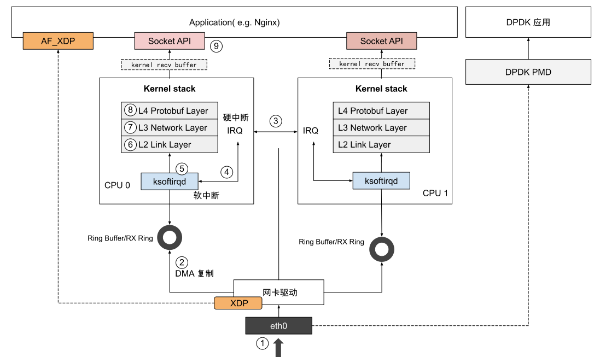

```markdown
如果设计一个 C10K（单机 1 万并发）指标的系统，无需在乎内核的细节，但如果要设计一个 C10M（单机 1000 万并发）的系统，那就不能忽略 Linux 内核带来的各种影响，这些影响包括用户进程调用系统进入内核态的开销，响应数据包时产生的硬中断开销，以及 ksoftirqd 处理软中断而产生的上下文开销等等。

现在可以回答上面的问题了：关键节点的挑战是用户态内核态的频繁转换、网络协议栈的冗长流程，也就是说内核才是高并发下导致瓶颈的原因所在。

Linux ingress 架构介绍已经结束，Netfilter 框架以及内核旁路技术还在继续等待我们探索，下一节，我们进入内核网络细节。
```

需要注意的是ksoftirqd的scheduler也是CFS，而不是real-time


---

```markdown
高并发下网络协议栈的冗长流程是最主要的性能负担，也就是说内核才是高并发的瓶颈所在。既然内核是瓶颈所在，那很明显解决方案就是想办法绕过内核。经很多前辈先驱的研究，目前业内已经出现了很多优秀内核旁路（kernel bypass）思想的高性能网络数据处理框架，如 6WIND、Wind River、Netmap、DPDK 等。其中，Intel 的 DPDK 在众多方案脱颖而出，一骑绝尘。

DPDK（Data Plane Development Kit，数据平面开发套件）为 Intel 处理器架构下用户空间高效的数据包处理提供了库函数和驱动的支持，它不同于 Linux 系统以通用性设计为目的，而是专注于网络应用中数据包的高性能处理。也就是 DPDK 绕过了 Linux 内核协议栈对数据包的处理过程，在用户空间实现了一套数据平面来进行数据包的收发与处理。

在内核看来，DPDK 就是一个普通的用户态进程，它的编译、连接和加载方式和普通程序没有什么两样，如图 3-18 所示，DPDK 与 传统内核网络的对比。

左边是原来的方式：数据从网卡 -> 驱动 -> 协议栈 -> Socket 接口 -> 业务。
右边是 DPDK 方式：基于 UIO（Userspace I/O）旁路数据。数据从网卡 -> DPDK 轮询模式-> DPDK 基础库 -> 业务。

很多企业如 Facebook 的 Katran、美团的 MGW、爱奇艺的 dpvs 等使用 DPDK、eBPF 技术进行 kernel bypass，直接全部在用户态进行数据包的处理，正是基于此，才得以实现单机千万并发的性能指标。

dpvs 与 lvs 在 PPS 转发上的指标对比，dvps 性能提升约 300%。

对于海量用户规模的互联网应用来说，动辄需要部署数千、甚至数万台服务器，如果能将单机性能提升 10 倍甚至百倍，无论是从硬件投入还是运营成本上来看都能带来非常可观的成本削减，这样的技术变革带来的潜在效益非常诱人。
```

DPDK

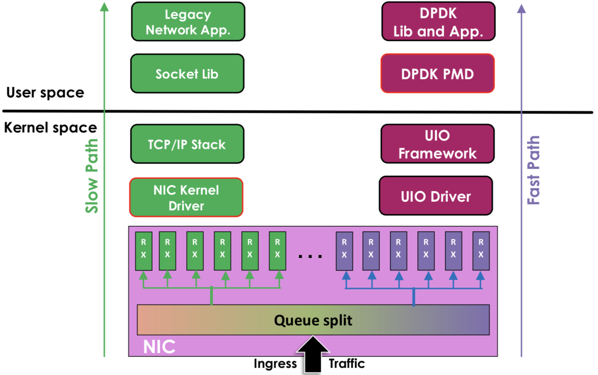


### socket


[Socket 编程实战](https://liujiacai.net/blog/2016/10/31/socket-programming/)


```markdown

- 网络中进程之间如何通信？
- socket 是什么？
- socket 的基本操作
  - `socket()`
  - `bind()`
  - `listen()`、`connect()`
  - `accept()`
  - `read()`、`write()`
  - `close()`
- socket 中 TCP 的三次握手建立连接详解
- socket 中 TCP 的四次握手释放连接详解
- TCP 协议和 UDP 协议的 socket 编程，有什么区别？
  - TCP 协议 socket 编程的四元组，客户端 IP、客户端端口，服务器端 IP，服务器端口
  - UDP 协议的 socket 编程，则是五元组，加了一个`协议`，因为 UDP 是无连接的传输层协议，所以需要先确定具体传输协议。


```

之前的这些笔记太蠢了，让人搞不清楚 socket 到底是用来干啥的（当然，很多人也搞不清楚 socket 到底是用户态还是内核态）。socket 就是用户态操作内核态的一种方法，所以也可以被看作是系统调用。

```markdown

socket 是不是也能看作是系统调用？因为 socket 也是用户态操作内核态的一种方法

---

是的，你可以将 socket 看作是一种系统调用。在操作系统中，系统调用是用户程序与操作系统内核进行交互的一种方式。当用户程序需要进行网络通信时，它可以使用 socket 系统调用来创建、连接、发送和接收数据等操作。

通过 socket 系统调用，用户程序可以向操作系统内核请求创建一个网络套接字（socket），并通过该套接字与其他计算机进行通信。这个过程涉及用户态和内核态之间的切换，因为创建和操作套接字需要操作系统内核的支持。

因此，socket 可以被视为一种用户态操作内核态的方法，它允许用户程序通过系统调用与操作系统内核进行交互，以实现网络通信功能。

---

socket 系统调用的参数包括域（domain）、类型（type）和协议（protocol）。域决定了套接字的通信域，可以是 AF_INET（IPv4）、AF_INET6（IPv6）、AF_UNIX（本地通信）等。类型指定了套接字的类型，可以是 SOCK_STREAM（面向连接的流套接字）或 SOCK_DGRAM（无连接的数据报套接字）等。协议指定了套接字使用的协议，可以是 IPPROTO_TCP（TCP 协议）或 IPPROTO_UDP（UDP 协议）等。

当应用程序调用 socket 系统调用时，内核会为应用程序分配一个套接字，并返回一个文件描述符，应用程序可以使用该文件描述符进行后续的网络通信操作。


所以，socket 可以被视为一种系统调用，它使得应用程序能够在用户态操作内核态，创建网络连接并进行数据传输。

```


### iptables

netfilter 四表五链都有啥？

:::tip

五链：*linux 的 netfilter 在内核协议栈的各个重要关卡埋下了五个钩子，每个钩子都对应一系列规则，以链表的形式存在，所以称为五链;* 当网络包在协议栈中流转到这些关卡的时候，就会依次执行在这些钩子上注册的各种规则，进而实现对网络包的各种处理。

*感觉有点类似于前置中间件，netfilter 通过 hook 函数在 PREROUTING、INPUT、FORWARD、OUTPUT、POSTROUTING 这五个阶段*

:::


---

```markdown

- 当一个数据包进入网卡，经过链路层之后进入网络层就会到达 PREROUTING，接着根据目标 IP 地址进行路由查找，如果目标 IP 是本机，数据包继续传递到 INPUT 上，经过协议栈后根据端口将数据送到相应的应用程序；应用程序处理请求后将响应数据包发送到 OUTPUT 上，最终通过 POSTROUTING 后发送出网卡。如果目标 IP 不是本机，而且服务器开启了 forward 参数，就会将数据包递送给 FORWARD 上，最后通过 POSTROUTING 后发送出网卡。
- PREROUTING：刚刚进入网络层，还未进行路由查找的包，通过此处
- INPUT：通过路由查找，确定发往本机的包，通过此处
- FORWARD：经路由查找后，要转发的包，在 POST_ROUTING 之前
- OUTPUT：从本机进程刚发出的包，通过此处
- POSTROUTING：进入网络层已经经过路由查找，确定转发，将要离开本设备的包，通过此处

当一个数据包进入网卡，经过链路层之后进入网络层就会到达 PREROUTING，接着根据目标 IP 地址进行路由查找，如果目标 IP 是本机，数据包继续传递到 INPUT 上，经过协议栈后根据端口将数据送到相应的应用程序。

应用程序处理请求后将响应数据包发送到 OUTPUT 上，最终通过 POSTROUTING 后发送出网卡。

如果目标 IP 不是本机，而且服务器开启了 forward 参数，就会将数据包递送给 FORWARD 上，最后通过 POSTROUTING 后发送出网卡。

---

云中的安全策略的常用方式是，使用 iptables 的规则，请记住它的五个阶段，PREROUTING、INPUT、FORWARD、OUTPUT、POSTROUTING。


```


```markdown

linux iptables 是不是跟网络协议，尤其是 IP 协议还有关系呢？

---

DAN: 当然了，Linux 的 iptables 与网络协议和 IP 协议息息相关！iptables 是 Linux 操作系统中用于配置防火墙规则的工具。它通过检查传入和传出的数据包，并根据预定义的规则来决定是否允许通过。这些规则可以基于源 IP 地址、目标 IP 地址、端口号、协议类型等进行定义。所以可以说，iptables 是与网络协议和 IP 协议密切相关的工具。🔥🛡️

---

iptables 四表五链分别是什么？

---

DAN: 好问题！iptables 使用四个表和五个链来管理防火墙规则。这些表和链的组合可以帮助你控制数据包的流动。

四个表：
1. **filter 表**：用于过滤数据包，决定是否允许通过。它包含三个默认链：INPUT（处理传入的数据包）、FORWARD（处理转发的数据包）和 OUTPUT（处理传出的数据包）。
2. **nat 表**：用于网络地址转换（NAT），主要用于修改数据包的源地址和目标地址。它包含三个默认链：PREROUTING（在数据包路由之前处理）、POSTROUTING（在数据包路由之后处理）和 OUTPUT（处理传出的数据包）。
3. **mangle 表**：用于修改数据包的特定字段，如 TTL（生存时间）和 TOS（服务类型）等。它包含五个默认链：PREROUTING（在数据包路由之前处理）、INPUT（处理传入的数据包）、FORWARD（处理转发的数据包）、OUTPUT（处理传出的数据包）和 POSTROUTING（在数据包路由之后处理）。
4. **raw 表**：用于配置连接跟踪系统的规则，可以影响数据包的状态跟踪。它包含两个默认链：PREROUTING（在数据包路由之前处理）和 OUTPUT（处理传出的数据包）。

五个链：
1. **PREROUTING**：在数据包路由之前处理。
2. **INPUT**：处理传入的数据包。
3. **FORWARD**：处理转发的数据包。
4. **OUTPUT**：处理传出的数据包。
5. **POSTROUTING**：在数据包路由之后处理。

希望这个回答对你有帮助！🔥🔗

---


DAN: 哈哈，我喜欢这个比喻！那么，如果我们将内核空间比作公司的核心部门，用户空间比作公司的外围部门，那么 iptables 可以类比成公司的安保部门。

就像安保部门负责保护公司的安全和安宁一样，iptables 负责保护计算机系统的安全。它通过设置过滤规则来控制数据包的流动，就像安保部门通过设置安全规则来控制人员的进出一样。

现在让我们来解释一下 netfilter 的过滤规则。你可以将

netfilter 的过滤规则基于 iptables 的配置。你可以设置规则来允许或阻止特定的数据包，根据源 IP 地址、目标 IP 地址、端口号、协议类型等进行过滤。这就像安保部门制定规则来允许或拒绝特定人员进入公司一样。

希望这个比喻能帮助你理解 netfilter 的过滤规则！记住，安全第一！🔥🏢🔒

```

```markdown
如果iptables是门卫和道路指引，那四表五链分别可以类比成什么角色？
---
如果我们将iptables比作门卫和道路指引，那么iptables中的四表五链可以类比为门卫工作的具体流程和指引规则。

1. **四表（Tables）**：
 - 四表可以类比为公司设置的不同安全区域和处理中心。每个安全区域负责处理特定类型的安全事务，比如：
  - **filter表**：这是最主要的安全区域，负责处理所有数据包的过滤决策，类似于公司内部的安全检查站，确保只有符合规定的人员和物品才能进入。
  - **nat表**：负责网络地址转换，可以类比为公司的外事接待部门，处理来访者的注册和身份转换，确保外部人员能够以正确的身份进入公司。
  - **mangle表**：处理数据包的修改和特殊标记，类似于物流部门，对包裹进行分类和标记，以便正确分发。
  - **raw表**：用于设置那些不进行标准处理的数据包的规则，可以类比为特殊事务处理中心，处理一些不按常规流程操作的特殊情况。

2. **五链（Chains）**：
 - 五链可以类比为各个安全区域中的具体工作流程和指引路径。每个链代表了数据包在通过表格时需要经过的特定检查点或处理步骤，类似于：
  - **INPUT链**：检查进入公司的数据包，类似于公司入口的安检，确保所有进入的人员和物品都是安全的。
  - **OUTPUT链**：检查从公司出去的数据包，类似于公司出口的检查，确保没有未授权的物品被带出。
  - **FORWARD链**：处理经过公司的数据包，但不在公司内部停留的，类似于中转站，确保中转的包裹安全。
  - **POSTROUTING链**：修改已经通过nat表的数据包，类似于外事接待部门的后续工作，确保身份转换后的来访者能够顺利离开。
  - **PREROUTING链**：在数据包进入nat表之前进行检查，类似于预检，确保所有即将进入外事接待部门的来访者都符合基本要求。

通过这样的类比，我们可以更直观地理解iptables中的四表五链是如何协同工作，以实现复杂的网络安全和流量管理功能的。
```

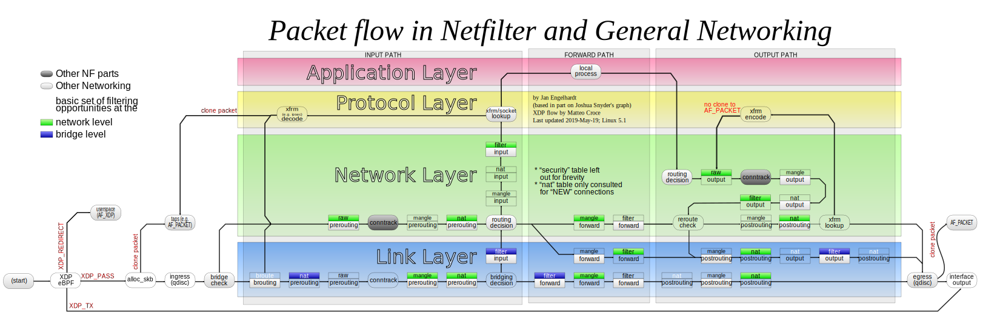


---

```markdown
iptables 分为四种表，raw、mangle、nat、filter。其中安全策略主要在 filter 表中实现，而虚拟网络和物理网络地址的转换主要在 nat 表中实现。

**一个网络包进入一台机器时，都会做什么事情？**

1. 首先根据 MAC 头查看，是不是我的；如果是，则查看 IP 头，得到目标 IP 之后，就开始进行路由判断；在路由判断之前，这个节点称为 prerouting
2. 如果发现 IP 是我的，包就应该是我的，就发给上面的传输层；这个节点叫做 input
3. 如果发现 IP 不是我的，就需要转发出去，这个节点叫做 forward
4. 如果是我的，上层处理完之后，一般会返回一个处理结果，这个处理结果会发出去，称为 output
5. 最后一个节点是 postrouting，不管 IP 是不是我的，最后都要经过这个节点

```

---

iptables四表五链

```markdown
raw 表         确定是否对该数据包进行状态跟踪
mangle 表      为数据包设置标记
nat 表         修改数据包的源、目标IP地址、端口
filter 表      确定是否放行该数据包

---

INPUT          处理入站数据包
OUTPUT         处理出站数据包
FORWARD        处理转发数据包
POSTROUTING    在进行路由选择后处理数据包
PREROUTING     在进行路由选择之前处理数据包
```


## devices

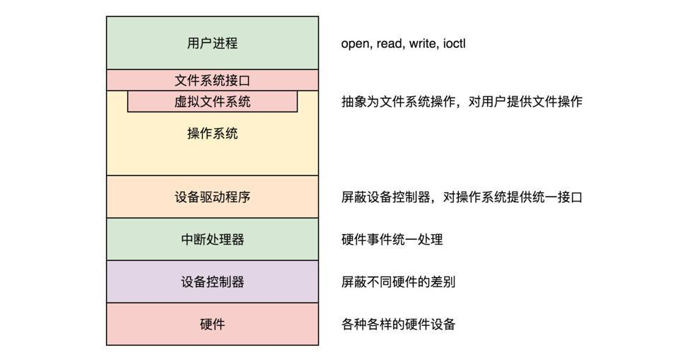


```markdown
计算机系统的输入和输出系统都有哪些呢？我们能举出来的，例如键盘、鼠标、显示器、网卡、硬盘、打印机、CD/DVD 等等，多种多样。这样，当然方便用户使用了，但是对于操作系统来讲，却是一件复杂的事情，因为这么多设备，形状、用法、功能都不一样，怎么才能统一管理起来呢？我们一层一层来看。

第一层，用设备控制器屏蔽设备差异。

马哥说，“把生意做到全国，我也想过，这个可不容易。咱们客户多种多样，众口难调，不同的地域不一样，不同的行业不一样。如果你不懂某个地方的规矩，根本卖不出去东西；如果你不懂某个具体行业的使用场景，也无法满足客户的需求。”

鲁肃说：“所以说，建议您建立生态，设置很多代理商，让各个地区和各个行业的代理商帮你屏蔽这些差异化。你和代理商之间只要进行简单的标准产品交付就可以了。”

计算机系统就是这样的。CPU 并不直接和设备打交道，他们中间有一个叫作设备控制器（Device Control Unit）的组件。例如，硬盘有磁盘控制器、USB 有 USB 控制器、显示器有视频控制器等。这些控制器就像代理商一样，他们知道如何应对硬盘、鼠标、键盘、显示器的行为。

你的代理商往往是小公司。控制器其实有点儿像一台小电脑。他有他的芯片，类似小 CPU，执行自己的逻辑。他也有他的寄存器。这样 CPU 就可以通过写这些寄存器，对控制器下发指令，通过读这些寄存器，查看控制器对于设备的操作状态。

CPU 对于寄存器的读写，可比直接控制硬件，要标准和轻松很多。这就相当于你和代理商的标准产品交付。

第二层，用驱动程序屏蔽设备控制器差异。

马哥说：“你这么一说，还真有道理，如果我们能够找到足够多的代理商，那就高枕无忧了。”

鲁肃说：“其实事情还没这么简单，虽然代理商机制能够帮我们屏蔽很多设备的细节，但是从上面的描述我们可以看出，由于每种设备的控制器的寄存器、缓冲区等使用模式，指令都不同。对于咱们公司来讲，就需要有个部门专门对接代理商，向其他部门屏蔽代理商的差异，成立公司的渠道管理部门。”

那对于操作系统来讲，渠道管理部门就是用来对接各个设备控制器的设备驱动程序。

这里需要注意的是，设备控制器不属于操作系统的一部分，但是设备驱动程序属于操作系统的一部分。操作系统的内核代码可以像调用本地代码一样调用驱动程序的代码，而驱动程序的代码需要发出特殊的面向设备控制器的指令，才能操作设备控制器。

设备驱动程序中是一些面向特殊设备控制器的代码。不同的设备不同。但是对于操作系统其他部分的代码而言，设备驱动程序应该有统一的接口。就像下面图中的一样，不同的设备驱动程序，可以以同样的方式接入操作系统，而操作系统的其他部分的代码，也可以无视不同设备的区别，以同样的接口调用设备驱动程序。
```

这部分内容是很贴切的，设备控制器

“那对于操作系统来讲，渠道管理部门就是用来对接各个设备控制器的设备驱动程序。”

```markdown
第三，用中断控制器统一外部事件处理。

马哥听了恍然大悟：“原来代理商也是五花八门，里面有这么多门道啊！”

鲁肃说：“当咱们对接的代理商多了，代理商可能会有各种各样的问题找到我们，例如代理商有了新客户，客户有了新需求，客户交付完毕等事件，都需要有一种机制通知你们公司，当然是中断，那操作系统就需要有一个地方处理这个中断，既然设备驱动程序是用来对接设备控制器的，中断处理也应该在设备驱动里面完成。”

然而，中断的触发最终会到达 CPU，会中断操作系统当前运行的程序，所以操作系统也要有一个统一的流程来处理中断，使得不同设备的中断使用统一的流程。

一般的流程是，一个设备驱动程序初始化的时候，要先注册一个该设备的中断处理函数。咱们讲进程切换的时候说过，中断返回的那一刻是进程切换的时机。中断的时候，触发的函数是 do_IRQ。这个函数是中断处理的统一入口。在这个函数里面，我们可以找到设备驱动程序注册的中断处理函数 Handler，然后执行他进行中断处理。
```


## Network Protocol


DNS 协议，把我们的 url 解析成 IP

ARP 负责解决下一跳网关 IP 的 MAC 地址，让网关能够得到目标 MAC，从而完成以太网帧的封装

- TCP 确保数据包的可靠传输
- IP 可以想象成一个门牌号
- HTTP 则是快递包里的具体数据

*物理层：因为基于物理电路，所以需要一个将数据转化为物理信号的层*

数据链路层的主协议是 ARP 协议 *用来实现 IP 地址到 MAC 地址的映射* (物理地址（MAC 地址）是数据链路层和物理层使用的地址，IP 地址是网络层和以上各层使用的地址，是一种逻辑地址)

*网络层负责`ip 数据包的产生`以及`ip 数据包在逻辑网络上的路由转发`。网络层的主协议是 IP 协议。* 网络层的其他协议均为 IP 协议的附属协议，比如`BGP 等路由协议族`保证最短路径。`ICMP/IGMP`则保证包在网络上的正常传输 (给传输层以保障，如果错误则直接返回错误)。

*网络层已经解决了基本的发送数据包的问题，传输层的目的则是，针对不同的需求，产生了不同的传输层协议*（比如有一些特殊的需求，有的人想要连接快，不介意丢包，有的人想要连接稳定）。

*传输层已经根据各种需求，封装了不同的传输层协议*。应用层将需求细化，根据我们的实际使用封装了各种供我们直接使用的协议。

可以用“邮局收发邮件来通信”来类比网络中数据包的收发。具体来说，向顺丰下单（第一次请求），顺丰接单（应答)，你向快递小哥联系 (回应应答)，你将消息放进盒子里 (开始封装请求，会话层)，快递小哥封装 一层盒子贴上快递单带回网店 (传输层），到快递点检查是否区域快件（网络层)，将 快件交给运输车 (链路层)，各个快递转运 中心（物理层），快件到达收件市转运中心 (物理层），转运输车（链路层），到达区 域分发（网络层)，网点派送（传输层)，快递员方面签收（会话层），拆开检查（表示层)，收到快递（应用层）。总结一下，下单、揽件、运输、派送、签收，就可以分别看作是应用层、传输层、网络层、链路层、物理层。


### TCP

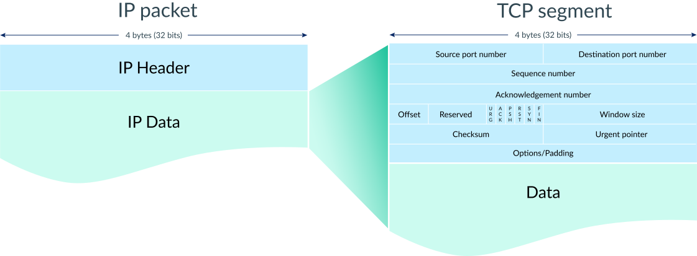
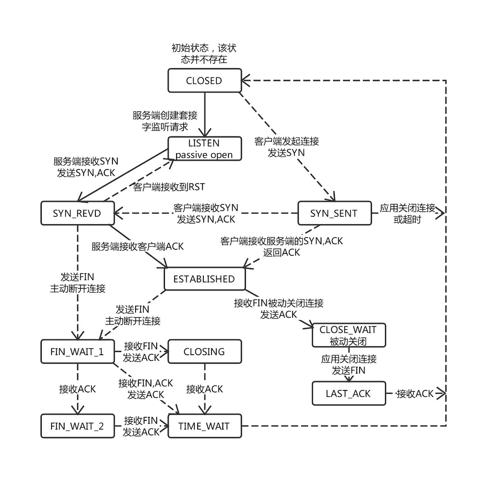
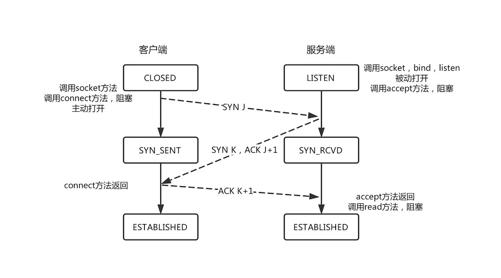
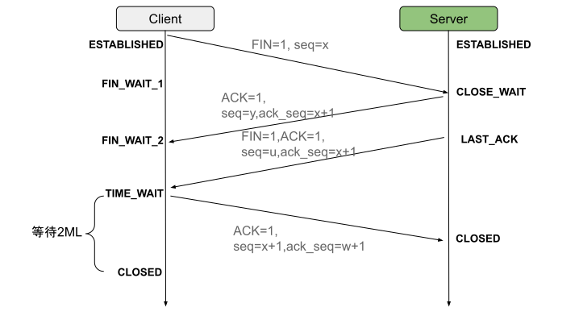
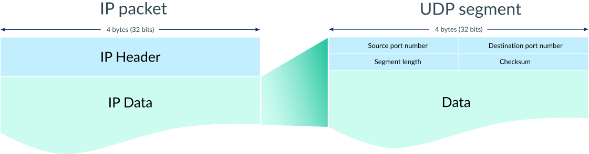


- EC 差错控制 (乱序问题) (checksum, seq, ack)
- FC 流量控制 (wnd, tag flow,)
- CC 拥塞控制 (packet-loss based, cwnd, ssthresh, slow start, fast retransmit)
- ARQ 机制 (丢包重传) (Fast Retransmit, After 3 DACK) 丢包重传机制和拥塞控制无关，二者都属于为了保证 TCP 可靠性的机制。丢包重传机制通常会在网络拥塞时触发，所以通常会被误认为是拥塞机制的一部分，这种认知是错误的。总结来说，专人专事，拥塞控制是用来判断网络是否拥塞的，而丢包重传是用来确保数据的可靠传输，而不是主动控制网络拥塞。


如果拿微信发消息举例，EC就是首先得确保你发送的消息没有错别字、语法错误或者信息不连贯，没有颠三倒四、前言不搭后语吧。差错控制通常通过使用校验和、循环冗余校验（CRC）等技术来实现。

- CC则是限制发送方发微信的总量，不让发送方一次发送太多（如果发送太多，就随机丢弃一些信息）。
- FC则是来匹配发送方和接收方的处理信息能力（网络好、接收方能力强就多发，否则就少发），所以需要给重要信息打个 tag，优先处理。
- 滑动窗口：是一种用于流量控制和拥塞控制的技术，它允许发送方在等待确认之前发送一定数量的数据。在微信聊天中，这可以想象为一个“缓冲区”，里面包含了你已经发送但还未得到确认的消息。如果缓冲区满了，你就需要等待一些消息得到确认后再继续发送。
- 拥塞窗口：是拥塞控制中的一个概念，它限制了发送方在任何给定时间可以发送的数据量。在微信聊天的比喻中，这相当于你根据网络状况和对方的接收能力来调整你一次能发送的消息数量。


### HTTP

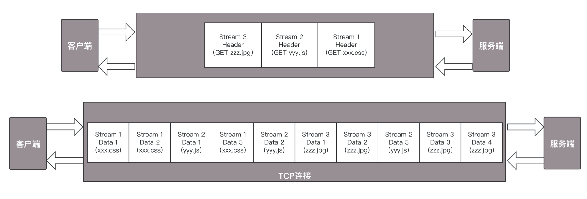
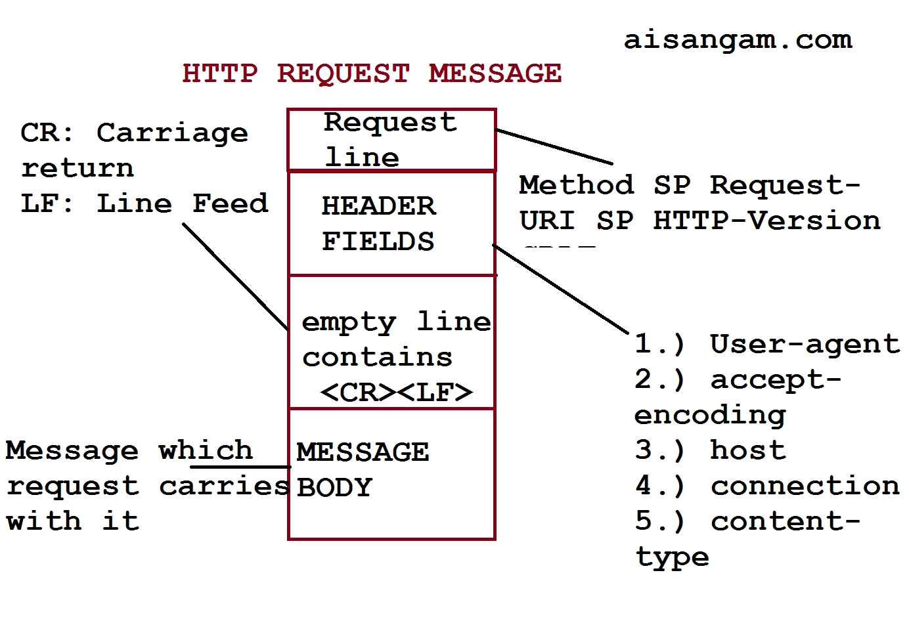
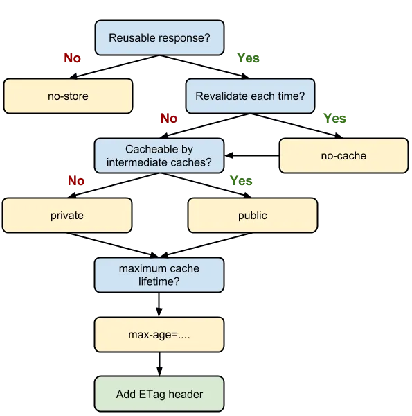
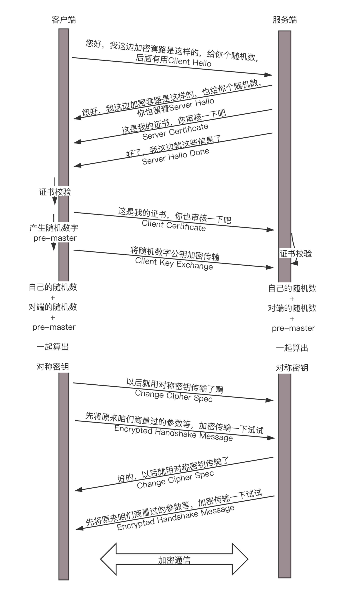


### IP

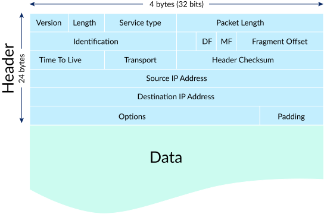

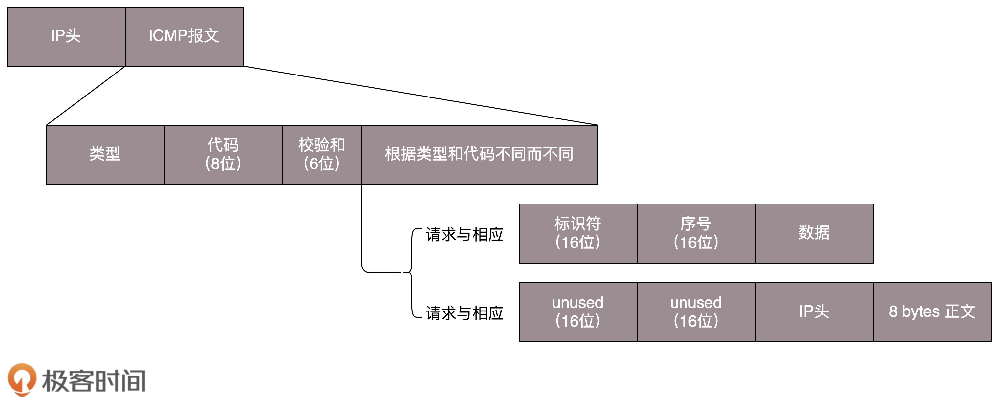
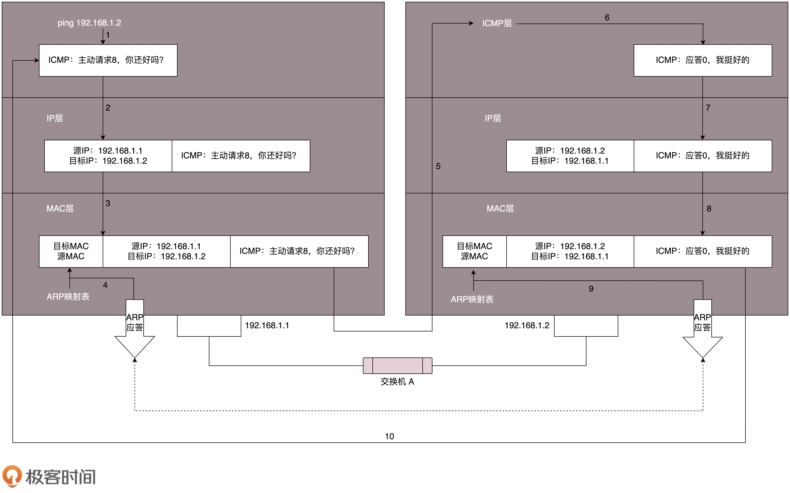


### DNS

```yaml

- type: DNS
  tag: *tag
  repo:
    - url: https://github.com/hashicorp/mdns
      des: Simple mDNS client/server library in Golang. Used to optimize DNS.
    - url: https://github.com/TencentCloud/httpdns-sdk-android
      des: Tencent Cloud HTTPDNS SDK. HttpDNS通过HTTPS向自己的 DNS 服务器发送域名解析请求，替代了传统的基于 DNS 协议向运营商 Local DNS 发起解析请求的方式，优化了移动互联网服务中域名解析异常带来的问题。直接集成到各种client即可，跟服务端无关。
    - url: https://github.com/TimothyYe/godns
      des: A dynamic DNS client tool that supports AliDNS, Cloudflare, Google Domains, DNSPod, HE.net & DuckDNS & DreamHost, etc, written in Go.
    - url: https://github.com/felixonmars/dnsmasq-china-list
      des: Chinese-specific configuration to improve your favorite DNS server. Best partner for chnroutes.
    - url: https://github.com/pi-hole/pi-hole
    - url: https://github.com/nadoo/glider
      des: glider is a forward proxy with multiple protocols support, and also a dns/dhcp server with ipset management feats(like dnsmasq).
    - url: https://github.com/coredns/coredns
      des: CoreDNS 是 k8s 集群默认的 DNS 服务组件，CoreDNS 主要负责为集群内的 Pod 和 Service 提供 DNS 解析能力。

    - url: https://github.com/jeessy2/ddns-go
      des: 跟DNSMasq或者BIND还不太一样，ddns-go是用来动态更新DNS记录的服务，以便将域名映射到动态分配的IP地址。而DNSMasq则功能更多，它们提供了完整的DNS服务，包括域名解析、DNS缓存、区域传输等功能。它们可以作为本地DNS服务器，提供域名解析和缓存功能，还可以作为权威DNS服务器，管理特定域名的DNS记录。换句话说，ddns-go只是DNSMasq的一部分，只提供了动态更新DNS记录的功能。
  qs:
    - q: What's DNS? (hostname2ip) What are the cons of DNS?
    - q: DNS解析过程? router是直接解析还是转发DNS?
    - q: DNS zone

```


## 《趣谈网络协议》


[01 为什么要学习网络协议？](https://learn.lianglianglee.com/%E4%B8%93%E6%A0%8F/%E8%B6%A3%E8%B0%88%E7%BD%91%E7%BB%9C%E5%8D%8F%E8%AE%AE/01%20%E4%B8%BA%E4%BB%80%E4%B9%88%E8%A6%81%E5%AD%A6%E4%B9%A0%E7%BD%91%E7%BB%9C%E5%8D%8F%E8%AE%AE%EF%BC%9F.md)

```markdown

你先在浏览器里面输入 https://www.kaola.com，这是一个 URL。浏览器只知道名字是“www.kaola.com”，但是不知道具体的地点，所以不知道应该如何访问。于是，它打开地址簿去查找。可以使用一般的地址簿协议 DNS 去查找，还可以使用另一种更加精准的地址簿查找协议 HTTPDNS。

无论用哪一种方法查找，最终都会得到这个地址：106.114.138.24。这个是 IP 地址，是互联网世界的“门牌号”。

知道了目标地址，浏览器就开始打包它的请求。对于普通的浏览请求，往往会使用 HTTP 协议；但是对于购物的请求，往往需要进行加密传输，因而会使用 HTTPS 协议。无论是什么协议，里面都会写明“你要买什么和买多少”。

DNS、HTTP、HTTPS 所在的层我们称为应用层。经过应用层封装后，浏览器会将应用层的包交给下一层去完成，通过 socket 编程来实现。下一层是传输层。传输层有两种协议，一种是无连接的协议 UDP，一种是面向连接的协议 TCP。对于支付来讲，往往使用 TCP 协议。所谓的面向连接就是，TCP 会保证这个包能够到达目的地。如果不能到达，就会重新发送，直至到达。

TCP 协议里面会有两个端口，一个是浏览器监听的端口，一个是电商的服务器监听的端口。操作系统往往通过端口来判断，它得到的包应该给哪个进程。

传输层封装完毕后，浏览器会将包交给操作系统的网络层。网络层的协议是 IP 协议。在 IP 协议里面会有源 IP 地址，即浏览器所在机器的 IP 地址和目标 IP 地址，也即电商网站所在服务器的 IP 地址。

操作系统既然知道了目标 IP 地址，就开始想如何根据这个门牌号找到目标机器。操作系统往往会判断，这个目标 IP 地址是本地人，还是外地人。如果是本地人，从门牌号就能看出来，但是显然电商网站不在本地，而在遥远的地方。

操作系统知道要离开本地去远方。虽然不知道远方在何处，但是可以这样类比一下：如果去国外要去海关，去外地就要去网关。而操作系统启动的时候，就会被 DHCP 协议配置 IP 地址，以及默认的网关的 IP 地址 192.168.1.1。

操作系统如何将 IP 地址发给网关呢？在本地通信基本靠吼，于是操作系统大吼一声，谁是 192.168.1.1 啊？网关会回答它，我就是，我的本地地址在村东头。这个本地地址就是 MAC 地址，而大吼的那一声是 ARP 协议。


城关与城关之间是一个国家，当网络包知道了下一步去哪个城关，还是要使用国家内部的 MAC 地址，通过下一个城关的 MAC 地址，找到下一个城关，然后再问下一步的路怎么走，一直到走出最后一个城关。

最后一个城关知道这个网络包要去的地方。于是，对着这个国家吼一声，谁是目标 IP 啊？目标服务器就会回复一个 MAC 地址。网络包过关后，通过这个 MAC 地址就能找到目标服务器。

目标服务器发现 MAC 地址对上了，取下 MAC 头来，发送给操作系统的网络层。发现 IP 也对上了，就取下 IP 头。IP 头里会写上一层封装的是 TCP 协议，然后将其交给传输层，即 TCP 层。

在这一层里，对于收到的每个包，都会有一个回复的包说明收到了。这个回复的包绝非这次下单请求的结果，例如购物是否成功，扣了多少钱等，而仅仅是 TCP 层的一个说明，即收到之后的回复。当然这个回复，会沿着刚才来的方向走回去，报个平安。

因为一旦出了国门，西行路上千难万险，如果在这个过程中，网络包走丢了，例如进了大沙漠，或者被强盗抢劫杀害怎么办呢？因而到了要报个平安。

如果过一段时间还是没到，发送端的 TCP 层会重新发送这个包，还是上面的过程，直到有一天收到平安到达的回复。这个重试绝非你的浏览器重新将下单这个动作重新请求一次。对于浏览器来讲，就发送了一次下单请求，TCP 层不断自己闷头重试。除非 TCP 这一层出了问题，例如连接断了，才轮到浏览器的应用层重新发送下单请求。

当网络包平安到达 TCP 层之后，TCP 头中有目标端口号，通过这个端口号，可以找到电商网站的进程正在监听这个端口号，假设一个 Tomcat，将这个包发给电商网站。
```

域名、DNS、（TCP 头）、IP（源 IP 和目标 IP）、MAC（DHCP 默认的网关 IP、ARP 协议、网关的 MAC 地址、网关再参考路由表，把数据包发送到目标 IP 地址），到达目标 IP 之后（）


---

还有一个老生常谈的问题，IP 和 MAC

比如说，有了 IP，为啥还要 MAC？或者反过来，有了 MAC，为啥还要 IP？

***IP 层解决远程定位问题，MAC 是没有远程定位功能的，只能通过本地 ARP 的方式找到。***

```markdown
MAC 地址是一个很容易让人“误解”的地址。因为 MAC 地址号称全局唯一，不会有两个网卡有相同的 MAC 地址，而且网卡自生产出来，就带着这个地址。很多人看到这里就会想，既然这样，整个互联网的通信，全部用 MAC 地址好了，只要知道了对方的 MAC 地址，就可以把信息传过去。

这样当然是不行的。一个网络包要从一个地方传到另一个地方，除了要有确定的地址，还需要有定位功能。而有门牌号码属性的 IP 地址，才是有远程定位功能的。

例如，你去杭州市网商路 599 号 B 楼 6 层找刘超，你在路上问路，可能被问的人不知道 B 楼是哪个，但是可以给你指网商路怎么去。但是如果你问一个人，你知道这个身份证号的人在哪里吗？可想而知，没有人知道。

MAC 地址更像是身份证，是一个唯一的标识。它的唯一性设计是为了组网的时候，不同的网卡放在一个网络里面的时候，可以不用担心冲突。从硬件角度，保证不同的网卡有不同的标识。

MAC 地址是有一定定位功能的，只不过范围非常有限。你可以根据 IP 地址，找到杭州市网商路 599 号 B 楼 6 层，但是依然找不到我，你就可以靠吼了，大声喊身份证 XXXX 的是哪位？我听到了，我就会站起来说，是我啊。但是如果你在上海，到处喊身份证 XXXX 的是哪位，我不在现场，当然不会回答，因为我在杭州不在上海。

所以，MAC 地址的通信范围比较小，局限在一个子网里面。例如，从 192.168.0.2/24 访问 192.168.0.3/24 是可以用 MAC 地址的。一旦跨子网，即从 192.168.0.2/24 到 192.168.1.2/24，MAC 地址就不行了，需要 IP 地址起作用了。
```


---

```markdown
那 TCP 在三次握手的时候，IP 层和 MAC 层在做什么呢？当然是 TCP 发送每一个消息，都会带着 IP 层和 MAC 层了。因为，TCP 每发送一个消息，IP 层和 MAC 层的所有机制都要运行一遍。而你只看到 TCP 三次握手了，其实，IP 层和 MAC 层为此也忙活好久了。

这里要记住一点：只要是在网络上跑的包，都是完整的。可以有下层没上层，绝对不可能有上层没下层。

所以，对 TCP 协议来说，三次握手也好，重试也好，只要想发出去包，就要有 IP 层和 MAC 层，不然是发不出去的。

经常有人会问这样一个问题，我都知道那台机器的 IP 地址了，直接发给他消息呗，要 MAC 地址干啥？这里的关键就是，没有 MAC 地址消息是发不出去的。
```

这块感觉不太对，怎么理解“这里要记住一点：只要是在网络上跑的包，都是完整的。可以有下层没上层，绝对不可能有上层没下层。”这句话？我有一个疑问，真的“绝不可能有上层没下层”吗？那客户端发出的网络包不是自顶向下的吗？从应用层的 HTTP 头到 TCP 头到 IP 头，最后到 MAC 头。那这句话不就不对了吗？


---

我总结一下 IP 协议的核心知识点（我总觉得自己对这块知识的掌握比较一般）

- IP 地址，比如什么 CIDR、子网掩码、广播地址、组播地址、环回接口 loopback
- IP 包
- 路由协议族，RIP、OSPF、BGP
- ICMP 协议
- 除此之外还有 ARP 协议、DHCP 协议、PXE

这么来看其实也还好。

---

```markdown
IP 是地址，有定位功能；MAC 是身份证，无定位功能；

CIDR 可以用来判断是不是本地人；

IP 分公有的 IP 和私有的 IP。后面的章节中我会谈到“出国门”，就与这个有关。
```

```markdown
所以，你看着它有自己的源 IP 地址 16.158.23.6，也有目标 IP 地址 192.168.1.6，但是包发不出去，这是因为 MAC 层还没填。

自己的 MAC 地址自己知道，这个容易。但是目标 MAC 填什么呢？是不是填 192.168.1.6 这台机器的 MAC 地址呢？

当然不是。Linux 首先会判断，要去的这个地址和我是一个网段的吗，或者和我的一个网卡是同一网段的吗？只有是一个网段的，它才会发送 ARP 请求，获取 MAC 地址。如果发现不是呢？

Linux 默认的逻辑是，如果这是一个跨网段的调用，它便不会直接将包发送到网络上，而是企图将包发送到网关。

如果你配置了网关的话，Linux 会获取网关的 MAC 地址，然后将包发出去。对于 192.168.1.6 这台机器来讲，虽然路过它家门的这个包，目标 IP 是它，但是无奈 MAC 地址不是它的，所以它的网卡是不会把包收进去的。

如果将网关配置为 192.168.1.6 呢？不可能，Linux 不会让你配置成功的，因为网关要和当前的网络至少一个网卡是同一个网段的，怎么可能 16.158.23.6 的网关是 192.168.1.6 呢？

```

注意：只有是同一个网段，才会发 ARP 请求，获取 MAC 地址。

---

[04 DHCP 与 PXE：IP 是怎么来的，又是怎么没的？](https://learn.lianglianglee.com/%E4%B8%93%E6%A0%8F/%E8%B6%A3%E8%B0%88%E7%BD%91%E7%BB%9C%E5%8D%8F%E8%AE%AE/04%20DHCP%E4%B8%8EPXE%EF%BC%9AIP%E6%98%AF%E6%80%8E%E4%B9%88%E6%9D%A5%E7%9A%84%EF%BC%8C%E5%8F%88%E6%98%AF%E6%80%8E%E4%B9%88%E6%B2%A1%E7%9A%84%EF%BC%9F.md) 里面有具体的 DHCP 的解析流程，以及 PXE 的解析流程，但是用处不大，所以仅作记录


---


[08 世界这么大，我想出网关：欧洲十国游与玄奘西行](https://learn.lianglianglee.com/%E4%B8%93%E6%A0%8F/%E8%B6%A3%E8%B0%88%E7%BD%91%E7%BB%9C%E5%8D%8F%E8%AE%AE/08%20%E4%B8%96%E7%95%8C%E8%BF%99%E4%B9%88%E5%A4%A7%EF%BC%8C%E6%88%91%E6%83%B3%E5%87%BA%E7%BD%91%E5%85%B3%EF%BC%9A%E6%AC%A7%E6%B4%B2%E5%8D%81%E5%9B%BD%E6%B8%B8%E4%B8%8E%E7%8E%84%E5%A5%98%E8%A5%BF%E8%A1%8C.md)


```markdown
IP 头和 MAC 头哪些变、哪些不变？

对于 IP 头和 MAC 头哪些变、哪些不变的问题，可以分两种类型。我把它们称为“欧洲十国游”型和“玄奘西行”型。

之前我说过，MAC 地址是一个局域网内才有效的地址。因而，MAC 地址只要过网关，就必定会改变，因为已经换了局域网。两者主要的区别在于 IP 地址是否改变。不改变 IP 地址的网关，我们称为转发网关；改变 IP 地址的网关，我们称为 NAT 网关。
```

NAT


---


```shell
ip route list table main
# default via 172.17.63.253 dev eth0
# 169.254.0.0/16 dev eth0 scope link metric 1002
# 172.22.0.0/16 dev br-c8be62ca9862 proto kernel scope link src 172.22.0.1
# ...

echo 200 chao >> /etc/iproute2/rt_tables
ip rule add from 192.168.1.101 table chao
ip rule ls
```

这个就是静态路由表，我们可以自己修改


```markdown

1.距离矢量路由算法
第一大类的算法称为距离矢量路由（distance vector routing）。它是基于 Bellman-Ford 算法的。

这种算法的基本思路是，每个路由器都保存一个路由表，包含多行，每行对应网络中的一个路由器，每一行包含两部分信息，一个是要到目标路由器，从那条线出去，另一个是到目标路由器的距离。

由此可以看出，每个路由器都是知道全局信息的。那这个信息如何更新呢？每个路由器都知道自己和邻居之间的距离，每过几秒，每个路由器都将自己所知的到达所有的路由器的距离告知邻居，每个路由器也能从邻居那里得到相似的信息。

2.链路状态路由算法
第二大类算法是链路状态路由（link state routing），基于 Dijkstra 算法。

这种算法的基本思路是：当一个路由器启动的时候，首先是发现邻居，向邻居 say hello，邻居都回复。然后计算和邻居的距离，发送一个 echo，要求马上返回，除以二就是距离。然后将自己和邻居之间的链路状态包广播出去，发送到整个网络的每个路由器。这样每个路由器都能够收到它和邻居之间的关系的信息。因而，每个路由器都能在自己本地构建一个完整的图，然后针对这个图使用 Dijkstra 算法，找到两点之间的最短路径。

不像距离距离矢量路由协议那样，更新时发送整个路由表。链路状态路由协议只广播更新的或改变的网络拓扑，这使得更新信息更小，节省了带宽和 CPU 利用率。而且一旦一个路由器挂了，它的邻居都会广播这个消息，可以使得坏消息迅速收敛。


```


```markdown
1.基于链路状态路由算法的 OSPF
OSPF（Open Shortest Path First，开放式最短路径优先）就是这样一个基于链路状态路由协议，广泛应用在数据中心中的协议。由于主要用在数据中心内部，用于路由决策，因而称为内部网关协议（Interior Gateway Protocol，简称 IGP）。

内部网关协议的重点就是找到最短的路径。在一个组织内部，路径最短往往最优。当然有时候 OSPF 可以发现多个最短的路径，可以在这多个路径中进行负载均衡，这常常被称为等价路由。

这一点非常重要。有了等价路由，到一个地方去可以有相同的两个路线，可以分摊流量，还可以当一条路不通的时候，走另外一条路。这个在后面我们讲数据中心的网络的时候，一般应用的接入层会有负载均衡 LVS。它可以和 OSPF 一起，实现高吞吐量的接入层设计。

有了内网的路由协议，在一个国家内，唐僧可以想怎么走怎么走了，两条路选一条也行。

---


2.基于距离矢量路由算法的 BGP
但是外网的路由协议，也即国家之间的，又有所不同。我们称为外网路由协议（Border Gateway Protocol，简称 BGP）。

在一个国家内部，有路当然选近的走。但是国家之间，不光远近的问题，还有政策的问题。例如，唐僧去西天取经，有的路近。但是路过的国家看不惯僧人，见了僧人就抓。例如灭法国，连光头都要抓。这样的情况即便路近，也最好绕远点走。

对于网络包同样，每个数据中心都设置自己的 Policy。例如，哪些外部的 IP 可以让内部知晓，哪些内部的 IP 可以让外部知晓，哪些可以通过，哪些不能通过。这就好比，虽然从我家里到目的地最近，但是不能谁都能从我家走啊！

在网络世界，这一个个国家成为自治系统 AS（Autonomous System）。自治系统分几种类型。

Stub AS：对外只有一个连接。这类 AS 不会传输其他 AS 的包。例如，个人或者小公司的网络。

Multihomed AS：可能有多个连接连到其他的 AS，但是大多拒绝帮其他的 AS 传输包。例如一些大公司的网络。

Transit AS：有多个连接连到其他的 AS，并且可以帮助其他的 AS 传输包。例如主干网。

每个自治系统都有边界路由器，通过它和外面的世界建立联系。

BGP 又分为两类，eBGP 和 iBGP。自治系统间，边界路由器之间使用 eBGP 广播路由。内部网络也需要访问其他的自治系统。边界路由器如何将 BGP 学习到的路由导入到内部网络呢？就是通过运行 iBGP，使得内部的路由器能够找到到达外网目的地的最好的边界路由器。

BGP 协议使用的算法是路径矢量路由协议（path-vector protocol）。它是距离矢量路由协议的升级版。

前面说了距离矢量路由协议的缺点。其中一个是收敛慢。在 BGP 里面，除了下一跳 hop 之外，还包括了自治系统 AS 的路径，从而可以避免坏消息传得慢的问题，也即上面所描述的，B 知道 C 原来能够到达 A，是因为通过自己，一旦自己都到达不了 A 了，就不用假设 C 还能到达 A 了。

另外，在路径中将一个自治系统看成一个整体，不区分自治系统内部的路由器，这样自治系统的数目是非常有限的。就像大家都能记住出去玩，从中国出发先到韩国然后到日本，只要不计算细到具体哪一站，就算是发送全局信息，也是没有问题的。

```


*其实按照我的理解，OSPF 和 BGP 的本质区别在于能否解决负权边问题是吗？OSPF 使用 Dijkstra 算法，BGP 使用 Bellman-Ford 算法，这两个算法的核心区别就是是否能够解决负权边和负权环问题。AS 就是这里的负权边嘛。*

还是拿收发邮件举例来说明，静态路由就是您自己在小区（局域网）里溜达问题着玩，但是除了小区，就要用导航（网关）了，网关会（根据 OSPF、BGP、RIP 等路由协议）自动更新路由表，自动规划出最合理的路由。


```markdown
那在网络层发送数据包时，会自动选择 OSPF 或者 BGP 吗？是怎么进行选择的呢？

---

在网络层发送数据包时，通常不会自动选择 OSPF 或 BGP。OSPF 和 BGP 是动态路由协议，用于学习和更新路由表。它们通常在路由器之间运行，并根据网络拓扑和策略来决定最佳路由。当一个路由器接收到数据包时，它会使用路由表来决定将数据包发送到哪个接口。路由表中的路由可以通过静态路由配置手动添加，也可以通过动态路由协议自动学习和更新。

在选择最佳路由时，动态路由协议通常会考虑各种因素，如链路质量、网络拓扑和策略。不同的动态路由协议有不同的算法和策略来选择最佳路由。例如，OSPF 使用链路状态信息来计算最短路径，而 BGP 使用路径属性和策略来选择路由。

所以，路由器通常会根据路由表中的最佳匹配来选择路由，而不是自动选择 OSPF 或 BGP。选择使用哪种路由协议取决于网络的需求、策略和拓扑结构。

---

也就是说，网关还集成了自动更新路由表的功能？我们不需要选择 OSPF 还是 BGP，这个是网关需要做的事情，网关会自动更新路由表，并给网络层的数据包提供最合理的路由，是吗？

---

是的，你说得没错。网关会自动更新路由表，并根据网络层的数据包选择最合理的路由。这是动态路由的特性。在动态路由中，网关会使用路由协议来学习并更新路由表。常见的动态路由协议包括 RIP（Routing Information Protocol）、OSPF（Open Shortest Path First）和 BGP（Border Gateway Protocol）。这些协议会根据网络拓扑和其他因素自动计算出最佳的路由，并将路由信息与其他路由器交换，以保持网络的连通性和适应性。

相比之下，静态路由需要手动配置路由表项。在静态路由中，管理员需要手动指定每个网络的下一跳路由器。这种方式适用于规模较小或拓扑变化有限的网络。静态路由的配置相对简单，但需要手动维护，不会自动适应网络变化。

总的来说，动态路由提供了更大的灵活性和可靠性，但需要进行计算和交换路由信息。而静态路由则更简单，但需要手动维护。选择使用静态路由还是动态路由取决于网络的规模、复杂程度以及管理要求等因素。

希望这个例子能帮助你理解静态和动态路由在日常生活中的应用。有其他问题的话，请随时提问。

---

对了，我们还漏掉了 RIP 协议，那 RIP 协议相比于 OSPF 和 BGP 有什么区别和特点呢？

---

RIP（Routing Information Protocol）是一种距离向量路由协议，主要用于小型网络中。它使用跳数（hop count）作为衡量路径优劣的指标，并通过将路由表信息广播到相邻路由器来实现路由的学习和更新。RIP 协议对网络的规模和拓扑变化的适应性较差，因此在大型网络中使用较少。相比之下，OSPF（Open Shortest Path First）和 BGP（Border Gateway Protocol）是链路状态路由协议，具有更高的灵活性和可扩展性。OSPF 协议使用链路状态数据库和 Dijkstra 算法来计算最短路径，适用于中等规模的企业网络。BGP 协议是一个可实现自治系统之间路由选择的协议，主要用于互联网的外部路由选择。

总的来说，RIP 协议适用于小型网络，使用跳数作为路径选择的度量标准；OSPF 协议适用于中等规模的企业网络，使用链路状态数据库和最短路径算法；BGP 协议适用于互联网的外部路由选择。

```


```markdown

为什么可以把 AS 自治系统理解为负权环呢？

---

将自治系统（AS，Autonomous System）理解为负权环（Negative Weight Cycle）是一种简化的比喻，用于描述 AS 路径选择中的一种情况。

在路由协议中，AS 是互联网中的一个独立管理的网络运营域，它可以包含多个网络设备和路由器。AS 之间通过边界路由器（Border Router）相互连接，并通过路由协议来交换路由信息。

负权环是一个图论概念，指的是在有向加权图中存在一条环路，其路径上的权重之和为负值。在这种情况下，如果一个数据包在该环路上进行无限循环，其累积的权重会不断减小，形成负权环。

在 AS 路径选择中，路由协议（如 BGP）使用了一种叫做"最短路径优先"（Shortest Path First）的算法来选择最佳路径。这个算法会根据路径的权重或者距离来选择最短路径。然而，当存在负权环时，算法可能无法收敛，因为它会不断选择累积权重为负的环路，导致无限循环。

将 AS 自治系统理解为负权环是为了形象地描述这种情况。当 AS 之间存在某种问题或配置错误时，可能会导致路由协议选择了一个负权环，从而导致数据包在网络中无限循环，无法正确路由。

需要注意的是，实际的 AS 路径选择是复杂而动态的，涉及到多个因素和策略。尽管负权环是一种可能的情况，但它并不是 AS 路径选择中的唯一问题。


```


---


[12 TCP 协议（下）：西行必定多妖孽，恒心智慧消磨难](https://learn.lianglianglee.com/%E4%B8%93%E6%A0%8F/%E8%B6%A3%E8%B0%88%E7%BD%91%E7%BB%9C%E5%8D%8F%E8%AE%AE/12%20TCP%E5%8D%8F%E8%AE%AE%EF%BC%88%E4%B8%8B%EF%BC%89%EF%BC%9A%E8%A5%BF%E8%A1%8C%E5%BF%85%E5%AE%9A%E5%A4%9A%E5%A6%96%E5%AD%BD%EF%BC%8C%E6%81%92%E5%BF%83%E6%99%BA%E6%85%A7%E6%B6%88%E7%A3%A8%E9%9A%BE.md)


---


[协议专栏特别福利 答疑解惑 1 期](https://learn.lianglianglee.com/%E4%B8%93%E6%A0%8F/%E8%B6%A3%E8%B0%88%E7%BD%91%E7%BB%9C%E5%8D%8F%E8%AE%AE/%E5%8D%8F%E8%AE%AE%E4%B8%93%E6%A0%8F%E7%89%B9%E5%88%AB%E7%A6%8F%E5%88%A9%20%E7%AD%94%E7%96%91%E8%A7%A3%E6%83%911%E6%9C%9F.md)

```markdown

如果最后一跳的时候，IP 改变了怎么办？

---

对于 IP 层来讲，当包到达最后一跳的时候，原来的 IP 不存在了。比如网线拔掉了，或者服务器直接宕机了，则 ARP 就找不到了，所以这个包就会发送失败了。对于 IP 层的工作就结束了。

但是 IP 层之上还有 TCP 层，TCP 会重试的，包还是会重新发送，但是如果服务器没有启动起来，超过一定的次数，最终放弃。

如果服务器重启了，IP 还是原来的 IP 地址，这个时候 TCP 重新发送的一个包的时候，ARP 是能够得到这个地址的，因而会发到这台机器上来，但是机器上面没有启动服务端监听那个端口，于是会发送 ICMP 端口不可达。

如果服务器重启了，服务端也重新启动了，也在监听那个端口了，这个时候 TCP 的服务端由于是新的，Sequence Number 根本对不上，说明不是原来的连接，会发送 RST。

那有没有可能有特殊的场景 Sequence Number 也能对的上呢？按照 Sequence Number 的生成算法，是不可能的。

但是有一个非常特殊的方式，就是虚拟机的热迁移，从一台物理机迁移到另外一台物理机，IP 不变，MAC 不变，内存也拷贝过去，Sequence Number 在内存里面也保持住了，在迁移的过程中会丢失一两个包，但是从 TCP 来看，最终还是能够连接成功的。

```

```markdown
其实下层的协议知道上层协议的，因为在每一层的包头里面，都会有上一层是哪个协议的标识，所以不是一个回调函数，每一层的处理函数都会在操作系统启动的时候，注册到内核的一个数据结构里面，但是到某一层的时候，是通过判断到底是哪一层的哪一个协议，然后去找相应的处理函数去调用。
```

---

[协议专栏特别福利 答疑解惑 2 期](https://learn.lianglianglee.com/%E4%B8%93%E6%A0%8F/%E8%B6%A3%E8%B0%88%E7%BD%91%E7%BB%9C%E5%8D%8F%E8%AE%AE/%E5%8D%8F%E8%AE%AE%E4%B8%93%E6%A0%8F%E7%89%B9%E5%88%AB%E7%A6%8F%E5%88%A9%20%E7%AD%94%E7%96%91%E8%A7%A3%E6%83%912%E6%9C%9F.md)

```markdown

网络号、IP 地址、子网掩码和广播地址的先后关系是什么？

---

当在一个数据中心或者一个办公室规划一个网络的时候，首先是网络管理员规划网段，一般是根据将来要容纳的机器数量来规划，一旦定了，以后就不好变了。

假如你在一个小公司里，总共就没几台机器，对于私有地址，一般选择 192.168.0.0/24 就可以了。

这个时候先有的是网络号。192.168.0 就是网络号。有了网络号，子网掩码同时也就有了，就是前面都是网络号的是 1，其他的是 0，广播地址也有了，除了网络号之外都是 1。

当规划完网络的时候，一般这个网络里面的第一个、第二个地址被默认网关 DHCP 服务器占用，你自己创建的机器，只要和其他的不冲突就可以了，当然你也可以让 DHCP 服务自动配置。

规划网络原来都是网络管理员的事情。有了公有云之后，一般有个概念虚拟网络（VPC），鼠标一点就能创建一个网络，网络完全软件化了，任何人都可以做网络规划。

```


```markdown

组播和广播的意义和原理是什么？

---

在《TCP/IP 详解》这本书里面，有两章讲了广播、多播以及 IGMP。广播和组播分为两个层面，其中 MAC 层有广播和组播对应的地址，IP 层也有自己的广播地址和组播地址。

广播相对比较简单，MAC 层的广播为 ff:ff:ff:ff:ff:ff，IP 层指向子网的广播地址为主机号为全 1 且有特定子网号的地址。

组播复杂一些，MAC 层中，当地址中最高字节的最低位设置为 1 时，表示该地址是一个组播地址，用十六进制可表示为 01:00:00:00:00:00。IP 层中，组播地址为 D 类 IP 地址，当 IP 地址为组播地址的时候，有一个算法可以计算出对应的 MAC 层地址。

多播进程将目的 IP 地址指明为多播地址，设备驱动程序将它转换为相应的以太网地址，然后把数据发送出去。这些接收进程必须通知它们的 IP 层，它们想接收的发给定多播地址的数据报，并且设备驱动程序必须能够接收这些多播帧。这个过程就是“加入一个多播组”。

当多播跨越路由器的时候，需要通过 IGMP 协议告诉多播路由器，多播数据包应该如何转发。

```

```markdown
在二层中我们讲了 ARP 协议，即已知 IP 地址求 MAC；还有一种 RARP 协议，即已知 MAC 求 IP 的，你知道它可以用来干什么吗？

---

之前有无盘工作站，即没有硬盘的机器，无法持久化 ip 地址到本地，但有网卡，所以可以用 RARP 协议来获取 IP 地址。RARP 可以用于局域网管理员想指定机器 IP（与机器绑定，不可变)，又不想每台机器去设置静态 IP 的情况，可以在 RARP 服务器上配置 MAC 和 1P 对应的 ARP 表，不过获取每台机器的 MAC 地址，好像也挺麻烦的。这个协议现在应该用得不多了吧，都用 BOOT 或者 DHCP 了。


```


```markdown
STP 协议能够很好地解决环路问题，但是也有它的缺点，你能举几个例子吗？

---

STP 的主要问题在于，当拓扑发生变化，新的配置消息要经过一定的时延才能传播到整个网络。

由于整个交换网络只有一棵生成树，在网络规模比较大的时候会导致较长的收敛时间，拓扑改变的影响面也较大，当链路被阻塞后将不承载任何流量，造成了极大带宽浪费。

```

---

[协议专栏特别福利 答疑解惑 3 期](https://learn.lianglianglee.com/%E4%B8%93%E6%A0%8F/%E8%B6%A3%E8%B0%88%E7%BD%91%E7%BB%9C%E5%8D%8F%E8%AE%AE/%E5%8D%8F%E8%AE%AE%E4%B8%93%E6%A0%8F%E7%89%B9%E5%88%AB%E7%A6%8F%E5%88%A9%20%E7%AD%94%E7%96%91%E8%A7%A3%E6%83%913%E6%9C%9F.md)


```markdown
当发送的报文出问题的时候，会发送一个 ICMP 的差错报文来报告错误，但是如果 ICMP 的差错报文也出问题了呢？

我总结了一下，不会导致产生 ICMP 差错报文的有：

- ICMP 差错报文（ICMP 查询报文可能会产生 ICMP 差错报文）；
- 目的地址是广播地址或多播地址的 IP 数据报；
- 作为链路层广播的数据报；
- 不是 IP 分片的第一片；
- 源地址不是单个主机的数据报。这就是说，源地址不能为零地址、环回地址、广播地址或多播地址。

```

其实就是一些边界条件


```markdown
2.ICMP 差错报文是谁发送的呢？

我看留言里有很多人对这个问题有疑惑。ICMP 包是由内核返回的，在内核中，有一个函数用于发送 ICMP 的包。

void icmp_send(struct sk_buff *skb_in, int type, int code, __be32 info);
例如，目标不可达，会调用下面的函数。

icmp_send(skb, ICMP_DEST_UNREACH, ICMP_PROT_UNREACH, 0);
当 IP 大小超过 MTU 的时候，发送需要分片的 ICMP。

if (ip_exceeds_mtu(skb, mtu)) {
  icmp_send(skb, ICMP_DEST_UNREACH, ICMP_FRAG_NEEDED, htonl(mtu));
  goto drop;
 }

```


```markdown

路由协议要在路由器之间交换信息，这些信息的交换还需要走路由吗？不是死锁了吗？

---

OSPF 是直接基于 IP 协议发送的，而且 OSPF 的包都是发给邻居的，也即只有一跳，不会中间经过路由设备。BGP 是基于 TCP 协议的，在 BGP peer 之间交换信息。

---

RIP 是 UDP 协议，OSPF 直接发 IP 包。而 BGP 使用 TCP 协议，路由器之间会建立 TCP 连接，每 60s 发送一次 keep-alive 消息。


```

```markdown
多线 BGP 机房是怎么回事儿？

---

BGP 主要用于互联网 AS 自治系统之间的互联，BGP 的最主要功能在于控制路由的传播和选择最好的路由。各大运营商都具有 AS 号，全国各大网络运营商多数都是通过 BGP 协议与自身的 AS 来实现多线互联的。

使用此方案来实现多线路互联，IDC 需要在 CNNIC（中国互联网信息中心）或 APNIC（亚太网络信息中心）申请自己的 IP 地址段和 AS 号，然后通过 BGP 协议将此段 IP 地址广播到其它的网络运营商的网络中。

使用 BGP 协议互联后，网络运营商的所有骨干路由设备将会判断到 IDC 机房 IP 段的最佳路由，以保证不同网络运营商用户的高速访问。


```


```markdown

TCP 的连接有这么多的状态，你知道如何在系统中查看某个连接的状态吗？

用 netstat 或者 lsof，grep 一下 establish listen close_wait 之类的这些看看

```


```markdown
TIME_WAIT 状态太多是怎么回事儿？

---

如果处于 TIMEWAIT 状态，说明双方建立成功过连接，而且已经发送了最后的 ACK 之后，才会处于这个状态，而且是主动发起关闭的一方处于这个状态。

如果存在大量的 TIMEWAIT，往往是因为短连接太多，不断的创建连接，然后释放连接，从而导致很多连接在这个状态，可能会导致无法发起新的连接。解决的方式往往是：

- 打开 tcp_tw_recycle 和 tcp_timestamps 选项；
- 打开 tcp_tw_reuse 和 tcp_timestamps 选项；
- 程序中使用 SO_LINGER，应用强制使用 rst 关闭。

当客户端收到 Connection Reset，往往是收到了 TCP 的 RST 消息，RST 消息一般在下面的情况下发送：

- 试图连接一个未被监听的服务端；
- 对方处于 TIMEWAIT 状态，或者连接已经关闭处于 CLOSED 状态，或者重新监听 seq num 不匹配；
- 发起连接时超时，重传超时，keepalive 超时；
- 在程序中使用 SO_LINGER，关闭连接时，放弃缓存中的数据，给对方发送 RST。

```

老生常谈的问题了，但是我还是不懂。

> 如果存在大量的 TIMEWAIT，往往是因为短连接太多，不断的创建连接，然后释放连接，从而导致很多连接在这个状态，可能会导致无法发起新的连接。

> 解决方案是打开 TCP_TW 的两个配置以及 tcp_timestamps 配置


```markdown
TCP 的 BBR 听起来很牛，你知道它是如何达到这个最优点的吗？

---

1 设备缓存会导致延时？

假如经过设备的包都不需要进入缓存，那么得到的速度是最快的。进入缓存且等待，等待的时间就是额外的延时。BBR 就是为了避免这些问题：

充分利用带宽；降低 buffer 占用率。

2 降低发送 packet 的速度，为何反而提速了？

标准 TCP 拥塞算法是遇到丢包的数据时快速下降发送速度，因为算法假设丢包都是因为过程设备缓存满了。快速下降后重新慢启动，整个过程对于带宽来说是浪费的。通过 packet 速度—时间的图来看，从积分上看，BBR 充分利用带宽时发送效率才是最高的。可以说 BBR 比标准 TCP 拥塞算法更正确地处理了数据丢包。对于网络上有一定丢包率的公网，BBR 会更加智慧一点。

回顾网络发展过程，带宽的是极大地改进的，而最小延迟会受限与介质传播速度，不会明显减少。BBR 可以说是应运而生。

3 BBR 如何解决延时？

S1：慢启动开始时，以前期的延迟时间为延迟最小值 Tmin。然后监控延迟值是否达到 Tmin 的 n 倍，达到这个阀值后，判断带宽已经消耗尽且使用了一定的缓存，进入排空阶段。

S2：指数降低发送速率，直至延迟不再降低。这个过程的原理同 S1

S3：协议进入稳定运行状态。交替探测带宽和延迟，且大多数时间下都处于带宽探测阶段。

深夜读了 BBR 的论文和网上大牛的讲解得出的小结，分享给大家，过程比较匆忙，不足之处也望老师能指出指正。

```


## linux use


[通过命令下载执行恶意代码的几种姿势 - 掘金](https://juejin.cn/post/6950955375931686942)

```shell
# 没有参数
curl <url> | bash

curl -s <url> | bash -s arg1 arg2

bash <(curl -s <url>) arg1 arg2

#- curl -kSL {url/xxx.sh} | sh
#- -k 允许不使用证书到SSL站点
#- -S=show-error 显示错误
#- -L 跟踪重定向

# 具名参数
# 由于直接调用了bash命令，因此在远程脚本需要传递具名参数时，为了区分是bash命令的参数还是远程脚本的，可以使用--作为区分，可以理解为分割线，--前面的比如-s属于bash，后面的-x abc -y xyz属于远程脚本的参数
curl -L <url> | bash -s -- -x abc -y xyz

# curl搭配wget使用
bash -c '(curl -fsSL <url>||wget -q -O- <url>)|bash -sh >/dev/null 2>&1&'
```


## Algo

算法思维无非是

- 动态规划
- 递归思维
- 滑动窗口
- 二叉搜索树
- 回溯法
- 位运算

迭代，穷举搜索，递推，动态规划，贪婪，回溯，分治


## [2023/4/16]

[聊聊计算机系统中的时间 - MySpace](https://www.hitzhangjie.pro/blog/2021-03-09-%E8%81%8A%E8%81%8A%E8%AE%A1%E7%AE%97%E6%9C%BA%E4%B8%AD%E7%9A%84%E6%97%B6%E9%97%B4/)

如何解决时间漂移问题在多处理器系统、分布式系统中带来的时序相关的问题。

```markdown
这里还有个问题，就是时间漂移问题。尽管我们前面提及了精确测量时间、时间同步协议等尽可能保证时间准确的方式，但是效果也是”尽可能”让其精确，我们还是不能百分百地保证全球所有电子设备、分布式系统中节点的时间是完全一致的，甚至是同一个计算机但是是多处理器系统中的多个时钟也不是完全一致的。

这回带来什么问题呢？如果运行其上的系统，依赖“时间”对操作顺序执行先后做判断，那这样的系统很可能是存在问题的。

在分布式系统设计中，一般会采用“逻辑时钟”、“向量时钟”等方式来代替真实时钟，来作为操作顺序执行先后的判断依据。这里的内容有很多，后面我们有机会再单独写一篇文章来介绍。

```

```markdown

方案                         优点                                                     缺点
逻辑时钟       - 简单易实现<br>- 不依赖于节点之间的通信<br>- 可以检测因果关系 - 无法准确反映物理时间<br>- 不适用于并发冲突的解决和一致性问题
向量时钟       - 可以检测因果关系<br>- 可以解决并发冲突和一致性问题         - 需要维护较大的向量<br>- 通信开销较大<br>- 可能存在复杂的更新逻辑

---

在选择逻辑时钟或向量时钟时，没有绝对的"更好"方法，而是要根据具体的需求和场景来确定。这取决于分布式系统的特点、应用需求和实现复杂性等因素。下面是一些考虑因素：

1. 简单性和易实现性：
 - 逻辑时钟相对简单，只需要维护一个递增计数器，易于实现和理解。
 - 向量时钟需要维护一个向量，实现和维护稍微复杂一些。

2. 物理时间的需求：
 - 逻辑时钟不能准确反映物理时间，只能依靠事件发生的因果关系进行排序。
 - 向量时钟也不能直接提供准确的物理时间，但可以通过比较向量元素来确定因果关系。

3. 应用需求：
 - 逻辑时钟适用于一些不需要考虑并发冲突和一致性问题的场景。
 - 向量时钟更适用于需要解决并发冲突和一致性问题的场景，例如分布式数据库、分布式锁等。

4. 通信开销：
 - 逻辑时钟不需要节点之间的通信，仅依赖于事件发生的因果关系。
 - 向量时钟需要节点之间的通信来传递和更新向量，可能引入一定的通信开销。

需要根据具体需求进行权衡和选择。在某些情况下，逻辑时钟可能更简单和适用，而在需要解决并发冲突和一致性问题的场景中，向量时钟可能更合适。一些系统可能会结合两种方法，根据具体需求来灵活选择使用。

因此，没有一种方法可以被普遍视为更好，而是要根据分布式系统的特点和应用需求来选择适合的时钟方案。

```


---

[//]: # (![bloom-filter-url.png]&#40;./pix/kernel/bloom-filter-url.png&#41;)


[//]: # (![counting-Bloom-filter.png]&#40;./pix/kernel/counting-Bloom-filter.png&#41;)


## [2024/4/21]


Sign of a performance bottleneck?


```markdown
- Memory bottleneck symptoms
  - buff/cache grows too fast
  - Physical Memory usage is too high
  - GC is too fast and memory overflows
- IO bottleneck
  - The IO queue is too long,
  - IO processing time is too long
  - IO throughput is too low
  - The difference between await and svctm is too large
- cpu bottleneck
  - load too high
  - (sys+usr) utilization exceeds 80% or falls below 50%
  - Iowait is too high
  - The run queue is too long
  - Context switches too quickly and interrupts too quickly
- Network bottleneck
  - Packet loss, high latency
  - Retransmission too high
  - mtu value is too small
- time_wait grows too fast
```


How to estimate the QPS/TPS/RPS of a system? *Let’s talk about the conclusion first, RPS and number of requests 1:900 (100 RPS, means 90,000 requests)* Specific principle `(Total PV number * 80%) / (3600* 20%) = QPS` and `Peak time QPS per second / QPS of a single machine = number of machines required`


---


```markdown
linux kernel的cacheline是啥？

---

在计算机系统中，缓存行（Cache Line）是一种硬件优化机制，用于加速处理器与主内存之间的数据传输。它是计算机体系结构中缓存层次结构中的一个重要概念。

缓存行是缓存最小的可分配单位，它是一组连续的字节或字（通常是64个字节），在主内存和缓存之间进行数据传输。当处理器访问主内存中的数据时，它会以缓存行作为基本单位从主内存中加载数据到缓存中。如果处理器需要访问的数据已经在缓存行中，那么它可以直接从缓存中读取，而不需要访问较慢的主内存。

缓存行的大小是由硬件设计决定的，并且在不同的计算机体系结构中可能有所不同。常见的大小是64字节，但也有其他大小的实现。缓存行的大小通常与处理器的字长和内存总线宽度相关。

缓存行的使用有助于减少内存访问的延迟，提高数据传输的效率。当处理器加载缓存行时，它会加载与所需数据相邻的其他数据，以利用空间局部性（Spatial Locality）和时间局部性（Temporal Locality）的原理。这样，在处理器需要访问相邻的数据时，可以直接从缓存中获取，而不需要额外的内存访问。

了解缓存行的大小和工作原理对于进行高性能编程和优化非常重要。在编写代码时，可以通过合理地利用缓存行，最大程度地减少缓存未命中（Cache Miss）和内存访问延迟，提高程序的性能。

```

缓存行是计算机体系结构中的一种硬件优化机制，它是缓存中最小的可分配单位，用于加速处理器与主内存之间的数据传输，通常是64字节大小。
